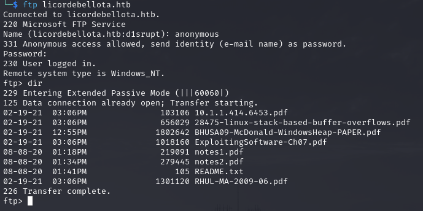

# PORT SCAN
* **21** &#8594; FTP
* **22** &#8594; SSH
* **53** &#8594; DNS
* **88** &#8594; KERBEROS
* **135** &#8594; MSRPC
* **139 / 445** &#8594; SMB
* **389 / 636** &#8594; LDAP
* **1433** &#8594; MSSQL


<br><br><br>

# ENUMERATION & USER FLAG
Interesting ports, also thanks to NMAP scripts I was able to retrieve the AD domain which is pretty funny :  `LicorDeBellota.htb` (PivotAPI is the computer name so let's change the **/etc/hosts** file).
Nice let's start in order with FTP! The service accepts anonymous login and is pretty rich!



Allright let's get all the contents and examine one file at the time. What we have is :
1) Parvez Anwar paper about stack overflow in Windows (I keep my finger crossed in order to not encounter BOF in this machine, lol)
2) A PDF note on how to steal access token
3) A PDF note about Shellcoding with tokens
4) Another pdf about buffer overflow (now my finger are double crossed)
5) **Practical Windows XP/2003 Heap Exploitation** paper (triple crosed)
6) A guide for BOF in Linux (crossed 4x)
7) **Running Malicious Code By Exploiting Buffer Overflows: A Survey Of Publicly Available Exploits** paper (crossed 1000x)

Ok joke aside, these are all the contents of the FTP server lol. Well lets uncross our fingers for now because until we get access into some machine we would not be able to perform a (possible) BOF. I am fresh of the **Acute** machine and what I learn is that reading all the content of a files means we need to put attention to the metadata as well. 

From the metadata I have etracted this info:
* Files are made with <u>Microsoft Word</u> (2013)
* <u>Cairo 1.10.2</u> is used t create **notes1.pdf** and **notes2.pdf**
* We have a set of creatore which can be used as (potential) username : **alex, Kaorz, saif and byron gronseth**

Cool the creator values can be usefull, one of my fav AD tricks is to use ASRE-roasting PoC to check if a username is valid or not inside the domain


We have been really really luckly, **<u>Kaorz</u>** is a valid user and no need pre-authentication for Kerberos. Let's crack this hash!


Nice stuff we have credentials now! I tried to login into MSSQL service but this credentials don't work. Well is time to use our favorit dog : **<u>BloodHound</u>**. Plus I extract info with **<u>ldapdomaindump</u>** because I love to work with this combo of 2 tools!

I have found nothing usefull for now involving the credentials we have but we can try to find something inside SMB, NETLOGON is interesting!


Oh no an exe file...let's download this stuff. Well the first thing I can think about is reverse engineering the exe...UNLEASH THE GHIDRA! 

Given the name of the executable **Restart-OracleService.exe** we can probably find some interesting artifacts about service account or some password that we can re-use on the full list of user that we have. Nothing from static analysis has pop out  so for the first time I need to perform some dynamic analysis, I moved the exe into my Windows VM and we are ready. We just need to instal sysinternal tool **<u>procmon64</u>**, set teh right filter and than we can fir it up and analyze the behaviour with the sysinternal tool!


The interesting thing is that a .bat has been created into the temporary Windows folder (see the highlighted line in the screenshot). I made more and more try and apparently the file is deleted after the execution. I changed the permissions and now the file would be trapped inside the directory ehehe. Here's the content of the bat file


Interesting, let's look at final lines
```
echo $salida = $null; $fichero = (Get-Content C:\ProgramData\oracle.txt) ; foreach ($linea in $fichero) {$salida += $linea.Replace(" ","")} ; [System.IO.File]::WriteAllBytes("C:\ProgramData\restart-service.exe",([System.Convert]::FromBase64String($salida))) > c:\programdata\monta.ps1
powershell.exe -exec bypass -file c:\programdata\monta.ps1
del c:\programdata\monta.ps1
del c:\programdata\oracle.txt
c:\programdata\restart-service.exe
del c:\programdata\restart-service.exe
```

We need to delete the lines where the new executable is removed and finally we have what we need! I used DNSPY to analyze it and into the main we have hardcoded credentials...FINALLY!


Let's seeif this credentials works on the machine


Oh...what a pain :(

But wait while I was searching for SVC into bloodhound I found the SVC_MSSQL account. So what if we make a small change in the password we have just found? Well after some small try I found it!


Well unluckly this credentials don't work with MSSQL ;( but we know that that `sa` is a standard high privilege account on MSSQL and we can try to use the same password but with this username


Ok folks time to enable **<u>xp_cmdshell</u>** ))


Beautiful now we can try and work smoothly...but wait a sec. Inside the starting SMB file we had some .msg file, I used this cool repository in order to view the content and well bad news for us ((


Yeah bad writing here but the point is that probably some firewall has been set up to avoid specific connection not just WinRM from the outside. In facts when I tried to use the `web_delivery` module I get the error **<u>No es posible conectar con el servidor remoto</u>** (plz HTB put the machine in english omg).

Let's try to figure it out on our own first let's see the user inside this machine into the `C:\Users` directory.


We just have the credentials of `svc_mssql` we can play with powershell in order to get it (we need to authenticate as that user to access the home directory contents). But what if we use the mssql service as PIVOT? I found this [cool repository](https://github.com/blackarrowsec/mssqlproxy) that makes some changes to the impacket **<u>mssqlclient</u>** adding some cool capabilities like the upload one. Inside the repository you would see an artcile that explain very well how to use so let's start uploading `reciclador.dll` (too much spanish tonight OMG)


Cool stuff now is time for the second DLL which would allow us to Pivot through proxychains called `Microsoft.SqlServer.Proxy.dll`


Now is time to activate the SOCKS port!


We have been really fast here but just because everything is well documented. Well cooooool stuff now we just need to setup correctly the proxychains configuration file (I have created a new one just for this machine) and run Evil-WinRM through that. In this way we bypass the firewall and we will access to WinRM from the inside (I live for this shit!)


Hell yeah, let's see if there is something cool into the home directory 


Now I have used **keepass2john** tool and crack the password of the database


I tried this pwd into wit `nxc` with user list I created but no luck here probably we need to open the keepass vault and take a look inside with keepass application for linux. 


The password is **Gu4nCh3C4NaRi0N!23** for user 3v4Si0N finally we have access to the machine and to our first flag...long trip ah?


<br><br><br>

# PRIVILEGE ESCALATION

Finally we can work a little bit with Active Directory but let's make a small briefing because obviously as soon as I get my hands on bloodhound or ldapdomaindump data I go and check them. First let's take our final prey into the sights, this prey is **<u>lothbrok</u>**. Why? Well because he can read **LAPS** password!


Cool now let's see what we can do with the credentials that we have gained during the foothold part.


Interesting we can change the password of **<u>Dr.Zaiuss</u>** which have a home folder inside the machine and maybe interesting thing would be stored there. The latter user can change the password of other 2 users


Only **<u>superfume</u>** have a User directory so I would aim to him where maybe some more info would pop out. Let's start!


Wonderfull! I use evil-WinRM but nothing interesting was found so I moved to change the **superfume** password and hope to have more luck there


Nothing interesting here too :(...come on we can manage this ehehe. What's new with this user is that we are now part of `Developers` group, not usefull for AD itself but we can now access a new folder located at **C:\Developers** and look what we have....omg I will have nightmare tonight lol


At least we have the C# code let's analyze that, is pretty long but use chiper for Jari's password 


Holy moly, the only way to have more info is to grab the executable (restart-mysql.exe) and re-use dnspy to decomiple the PE. Hell yeah we have some interesting info here!


I use [dotnetfiddle.net](https://dotnetfiddle.net/) website to run some C# code and print the Decrypted password.


Hell yeah! We can login with this user but before that let's check bloodhound what suggest to us! Finally game over!

I will explain how with a spice of spanish lmao.


Ok so the first edge is simple, we can set a new password for **<u>Gibdeon</u>** which is part of **<u>OPERS. DE CUENTAS</u>** in english **<u>Account Operators</u>**!


The [Account Operators](https://www.whiteoaksecurity.com/blog/account-operators-privilege-escalation/) is a pretty strong group, really really powerfull! We can also change password of exisisting account as well ehehehe...remember the LAPS group? ;)


I have added Jari just because is the one where I can PSRemote inside the machine and avoid annoying nested command


Let's GOOOOOOO!


The only hard part here is now translate **Administrator** to **Administrador**!


The flag is not inside the ADMISTRADOR directory, instead is on **<u>cybervaca</u>** onwe bacause he is actually the Domain Admin!


