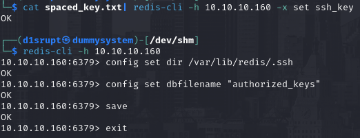

# PORT SCAN
* **22** &#8594; SSH
* **80** &#8594; HTTP
* **6379** &#8594; REDIS (4.0.9)
* **10000** &#8594; MINISERV (1.910)

   

# ENUMERATION & USER FLAG
Port 80 is just a brochure with nothing interesting within it so I woul like to move on the **<u>Redis DB</u>** and check if anonymous access is acceptable. Apparently this is the case!

I have tried to enumerate but the DB was empty (all index NULL). Hope is not lost because we can still have a path to gain foothold inside the system, we can write our public RSA key inside the `redis` directory (hopefully the standard one)

Now we can signin as `redis` through SSH

To read the user flag we need to take contol of `Matt` account. After some enumeration (where I found some miniserv files but without a proper account I am not able to see what's inside them) we have an interesting file in `/opt`

This is an encrypted version of the RSA key (apparently) belonging to `Matt`, for crack exercise I usually prefer **hashcat** (after taking a look on how it work is really a special tool even if widely used) but with "peculiar" target john is a better choice

After extracting the hash and use `john` to crack we have the plaintext **computer2008**. After decrypting the password with `openssl` the login failed but the password can be used to change user directly in the redis SSH session. Now we own the flag!

   

# PRIVILEGE ESCALATION

**<u>Root</u>** is running an interesting process 

I know the version thanks to the NMAP scan and I try to use the `linux/http/webmin_package_updates_rce`. For the credentials I reuse the Matt ones. The good news is that the credential are valid and we can now spawn a shell as **root**!

