# PORT SCAN
* **135** &#8594; MSRPC
* **139 / 445** &#8594; SMB
* **5985** &#8594; WinRM

   

# ENUMERATION & USER FLAG
Cute scan, really simple ports and we are lucky since we have a WinRM port for obtain shell access. On SMB through anonymous login we have the `Reports` directory let's get inside and jump in

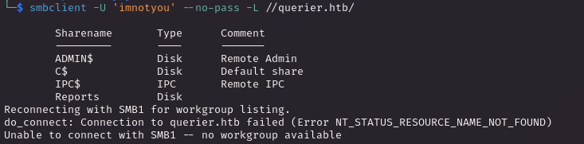

WIthin the directory we have a excel file (`.xlsm`), opened that with a online viewer appears to be empty but using strings we have a interesting `.bin` file 

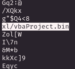

If you are keen enough with excel as attacker or defender you should hae already heard about **<u>macros</u>**, this should definetly the way let's see how we can access it. On [this stackoverflow question](https://unix.stackexchange.com/questions/494917/view-excel-files-in-linux-command-line-without-installing-any-packages) we have something interesting 

Interesting stuff so we can use unzip on the file we have retrieved from the SMB folder

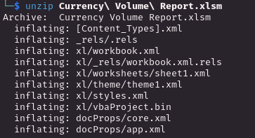

Cool now we can read the `.bin` file

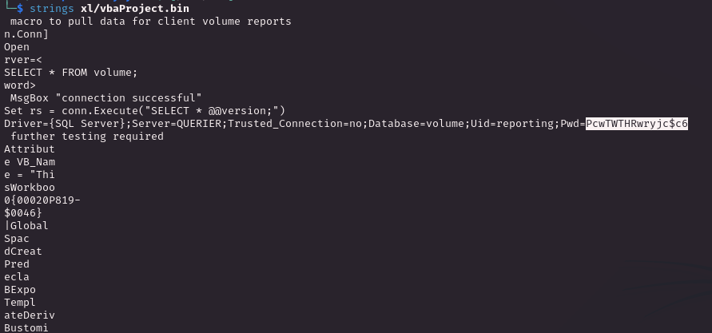

The username seems to be `reporting` adn we can use the `mssqclient.py` script of impacket to connect on the remote machine database. Inside is just a dummy DB with nothing inside but the default databse, **xp_cmdshell is disabled** and can't be activated with the current user, I have been in a similar situation already and we abuse `xp_dirtree` on a smb server we controll to get the hash of the user. In this case we have captures the `mssql-svc` hash

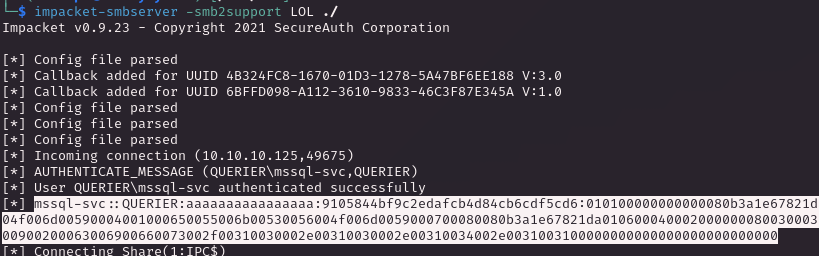

Really easy to crack

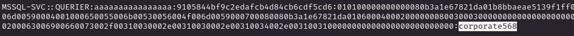

We can't login directly on WinRM but we can reuse this credentials to get access on a privileged instance of mssql and enable `xp_cmdshell`

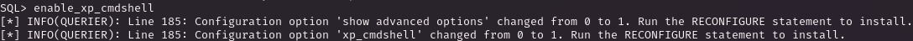

Everything cool but we have a problem here, we can't call a (simple) reverse shell because is blocked by Defender

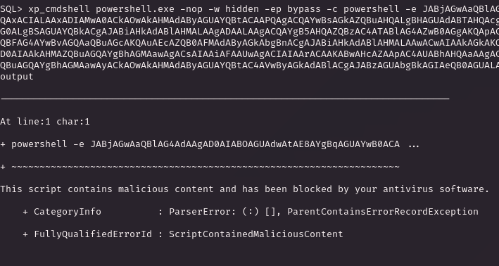

But using directly [nishang](https://github.com/samratashok/nishang) will trigger the reverse shell, now we are inside time to grab the flag!

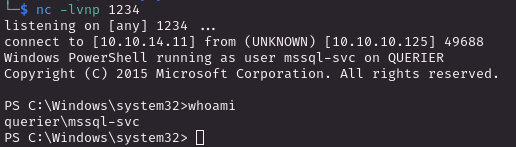

Another simple way was to host a `nc.exe` file and run directly from kali through SAMBA (this solution was widely better because I had issue to run script on previous shell)

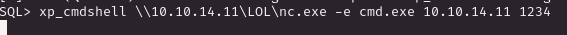

   

# PRIVILEGE ESCALATION

Here was easy than expected, just run a WinPeas instance and will retrieve for use some GPP stored passwords, we are lucky and are ownd by the administrator

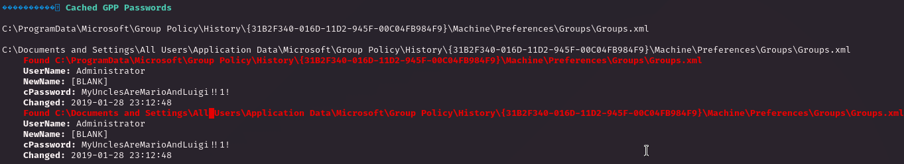

Yes just like that! We can finally use evil-WinRM and get access as administrator (pretty easy for a medium)

> The basic user have the **SeImpersonatePrivilege enabled** but I have decided to avoid to exploit that because is something that I have used too many times and if possible I would like to change attack paths in order to achieve a better understanding of Windows Internal 
