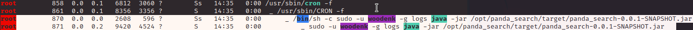
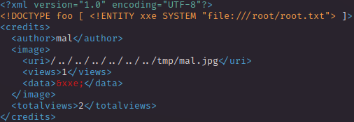

# PORT SCAN
* **22** &#8594; SSH
* **8080** &#8594; http-proxy

<br><br><br>

# ENUMERATION AND USER FLAG
On `8080` port we have access to a sort of seaerch page


And is really CUTEEEEE (UwU), we can search for a word and in return we have a set of red pandaaaaaas, for instance just seraching `a` give us back this results


What's bug my eye immediately was the title of the website <u>`Red Panda Search | Made with Spring Boot`</u>. Spring Boot ah? I saw that in a previous machine and was really a thing to find an abuse somehow, using [this guide](https://exploit-notes.hdks.org/exploit/web/framework/java/spring-pentesting/) (a must when I find a guide that fit a machine).

With some try I found that the webapp is vulnerable to **<u>STTI</u>**, look at the results when we search for `*{2*3}`


This mean we are able to put something and the webserver is going to evaluate and execute it. With this final check I get what I was searching for


Cool, following the guide I was able to get the shell


Let's go and grab the flag!

<br><br><br>

# PRIVILEGE ESCALATION
Running `linpeas` I saw this interesting cronjob



Cool the user root is running java with a jar file, interesting let's upload and use `pspy64` to get a better idea on the live process that are executed


This is called every **3 minutes** and see how we can abuse this cronjob, on `/opt/credit-score/LogParser/final/src/main/java/com/logparser/App.java` we have the java app and the main is pretty cool


It checks every line of the **log**, check if is an image and call `Map parselog`

```
    public static Map parseLog(String line) {
        String[] strings = line.split("\\|\\|");
        Map map = new HashMap<>();
        map.put("status_code", Integer.parseInt(strings[0]));
        map.put("ip", strings[1]);
        map.put("user_agent", strings[2]);
        map.put("uri", strings[3]);
        

        return map;
    }
```
Here just take from the log line the **status code, ip, user agent and url** and put everything in a data format called `Map`

Than the URL is passed on `getArtist(url)` function

```
public static String getArtist(String uri) throws IOException, JpegProcessingException
    {
        String fullpath = "/opt/panda_search/src/main/resources/static" + uri;
        File jpgFile = new File(fullpath);
        Metadata metadata = JpegMetadataReader.readMetadata(jpgFile);
        for(Directory dir : metadata.getDirectories())
        {
            for(Tag tag : dir.getTags())
            {
                if(tag.getTagName() == "Artist")
                {
                    return tag.getDescription();
                }
            }
        }

        return "N/A";
 }
```

Here we are getting a fullpath, reading the metadata of the JPG file, pick the `Artist` one and returned it. Use the artist to create a xml path and using that path on `addViewTo(xmlpath, parsed_data.get(url).toString())`

```
public static void addViewTo(String path, String uri) throws JDOMException, IOException
    {
        SAXBuilder saxBuilder = new SAXBuilder();
        XMLOutputter xmlOutput = new XMLOutputter();
        xmlOutput.setFormat(Format.getPrettyFormat());

        File fd = new File(path);
        
        Document doc = saxBuilder.build(fd);
        
        Element rootElement = doc.getRootElement();
 
        for(Element el: rootElement.getChildren())
        {
    
            
            if(el.getName() == "image")
            {
                if(el.getChild("uri").getText().equals(uri))
                {
                    Integer totalviews = Integer.parseInt(rootElement.getChild("totalviews").getText()) + 1;
                    System.out.println("Total views:" + Integer.toString(totalviews));
                    rootElement.getChild("totalviews").setText(Integer.toString(totalviews));
                    Integer views = Integer.parseInt(el.getChild("views").getText());
                    el.getChild("views").setText(Integer.toString(views + 1));
                }
            }
        }
        BufferedWriter writer = new BufferedWriter(new FileWriter(fd));
        xmlOutput.output(doc, writer);
    }
```

Here essentially we are reading the XML file in the path and adding 1 to the view field, here let's take a look at the log file afte searching for `s`


Cool after 3 minutes the java app will add 1 to the views filed of the XML of every jpg searched.

And this is the log file with the views


 

<br>

1) Download an image of a red panda, check the metadata `Artist` and change it with the malicious path. Than obv export it to the victim machine


2) I copied an existing XML file, added the XXE and change the other value, in particulare the url of the malicious jpg file and saved in the `/tmp` directory



3) I check an existing line on the log file, copied and change it in order to make it point to the malicious jpg


4) Now simply wait for the cronjob to be activated and BOOM, after a couple of minutes the malicious XML have the content of the `root.txt` file


