# PORT SCAN
* **21** &#8594; FTP
* **22** &#8594; SSH
* **25** &#8594; SMTP
* **135** &#8594; MSRPC
* **139 / 445** &#8594; SMB
* **41959**

<br><br><br>

# ENUMERATION & USER FLAG
Strange to find SSH on a Windows machine and we have a signle machine without web ports, moreover the namp scripts on SMTP identified Kerberos on the fingerprint so some Active Directory abuse should be needed. Talking about nmap script the NSE recognize the possibility of anonymous login on FRP so no better place to start if not the port 21!

Inside we can find the directory `documents` with the following contents

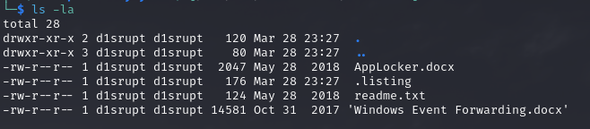

With `doc2exe` I can convert the docx file in text format and the content is pretty pretty interesting, let's analyze one at the time

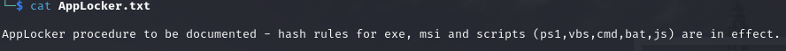

Cool stuff we know that these format cannot be used because will be detected and eliminate, good to know

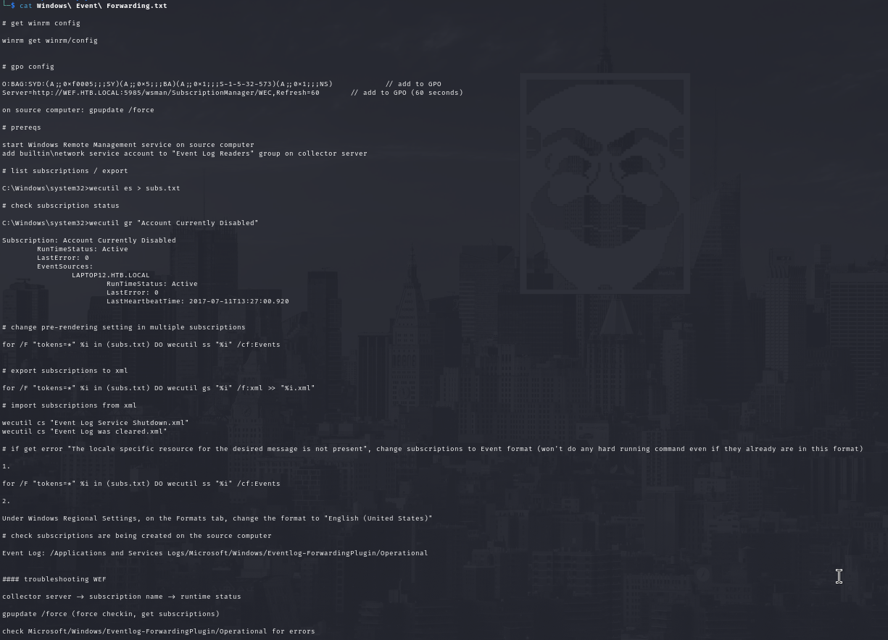

This document file explain how to configure (and implicate on how the machine is configured) the WEF and I can summarize like it follows :

 *  Checks the configuration of WinRM
 *  GPO configuration adding the "Network Service" account to the "Event Log Readers" group
 *  Check of the subscriptions
 *   Check the <u>pre-rendering</u> of Events Subscriptions (how event are detailed before sending) with `wecutil ss`
 *   Backup the subs.txt content to XML with `wecutil gs`
 *   Import the subscriptions from the XML files created with `wecutil cs`
 *   Force the update the GPO with `gpupdate /force`

Nice probably this is what we need to abuse since is playing with the WinRM protocol, before jump in and plan something I retrieved some information from the metadata of the docx

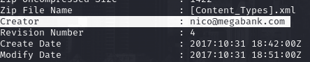

Pretty cool we have an email address and makes sense that we have to deliver a sort of payload from an email attachment, really classic! But before moving on the phish campaign we need to understand what is the payload and the answer is written in the `readme.txt` file, the last one in the FTP share

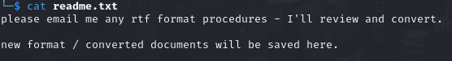

Rich Text Format is used on by different software and when I search for a vulnerability for that a lot of CVE pop-up, a little trick is to use the date of the machine (2018) and find a specific vulnerability before that date. With a little effort the [CVE-2017-0199](https://github.com/bhdresh/CVE-2017-0199). With the linked toolkit we can generate a RTF file that presumably would be convert it and potentially opened but <u>what software is used?</u> No worries metadata would tell us and they don't lie!

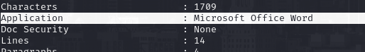

Looking at the github repository the way to obtain an RCE is through HTA and metasploit can host a HTTP server with a malicious HTA with the module `windows/fileformat/office_word_hta` (if you want to feel like a bad guy with the hoodie Empire offers the same feature)

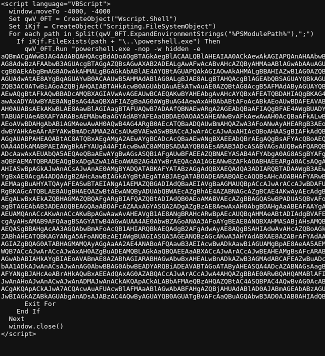

Now we can generate the RTF pointing to this HTA server and send it with  **<u>sendEmail</u>**

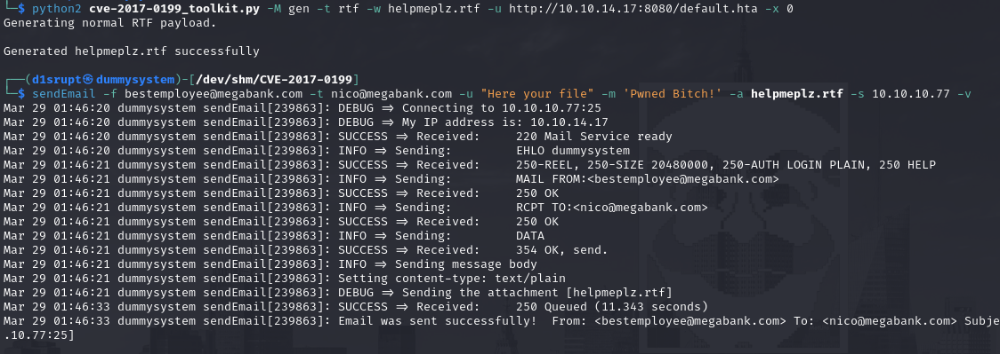

Just wait a few seconds and et voila', we are free to grab the user flag!

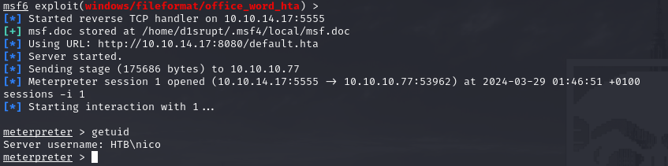

<br><br><br>

# PRIVILEGE ESCALATION
Checking the users we have **krbtgt** so we are inside an AD forest, good thing now is to retrieve some data for BloodHound but there was no way to create data to ingest, strange.
Well on the desktop there is something else with the user flag, a file called `cred.xml`

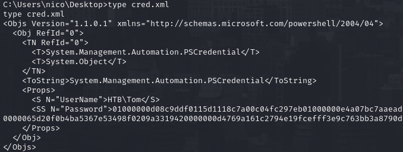

Yeah cool this is not the first time that I approach this, we have 2 ways to use this XML file : like a simple credentials that we can use to spawn a new powershell session or reverse it to get the plaintext. I opted for the latter because the SSH port can give us a more robust shell. 
First let's import the username (**Tom**) and the secure string password in `$cred` variable and use some powershell feature to extract username and password

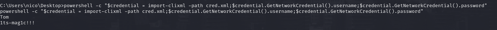

Now we can use it on SSH and we are finally inside the machine as Tom!

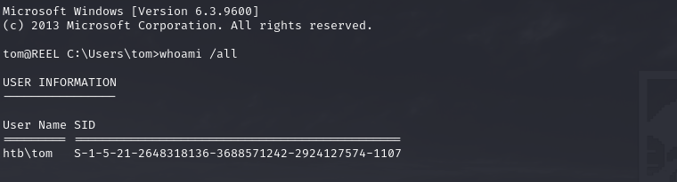

Surprise surprise we have a strange directory called `AD Audit` inside the Desktop with a text file 

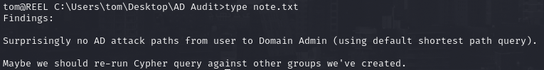

Well, I can do this job for you for free! There is another sub-directory called `BloodHound` containing different extension of sharphound and bloodhound that we cannot run because the group policy but an CSV file `acls.csv` that we can download and put on bloodhound. There was a problem, my bloodhound version dosent support that type of file and I don't want to undo my bloodhound installation just for this machine but no worries we can analyze manually the CSV. After some cleaning and understanding of the data here what it looks like

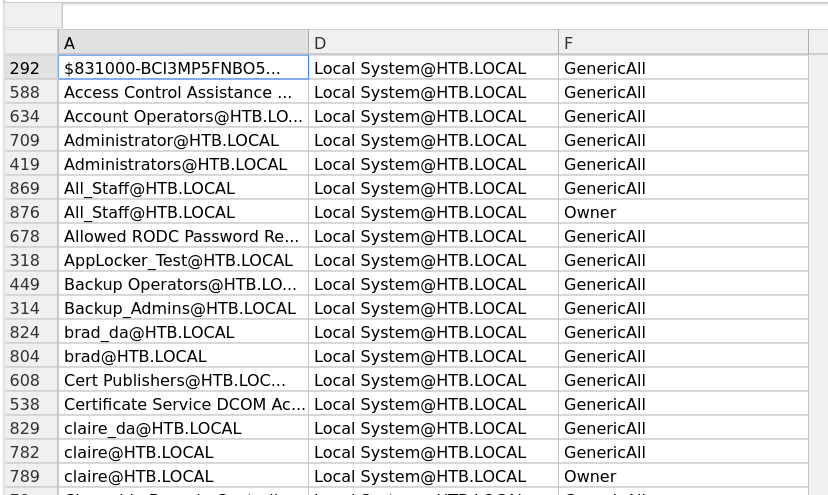

We translate every row in **<u>`D` have permission `F` on `A`</u>** so filtering on Collumn D we got something cool!

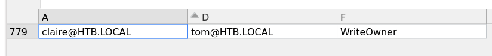

If we have `WriteOwner` on an user we can set Tom as owner and than change the claire password in order to controll it (using powerview)!

```
Set-DomainObjectOwner -identity claire -OwnerIdentity tom 


Add-DomainObjectAcl -TargetIdentity claire -PrincipalIdentity tom -Rights ResetPassword 
```

Now we can change the password

```
$cred = ConvertTo-SecureString "newpass123!" -AsPlainText -force
Set-DomainUserPassword -identity claire -accountpassword $cred

```

Yeah, now we can impersonate a new user

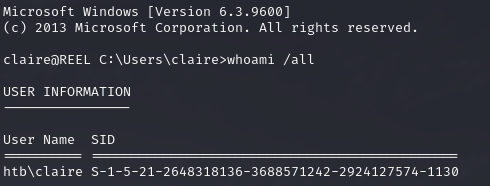

Back to the table, we can check if claire have something interesting to abuse, interesting enough we can add ourselves in the `Backup Admins` group.  We can use standard powershell commands to add clair to this group

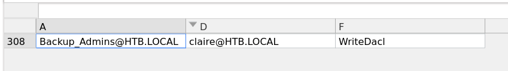

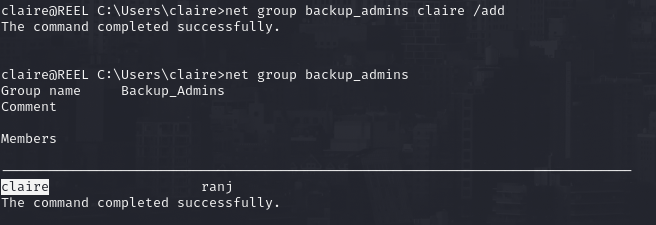

We can access the **Administrator desktop** but cannot read the flag yet. Not a problem because there is a folder named **"<u>Backup Scripts</u>"** where a powershell script within this directory contains hardcoded credentials.

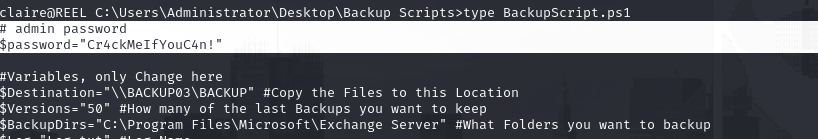

This password is the one used by the `Administrator` account and we are free to read the root flag!

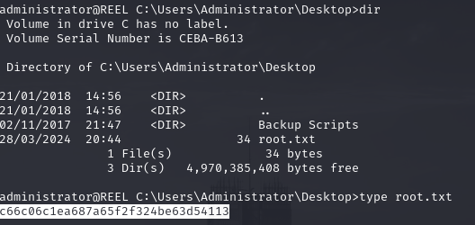
