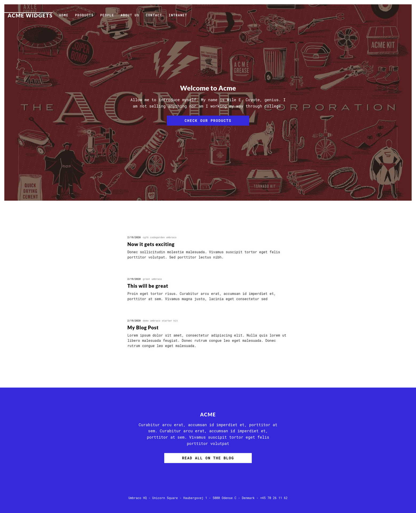

# PORT SCAN 
* **21** &#8594; FTP
* **80** &#8594; HTTP
* **111** &#8594; RPC
* **139 / 445** &#8594; SMB
* **2049** &#8594; NFS
* **5985** &#8594; WinRM

   

# ENUMRATION & USER FLAG & PE
I want to start on HTTP port and take a quick look at the webpage

At the bottom we can see the name `Umbraco` (same thing on the source code) which is a Open-Source ASP.NET CMS
On `/people` we have a some name and suname which may turn usefull for user enumeration

With some enumeration I found the login page at `/umbraco/login`

FTP accept anonymous login but is empty

RPC doesn't accept anonymous login, we don't have other option but look at NFS which ahve something ready for us

Just mount the NFS locally and start the hunt for something that can be used to gain access somehow

The file located at `App_Data/Umbraco.sdf` contain a email address and password SHA1 hash

Cool `admin@htb.local` is our target now we can move on and crack the hash. The plaintext password is `baconandcheese`, just use this credentials and we are inside the management panel

The version is `7.12.4` and we have a known vulnerability exactly for this version

and it work like a beauty <3

Now we can use the `web delivery` module on measploit to gain RCE

Now I used this [PoC](https://www.exploit-db.com/exploits/46153) and change the payload  in order to execute the powershell and get the meterpeter shell

Inside the `Public` directory we have the user flag, we are ready for PE which was really really simple thanks to meterpeter

As I learned (books, article, letteraly everyone) talk that when you get a meterpeter always try to use `getsystem` (obv this would not be the case in some situations that will detect us, I know that)

In this case we are abusing of [PrintSpooler](https://itm4n.github.io/printspoofer-abusing-impersonate-privileges/) (we are inside a Windows Server 2019) abusing <u>Token systems</u>.

PrintSpooler is just a tool to manage print job and a `pipe` is a fragment of shared memory used for communication exchange between process (`named pipes` make possible to exchange data even if process are located in different networks, a sort of client/server architecture)

Having the `SeImpersonate` token privileges we can impersonate the `client named pipe security context`, in this case root!

> The same idea can be applied in the named pipe context. If a process creates a pipe, this process will be the pipe owner or the pipe server. When another process connects to this pipe, it will be called the pipe’s client. Once connected, the pipe server can use the pipe client’s privilege level, the client’s security context or the client’s access rights. This is a Windows feature that helps perform activities based on the client’s privileges, since the server may have full access, but the client typically has more limited rights.
>
>This feature can be exploited by creating a pipe server with limited or low privileges and then attempting to connect a much more privileged client to that pipe server. When that happens, the pipe server can abuse the client’s elevated privileges to perform activities based on those access rights. ([resource](https://securityintelligence.com/identifying-named-pipe-impersonation-and-other-malicious-privilege-escalation-techniques/))

In short, we create a (server) pipe with our limited privileges and we convince the system level user to connecta nd execute a shell for us thanks to win32 API (really simplificate and short)
