# PORT SCAN
* **53** &#8594; DNS
* **88** &#8594; KERBEROS
* **135** &#8594; MSRPC
* **139 / 445** &#8594; SMB
* **389** &#8594; LDAP
* **593** &#8594; MSRPC (HTTP)
* **3268** &#8594; AD LDAP
* **5985** &#8594; WinRM
* **9389** &#8594; .NET MESSAGE FRAMING

   

# ENUMERATION & USER FLAG
The box is an Active Directory Domain Controller on the **<u>megabank.local</u>** domain, the OS is `Windows Server 2016 Standard 6.3`. This version is pretty outdated and I remind of the `ZeroLogon` vulnerability a really powerfull attack on outdated windows server. I run [this checker](https://github.com/SecuraBV/CVE-2020-1472) in order to be sure if is vulneable or not and the output is good to go

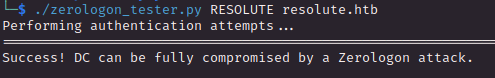

This is cool but I prefer to enumerato more before try to actively exploit this vulnerability

SMB is not accessible by anonymous so I need to move on RPC which accept anonymous, we can easily retrieve a <u>list of users</u>

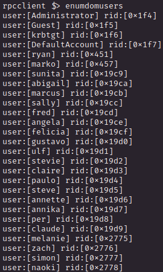

I quickly make a username-as-password brute force attempt with crackmapexec but none woked. Same thing can be done with <u>groups</u>

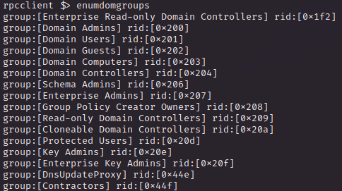

We have more than something here, `DnsUpdateProxy` may probably lead to `dnsAdmin`, `Cloneable Domain` Controllers may lead to `DC sync` and so on but for now these are just assumptions.

> <u>**LET'S TAKE A BREAK HERE PLZ!**</u>
> After some enumeration i decided to perform the zerologon exploit to reset the machine account to an empty string through the metasploit module
> 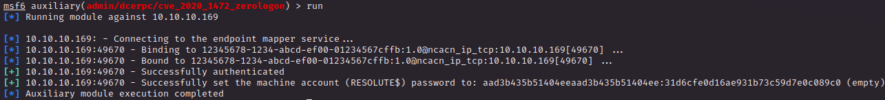
> Now I can easily perform a DCSync and dump all the hashes I want, Administrator included
> 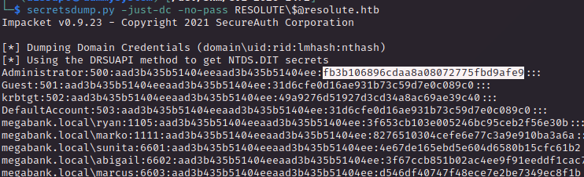
> Now I can just login through WinRM and pwn the box in a blink of an eye!
> 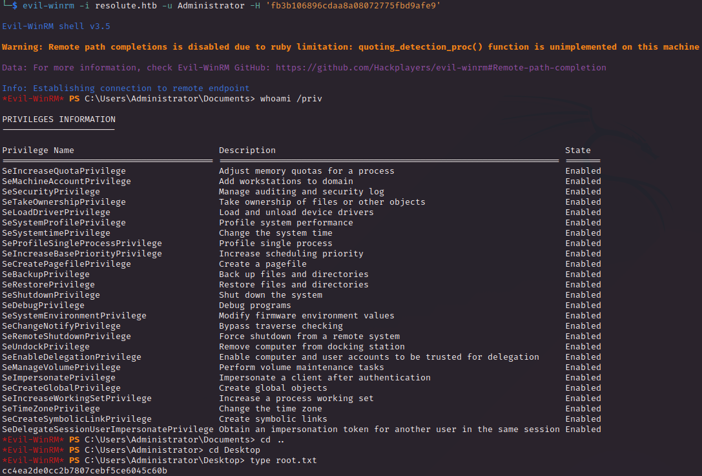
> Everything cool but sound weird to me since we are talking of a medium machine, so I just take a quick look at some writeups and obviously there was an intended path to get the box. That being said I grab the 2 flags and submitted them but I want to train myself to do something more that just run a couple of POCs so I will go through the walkthrough (cool words-game lol) without relying on ZeroLogon despite the fact I finally used this well known vulnerability

Is a good practice to take a look at users description in order to gain powerfull information or hardcoded password, `marko` description fit the case perfectly 

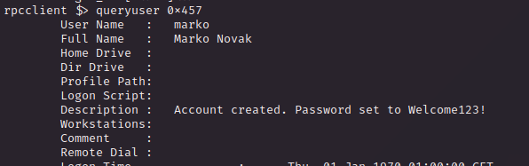

It doesn't directly works with the `marko` user but with crackmapexec we can check if another user use the same password

Dear <u>**melanie**</u>, thanks to allow me to get inside the domain contoller and retrieve the user flag. Whish you the best :)

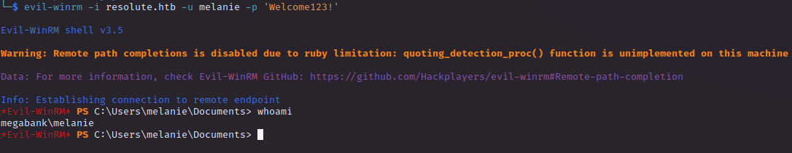

   

# PRIVILEGE ESCALATION
`Melanie` user doesn't take part of particular special groups 

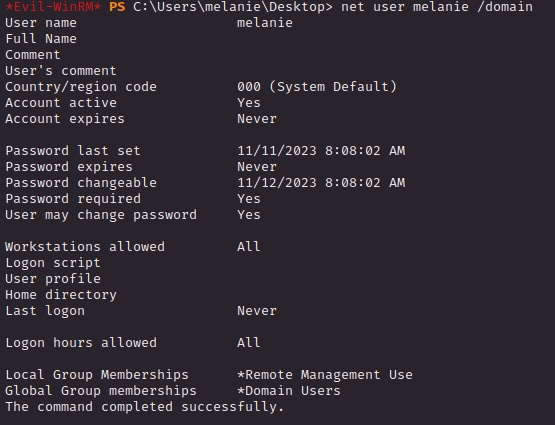

In the root directory we have a directory called `PSTranscripts` which may contains some lof of powershell

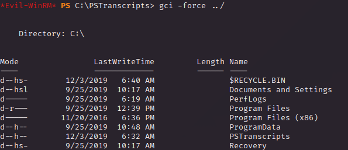

I was not able to check the content inside the directory but I hve searched online and adding `-recurse` at `gci -force` we would retrieve the contents

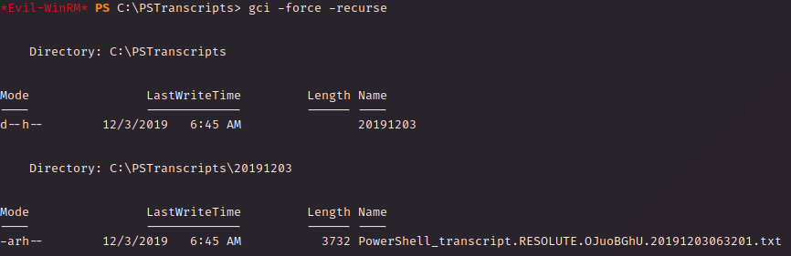

The file contains logs file of `ryan` user

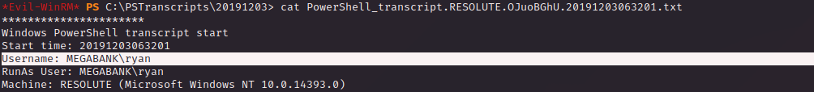

Let's see if can get a password

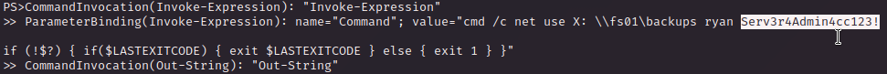

With the credentials we have we can login on resolute with a more privileges than before

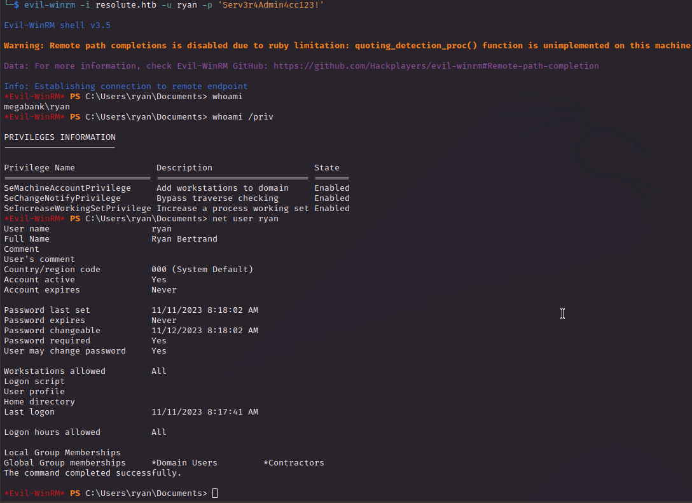

Inside the Desktop we have a txt file called `note.txt`

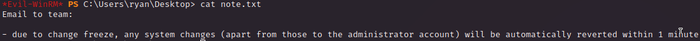

UHMMMMM, we are part of `Contractors` and with the power of powershell (powerview and sharphound are blocked by Windows Defender) we can see it's part of `DnsAdmin`

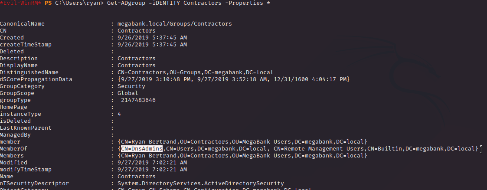

(same thing can be achieved with `whoami /groups`)

Cool stuff we can exploit this permissions we can force the Domain Controller DNS service to run a specified DLL (which will run as `nt authority/system`)

 

1) Create a costum DLL that will give us back a Shell with msfvenom and put it in a SAMBA server running locally

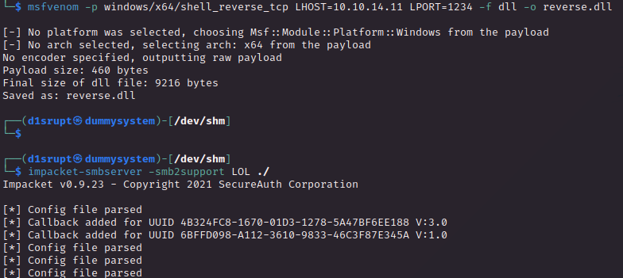

 

2) Set the DNS service to load the DLL

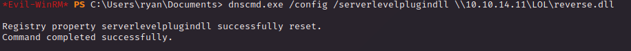

 

3) Restart the DNS service

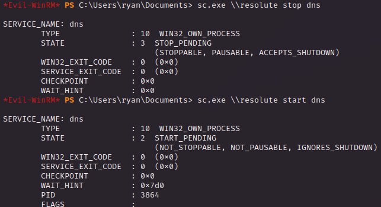

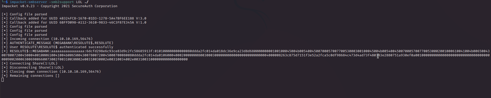

  

Now just wait a few seconds an netcat will popout for us

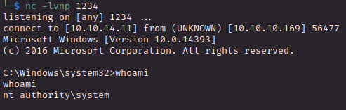

Gottch'a!

DNSAdmin abuse is something that luckly I have done already in a project for a UNI course that I am attending so good thing to refresh this things
