# PORT SCAN
* **22** &#8594; SSH
* **80** &#8594; HTTP 

   

# ENUMERATION & USER FLAG

The homepage is a brochure for a mobile app which permit to connect your smartphone to your router, nothing interesting in the site itself but on the `apk` download (`RouterSpace.apk`).

This is the frist time I play with this file extension, so I used to decompile it with `apktool`

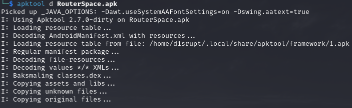

I tried to look inside for some information or, in the best scenario, hardcoded credentials but nothing the APK internal is pretty dense (and obfuscated) so we can try to emulate it to perform some dynamic analysis...but how? There are a lot of ways and honestly talking I look at walkthroughs made by other to find the way suitable for me. I opted to use `Genymotion` in combination with `adb` (as always installation phases are skipped because is not relevant at all, I am not a teacher lol)

While I download a Mobile instance with **Genymotion** we can extract and manipulate the burpsuite certificate which can be used by the mobile device and intercept the request with burpsuite. Most of the times vulnerabilities in Android or IOS involve API that's why we need burpsuite to work with the mobile device

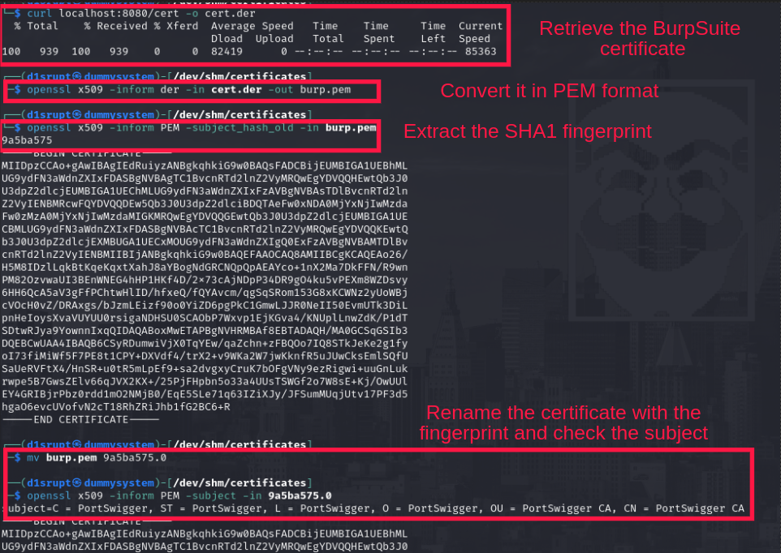

Now is time to import the certificate in the android device and this is where `adb` will kicks in, genymotion attach automatically the virtualized devices to adb (which is great!)
First we can change the fylesystem permission adding write capabilities (as standard is read-only) and "push" the certificate we made

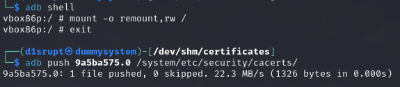

We can check that everything is ok in `Trusted Credentials` section inside the security settings, PortSwigger should be present there

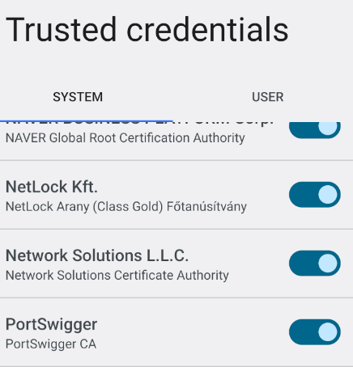

Now we can use the `adb shell` command to add the proxy pointing to BurpSuite (which we hav to change the proxy to be on all interface)

Now we are free to intercept the request with BurpSuite (easier than expected and I have learned quite few things!)

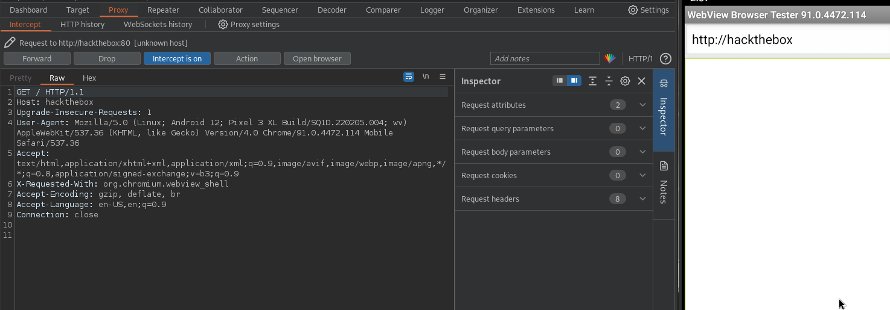

Now we can drag the apk from our machine to the mobile screen and will be automatically installed and run, we are good to go now we just need to fix the network error when we push the only button available `Check Status`

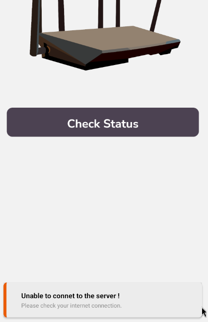

I tried different way to fix this but was easier and faster to run another device, with the standard `Google Pixel` now it works fine!

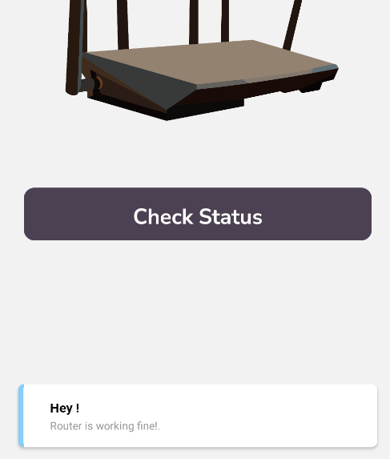

Cool stuff! Now we can intercept the request and put it on the repeater to see the response

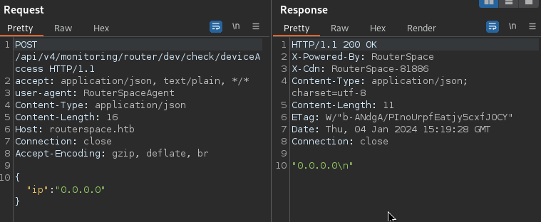

Whatever is the strings on the `ip` field would be echoed back, I tried to do some OS injection and we have it!

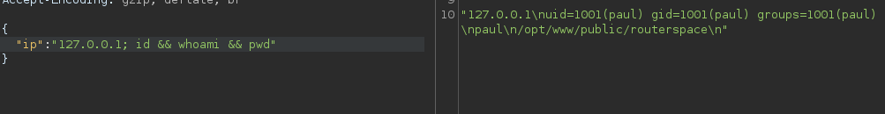

Cool RCE is accomplished correctly now but we are not able to reach our attacking machine (`ping` and `wget` apparently doesn't work) but we can inject our ssh public key in the `authorized_keys`. Now we can ssh inside the machine and grab the flag!

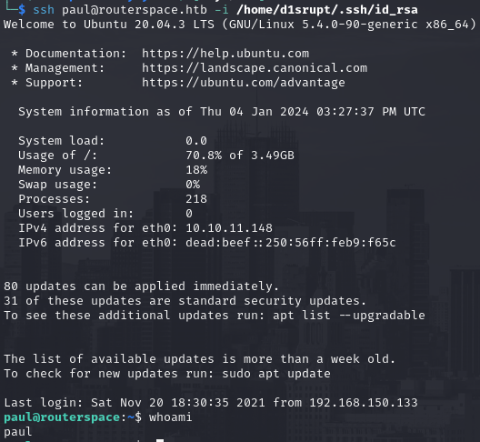

   

# PRIVILEGE ESCALATION
We still can't ping the attacker machine but SSH should be fine alone if we need to upload or download files. By the way the target system seems pretty clean, no special capabilities or SUID binaries probably we need to perform some **<u>Linux Exploit</u>**

LinPeas suggest [GNU Screeen 4.5.0](https://www.exploit-db.com/exploits/41154) but is not working instead we can use a more common one, the [Sudo Baron Samedit](https://www.qualys.com/2021/01/26/cve-2021-3156/baron-samedit-heap-based-overflow-sudo.txt) a heap overflow which affect `sudo` and used to spawn a shell as root

We can easily check if is vulnerable or not with this command, if it ask for the password we have a good chance we can exploit it

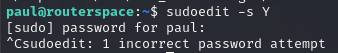

[This](https://github.com/worawit/CVE-2021-3156) is a cool repository with a lot of version of this exploit, the author suggest to use **<u>exploit_nss.py</u>** as first

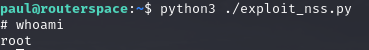

Luckly is all for this box!
