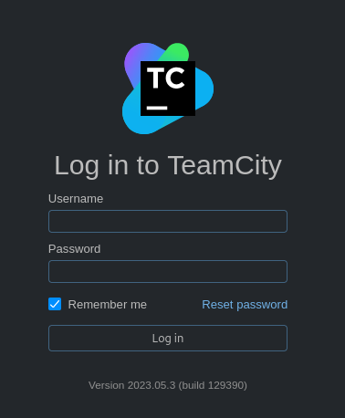
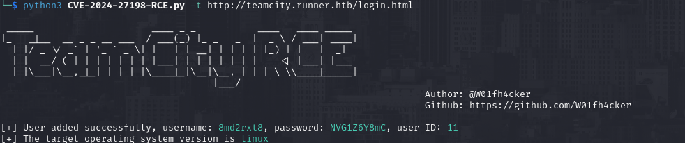
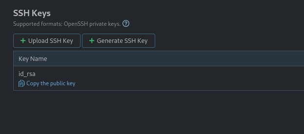
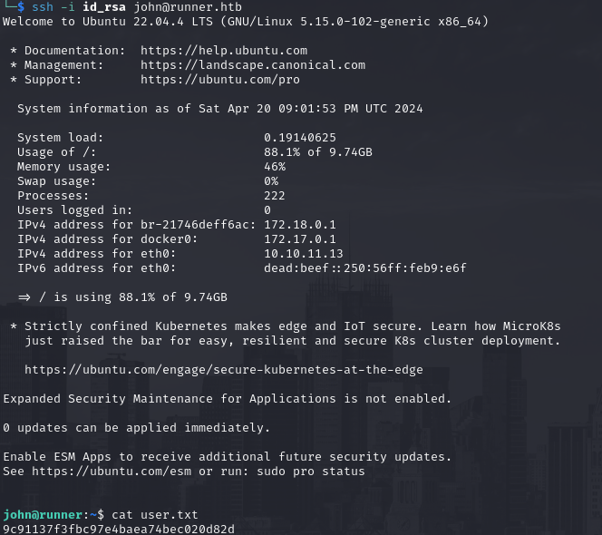
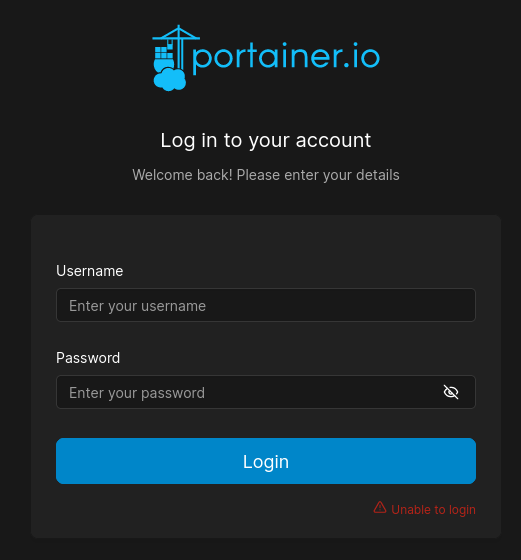
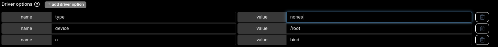
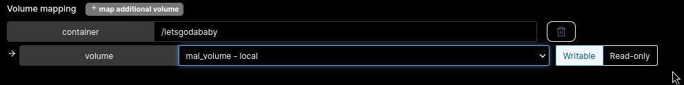
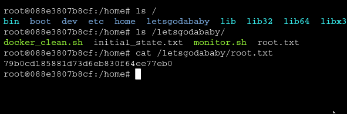

# PORT SCAN
* **22** #&8594; SSH
* **80** #&8594; HTTP (nginx 1.18.0)
* **8000** #&8594; Nagios

   

# ENUMERATION & USER FLAG
The homepage present the machine as a company for CI/CD solutions

The port90 is a simple brochure static page with nothing relevant so I changed my focus from port 80 to port 8000. Using **GoBuster** I found the API endpoint `/version` (which return **0.0.0-src**, weird output) and `/health`. With subdomain busting I have found the **<u>teamcity</u>** subdomain with a login panel of the well known software

This version is vulnerable to [CVE-2024-27198](https://github.com/W01fh4cker/CVE-2024-27198-RCE) that permits an authentication bypass and login inside the panel as admin, that's cool!

We can use the credentials created to access the TeamCity Panel	and I get an idea of the Admin name which is `John`, than a SSH private key can be found

Now we can copy, paste it, give the right permissions and SSH as jhon inside the machine

   

# PRIVILEGE ESCALATION

Inside the apache configuration file we have another subdomain configured on port 80 called `portainer-administration.runner.htb`

I have try to fetch some information about the credentials but nothingu sefull popout so I decide to use some brute force with Hydra and th credential `matthew:piper123` are valid. `Portainer.io` is a UI docker orchestrator, we can create docker container (just a simple ubuntu image is available) inside the machine. The idea is to make a bind mount on the host, inside the docker container we have root permissions and if we can get inisde the host filesystem we can read the contents of `/root` (another abuse is to create a root SUID bash binary that the standard user can reach and run it to become root directly on the host). We need to create a **<u>tmpfs</u>** volume in Portainer.IO and use the volume driver option to set it up correctly.

Than while creating the docker instance let's link the volume on a new directory inside the container

After the deploymen we can visit the directory we have created and read the root flag!

