## PORT SCAN

I had to use the flag **-Pn** to skip host discovery otherwise the host seems down for nmap

* **22** [SSH]
* **80** [HTTP] &#8594; filtered (with SYN and TCP scan)
* **55555** [UNKNOWN]

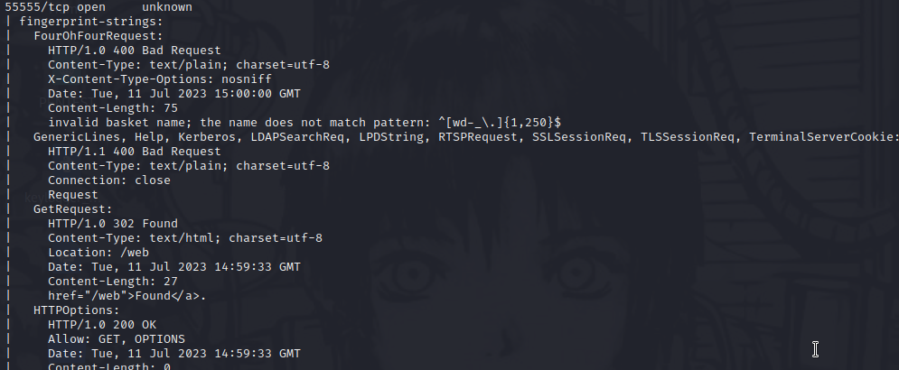

From the nmap scan on port <u>55555</u> we can see LDAP, KERBEROS and a path **/web**. With a search on the internet I found that this specific port is wdely used by trojan (but I think this is not the case).


Since port 80 is filtered and I can't access through my browser I went directly on port 55555 and we hae something similar to a e-shop(?)

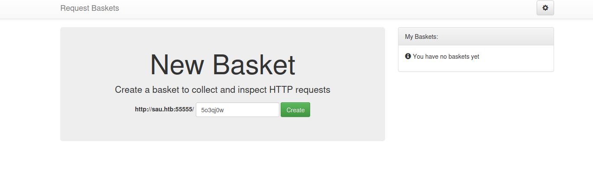

I will use normally this site (while a dirb scan is active on the background) 

Ok so this is based on [this github project](https://github.com/darklynx/request-baskets) (a [demo](https://rbaskets.in/web/wxwdvk1) is also available and is the same as the machine)

And here is how it works 

1) We create a new <u>basket</u>, used to collect and inspect HTTP requests (POST request to **/api/baskets/[BASKET_ID]**)

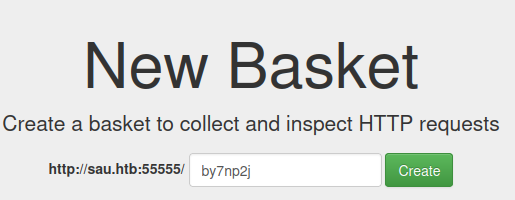

2) After the creation we are prvided with a <u>token</u> with a box telling us teh basket succesfully has created

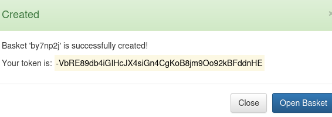

3) When we first open the basket (at **/web/[BASKET_ID]**) is obviously empty 

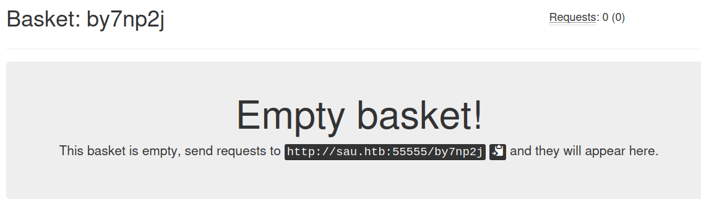

4) So we have to visit the path **/[BASKET_ID]** to put an "item" (or better saying the request) inside our basket (what we have as output is a empty page)
5) Than return back to our basket and here we are

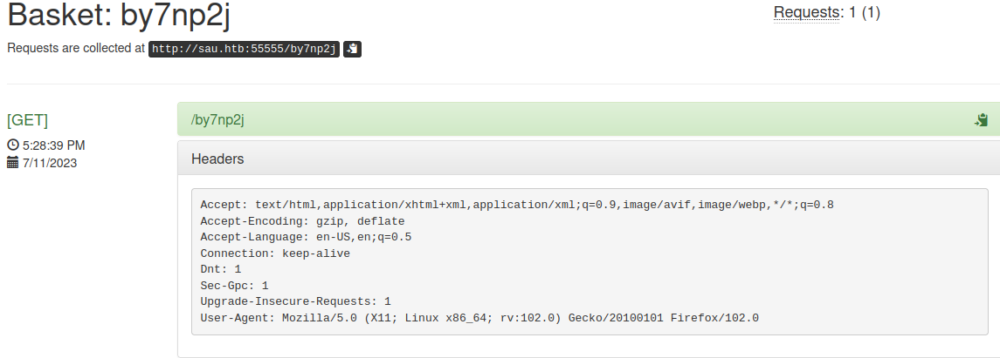

One of the features allow the user to change the response of the collected requests, maybe this can be useful but I prefer make some enumaration before act in a way or another 

One more thing is the **<u>master token</u>**, visiting **/web/baskets** a dialog box appear telling us to provide the master token and as reward wecan see all baskets...maybe this master token is what we need to achieve, cool!

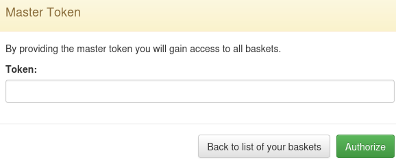


Ok, maybe we are well orienteted. request-baskets (<= 1.2.1) is vulnerable to SSRF with the **/baskets/[NAME]** ([CVE-2023-27163](https://notes.sjtu.edu.cn/s/MUUhEymt7#))

A small briefing about the CVE is needed to understand what I did.
In SSRF the attacker is (somehow) able to craft a request send by the server-side in order to read or submit data

In this specific CVE this is the [payload](https://gist.github.com/b33t1e/3079c10c88cad379fb166c389ce3b7b3) which is able to trick the vulnerability 
```
POC: POST /api/baskets/{name} API with payload - 
{
	"forward_url": "http://127.0.0.1:80/test",
	"proxy_response": false,
	"insecure_tls": false,
	"expand_path": true,
	"capacity": 250
}
```

Now one fetures seems to fit exactly this payload, let's get a look at it

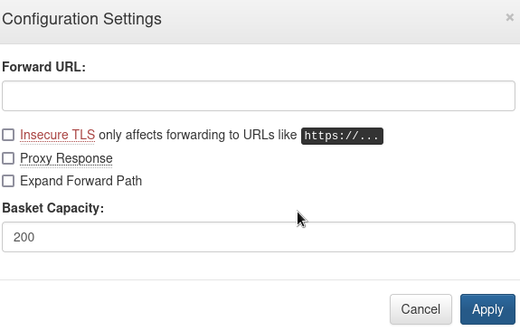

That's the exact match which fits with the CVE so cool I've decide to play with this a little changing the Forward-URL and check all the boxes.

After a while I remind of the port 80 which was not reachable before but through the SSRF we can have a little seeking about what is running.
(at this point the assumption on the master token was wrong goo to know because the risk of the rabbit hole is always looking for me!)

Just set the Forward-URL to **sau.htb:80** and enjoy the view

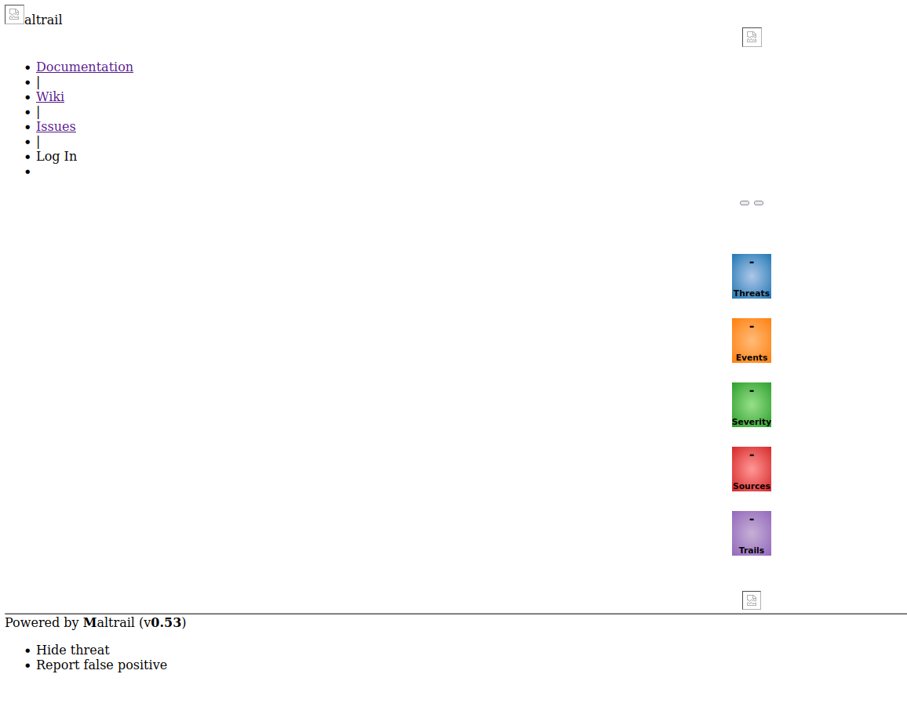

Now we know is running **Maltrail v0.53**, this software is a malicious traffic detection system checkin using pubblic lists of malware, executable and patterns. I found a [unauthenticated RCE](https://huntr.dev/bounties/be3c5204-fbd9-448d-b97c-96a8d2941e87/) for this version of maltrail...finally we have our way

So what I did first was to create a simple shell command pointing at my machine (and the following netcat listener) and run a simple http server with python. Than I change the Forward-URL adding the **/login** path.

For the explotation I used curl (like the PoC of the RCE) and I got the shell!

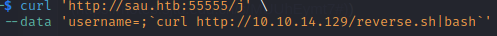

Just follow the home path and get the user flag!


## PRIVELEGE ESCALATION

Linepeas gave us this cute little guy

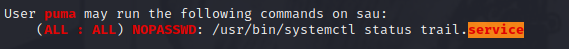

This gave us the status of Maltrail service and we are doing it as root, interesting but how can we abuse it?

As a first approach I focused on the Maltrail service but nothing usefull obviously so why don't let **systemctl** have all of my attention? 

This is what I did and I remember past machines where you can run some commands as superuser through sudo and everytime I check the appropiate section of [GTFO bins](https://gtfobins.github.io/gtfobins/systemctl/).

We got it! When status is called also **pager** (like `less`) is called and inside we can write the following string `!bash` will invoke a root shell, WE MADE IT!

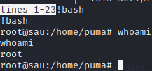

 
