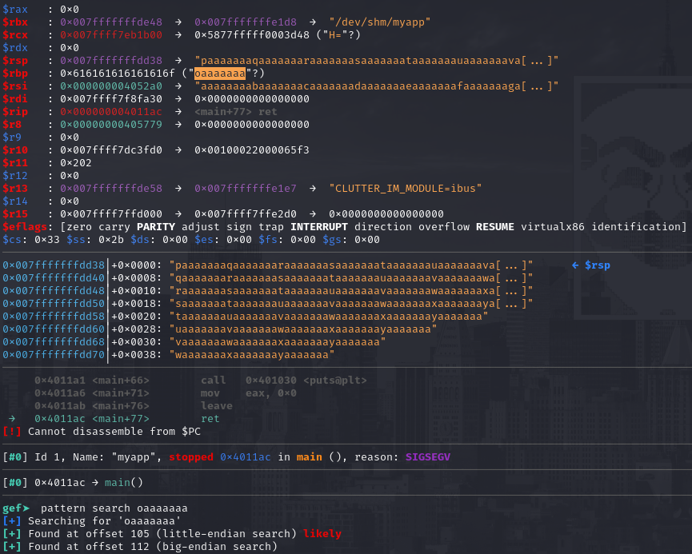

# PORT SCAN
* **22** &#8594; SSH
* **80** &#8594; HTTP (APACHE 2.4.25)
* **1337** &#8594; UNKNOWN

   

# ENUMERATION & USER FLAG
**Port 1337** (or "LEET") is unknown but I can interract with it through NetCat

port 80 is useless (at least from this first look) which is just the default APACHE page, even with some dirbusting of subdomain enumerations nothing changes. Pretty tough situation right here but when I have looked at the source code we have our first hint!

Cool, at `/myapp` we can download the binary that is running on port 1337 and I used Hydra since it doesn't look too complex, the results is pretty simple

`gets` and `puts` are not safe and makes the binary vulnerable to stack overflow, I took a loooong string just to be sure at voila' we need to deal with binary exploitation!

Cool, with GDB I can check the security measures in play and **<u>NX is enabled</u>** this means **<u>ROP Chain</u>** but ret2libc is not an option since I have no clue of the lib content (especially the relative address of the function). With `strings` on the binary makes able to look what functions are used and **system** is already saved inside the binary which is great, w have mitigated the fact that we have no access to libc

By the way let's go step by step and find the buffer size, using `file` command I know we are inside a 64 bit infrastructure (x86) and with `pattern create` and `pattern search` return the size dimension of 112

112 of buffer size means that with 200 (112 + 8) we can fill the base pointer, to prove this I have injected a payload of 112 A and 8 B (in order)  

`system` is availabe and is used to execute `uptime` and the address is **00401040**

Now I have followed the [0xdf writeup](https://0xdf.gitlab.io/2019/10/26/htb-safe.html#shell-as-user) (I know is bad but I am very bad at binary exploitation so I was not able to solve it alone, I am bad I know) and I have learned a cool way to exploit this. We are going to leak both libc address and `/bin/sh` offset and than combine it with `system` to get a shell. 
Before start is healthy to explain a few things

1) **<u>PLT address</u>** = Procedure Linkage Table, used to call external procedures with unknown address (in linking time) which is resolved by dinamic linker at run time
2) **<u>GOT address</u>** = Gloabl Offsets Table, massive table of addresses on memory of the libc functions

The address of `system` found before (0x00401040) is **PLT** while `0x00404020` is the **GOT** and what we need to accomplish is **<u>[RET-2-PLT attack](https://ir0nstone.gitbook.io/notes/types/stack/aslr/plt_and_got#ret2plt)</u>**,

Also is important to note how RDI is used to load the address of `system` function parameters using **LEA** assembly function (you can see it putting a breakpoint after LEA instrucion has been called and check the contents of RDI)

After this brief lessons on binary we can go through and look at the other funxctions that are loaded in the binary, one of this is `test`  found thanks to **GHIDRA**

That's cool because the `jmp r13` instruction, with this we can hijack the running flow filling **r13** with something we want to execute like `system` and on the top of the stack the `/bin/sh` in order to spawn a shell! What we need now is a gadget that can help us to insert a value inside R13

I will choose the first one just to not copy and paste from existing writeups so our payload will be something like this 

`JUNK + BIN_SH + GADGET + NULL + SYSTEM + NULL + NULL + TEST_FUNCTION`

Obviously python is awsome for such things

Now we can run it and let's gooo!

> After this ,achine I decided I will take some spare time to train my binary exploitation skills, this would also help me in reverse engineering skills and I think being comfortable with machine code is a good thing. I also understimate this because I like to focus on network skills but actually is pretty fun BE too!

   

# PRIVILEGE ESCALATION
Inside the user home folder is located a **<u>KeePass</u>** file

I have copied on my local machine and try to crack it and worked for 30 minutes while I was eating....I think password cracking is not the way to solve this box lol. What's funny is all the  JPG file in the same directory where the `kdbx` file is located

Well, everything is transfered on my local machine, the images are simple photos made with a phone os nothing relevant. I tried to check metadata and even `steghide` but pretty empty stuff. I have searched online for "KeePass image file" and I have looked through the [keepass documentation](https://documentation.help/keepass/keys.html)

Interesting whatever file can be used as key with the requirements of enough randomness data, a JPEG is pretty suitable for this task but how we handle this? Well `keepass2john` have a flag that permits to specified a keyfile to use 

Cool we can try a bruteforce within the bruteforce trying to crack all possible hash created with all possible JPEG as key file

Cool stuff, now we can open the password safe (the hash cracked was the one generated from `IMG_0547.JPG`) so is time to navigate the safe with `kpcli` and `show -f 0` to retrieve the root password. Pretty straightforward and cool the image trick!

