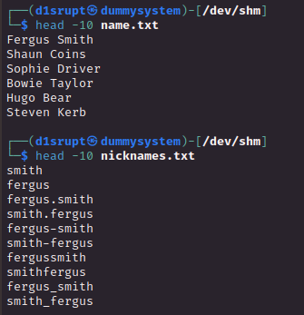
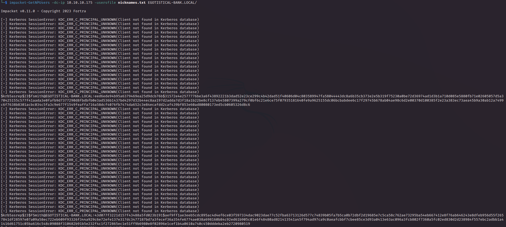
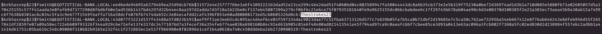
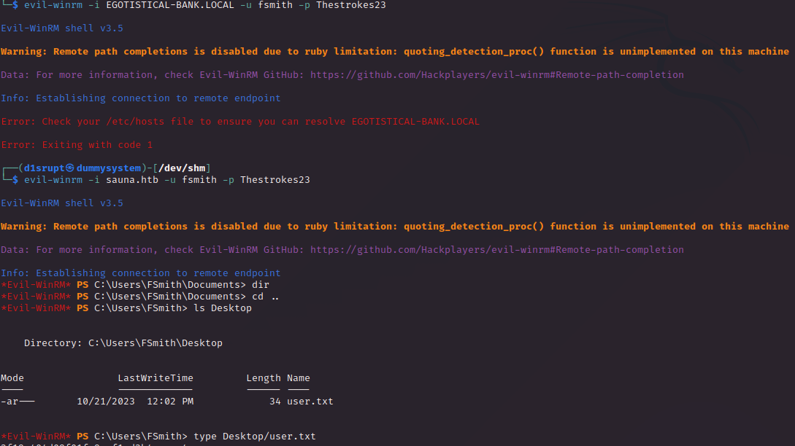
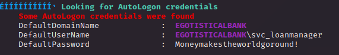
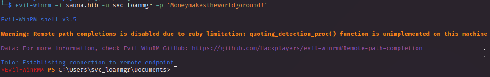
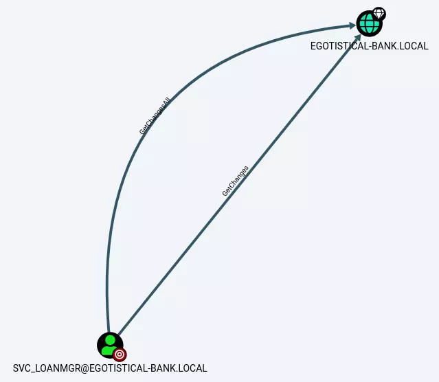
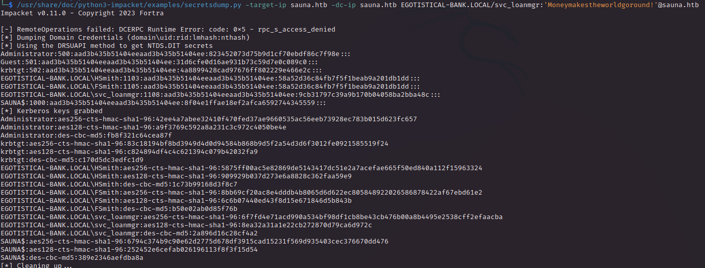

# PORT SCAN
* **53** &#8594; DNS
* **80** &#8594; HTTP
* **88** &#8594; KERBEROS
* **135** &#8594; RPC MAPPER
* **139** &#8594; SMB over NBT
* **389** &#8594; LDAP
* **445** &#8594; SMB over TCP
* **593** &#8594; RPC
* **3268** &#8594; LDAP
* **5985** &#8594; WinRM
 
    
 
 # USER FLAG
 The box is a domain controller on the `EGOTISTICAL-BANK.LOCAL` domain, starting from the HTTP port we have a static site without user interaction (no form, no uploads, no nothing). In the `/about` page we have the team employee names
 
 
 
 This name nad surname can quickly become a list of potential valid username, I found [this usefull script](https://github.com/florianges/UsernameGenerator) using a text file with name and surname will output a text file with common combination used for username creation
 
 
 
 Now I was able to perform ASREP roasting using impaket script `GetNPUsers`, the `fsmith` user is vulnerable and we have 2 different ASREP password hash 
 

Both return the same plaintext password (hashcat)

Now we can login through WinRM and get the flag

   

# PRIVILEGE ESCALATION
Inside the machine we can know that `svc_loanmanager` use AutoLogon and we can extract teh dault password

Cool, a service user can become really usefull if can get controll of it. There is no user called `svc_loanmanager` but we have one pretty close to it `svc_loanmgr`, we can try this password on this username on Evil-WinRM to get access

Now I just extractd teh info for bloodhound and look at the shortest path to get controll of the domain

This mean we can do a DCSync attack using `secretsdump.py`

Cool we have the administrator hash we can try and use it on evil-WinRM to get a shell

Grab the flag and take the reward!
