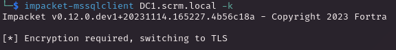

# PORT SCAN
* **53** &#8594; DNS
* **80** &#8594; HTTP (IIS 10.0)
* **88** &#8594; KERBEROS
* **135** &#8594; MSRPC
* **139/445** &#8594; SMB
* **389/636** &#8594; LDAP
* **1433** &#8594; MSSQL
* **4411** &#8594; ???
* **5985** &#8594; WinRM

   

# ENUMERATION & USER FLAG
The domain of the target is `scrm.local` so it's time to update the hosts file. Also port `4411` is pretty uncommonand with a first research is still not clear what the service is located there, well I guess I can start from port **80**

Nothing usefull on the `Home` or `Reports` but `IT Services` have something for me

Bad news **<u>NTLM</u>** is down well we have to figure out how to overcome this because Kerberos should be used as authentication method but let's see the other link in this section like `/supportrequest.html`

Well we have a user called **<u>ksimpson</u>** now let's move on `/passwords.html`

I tried with `ksimpson:ksimpson` credentials but no way to access at least for now. Finally we have a clue about what is inside **port 4411** on `/salesordes.html`

Interesting stuff but without credentials is pretty uncommon that I will be ble to get an eye on that service.
Returning back to the credentials I am pretty sure they are correct but (obviously) with **NTLM <u>disabled</u>** the default crackmapexec will not work. We need the FQDN of the Domain Controller and returning back to the namp output is `DC1.scrm.local`su

Well know we can ask for a TGT ticket

We can use this TGT to get the SPNs related to this user with `GetUserSPNs`, we need to specify the `-k` flag to force Kerberos authentication and most importantly the `-dc-host` specifying the FQDN of the Domain Controller otherwise and error will occur

Cool the sql service account have a SPN for `ksimpson` so now we can make some kerberoasting with `-request`

With `hashcat` I was able to bruteforce it and retrieve the plain text of the password which is `Pegasus60` now I will switch the TGT getting another one but for the sql user instead of ksimpson and use it to access MSSQL

Bad news we still don't have access

Makes sense, remember everything is doing with Kerberos not with NTLM so we need to think with this in mind. To access the MSSQL we need a ticket, **<u>A SILVER TICKET!</u>** With one of that we would be able to access the DB and extend more.

Now we need the NTLM hash of the `sqlsvc` password, sounds funny usually we need the opposite . I used a simple generator online and use bash to convert all in lowercase

Next we need the Domain SID, I have already encounter this need and `GetPAC`sc of impacket kicks in

Now we can craft the ticket specifying the SPN of the target service

Finally we have access! We can also enable `xp_cmdshell` so we have a way in

Is time to use the web delivery module of metasploit to gain a shell

This user doesn't have the flag so I need to go deeper a little more. The `sqlsvc` user have the infamous **<u>SeImpersonatePrivilege enabled</u>** so root can be easily achieved that way but I wanna learn so I will put this method on the shelf 

I enumerated further the DB and I found a credentials for another user which have a directory in `C:\Users`

This is cool now we can use this credentials to run a new powershell session and than re-establish a reverse shell with metasploit with the `-ScriptBlock`

Now the flag is in our hands!

   

# PRIVILEGE ESCALATION

We have 2 things here which are both related with the port `4411`, the first one is the path of the service inside the target

Plus this user is in the `ITShares` group so finally we can have a look at SMB where we can find the Client of the service

Cool, they are .NET assembly this means dnspy will be our best friend from now one, <u>DECOMPILE TIME!</u>
We have some serialization and deserialization inside the DLL file

Interesting let's see where this is used, let's keep in mind this dictionary object because we can interract through NetCat with those (they are under `ScrambleNetRequest`)

There is a method which use the `Serialize method`

And we have the one that is using the `Deserialized method`

Actually we need to focus on the `UploadOrder` function, serialize the input and will probably deserialize on the Server side. This sounds the way client and server communicate through serialized object, let's see if we can make a **<u>deserialization attack</u>**. So the `BinaryFormatter()` is used before being base64 encoded, this seems enough to run **<u>ysoserial</u>** on my windows VM and create a serialization object running a powershell command which will trigger the usuale web delivery module of metasploit

Gottch'a looks cool! We just need to figure out how to inject it, well we know that `UPLOAD_ORDER` will be the request type and the parameter are served adding a `;` whatever is next to it will be the value of the parameters. We can see that here

Cool, we can now use the ysoserial payload as parameter which would be serialized and than deserialize at the server side triggering the command we have embedded

Beautiful, the meterpeter shell is triggered wounderful!

We have high privilege now, the root flag is mine!
