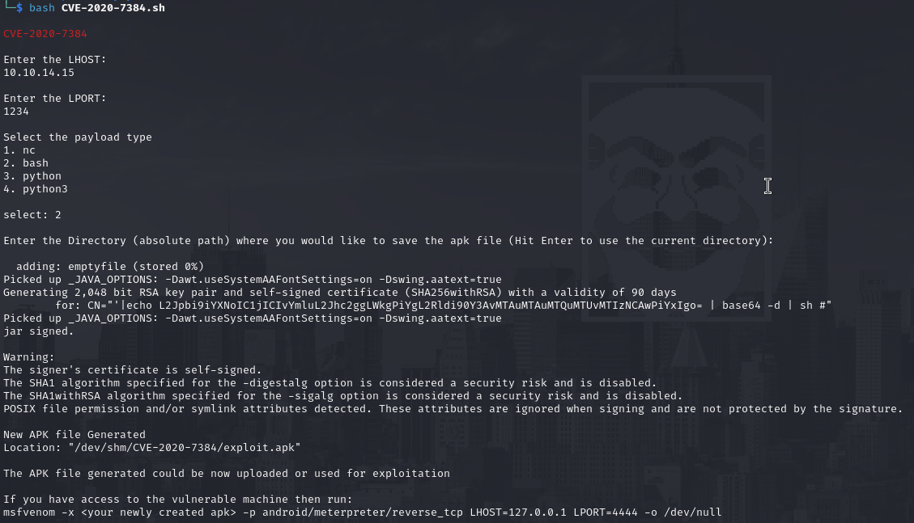
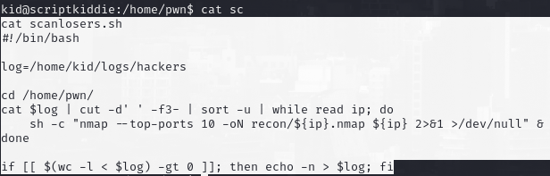

# PORT SCAN
* **22** &#8594; SSH
* **5000** &#8594; HTTP (Werkzeug 0.16.1)

   

# ENUMERATION & USER FLAG
Finally a box made for me LOL, obviously we have to look through port 5000 which is a really website for kiddies

The nmap scan can reach my local machine

By the way they are simple forms which are (probably) used as parameter so I tried some OS injection but this kid is not too much noob as expected

Interesting stuff OS injection are not possible so we need to focus on the only webtool which allows us to upload a file, `msfvenom`. So I searched for some vulnerability on msfvenom which include a template file to be executed, the response was [CVE-2020-7384](https://nvd.nist.gov/vuln/detail/CVE-2020-7384). Thanks to a crafted APK we can execute remote command if msfvenom use it as template and this [PoC](https://github.com/nikhil1232/CVE-2020-7384) is well done for this purpose

Now we just need to upload and set whatever ip you want after a few seconds the reverse shell will pop up! User flag is in the home directory of **kid** user

   

# PRIVILEGE ESCALATION
We have a `logs` directory in the home folder which name of file inside is pretty interesting

"hackers" ah? maybe the error we had before can now be usefull! The log file is filled with the soruce ip when the error `Stop hacking me - we'll hack you back` that occur when a non alphanumeric character is present in one of the parameter (the content of `app.py` is pretty usefull here)

We have another folde in the home directory called `pwn` which inside have a bash script that use the ip inside the log and scan it with nmap and then delete the records inside it (this is why when we try to read the file is empty). I also check with TCPDUMP and is actually scanning so there will be a cronjob or watchdog that trigger the script

We can write inside the file `hackers` so I injected this to perform OS injection

It was not working because thescript will cut the first 3 whitespace (`-f3-`) and treat them as single strings so we can use something little different

Now we can try to pop another shell but this time as **<u>pwn</u>**

Now that we are in as **pwn** we can execute as root the metasploit framework!

this is a pretty good thing, through `msfconsole` we can exevute OS command and with this permission we will do it as root. Easy!

