# PORT SCAN
* **53** &#8594; DNS
* **80** &#8594; HTTP
* **88** &#8594; KERBEROS
* **135** &#8594; MSRPC
* **389 / 636** &#8594; LDAP
* **443** &#8594; HTTPS
* **445** &#8594; SMB

   

# ENUMERATION & USER FLAG
What caught my eye here start from the NMAP scan because there is no WINRM port (usually available when the machine is a domain controller) so probably we would get inside the machine only with Administrator credentials through PSEXEC. But this is too early to think about this stuff so let's move on the website.

Pretty cool website, the machine is rated as hard but we are in AD enviroment a truf that I feel a (little bit) more comfortable. What can become usefull is the name and surname of the company team, we can play a little bit with Kerberos to check exisisting username

I used [usernamer](https://github.com/jseidl/usernamer) to generate a wordlist of potential username given a file with name and surname on every line. Now we can use one of my favorite tricks (I think this works good in CTF but is not ideal in a real engagement, too noisy) let's force ASREP roasting on the username list and check the ones that return `UF_DONT_REQUIRE_PREAUTH`

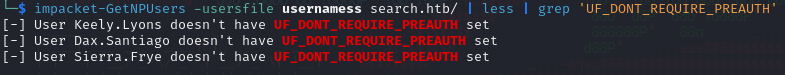

You see? Cool ah? Now we have something, it would be greate if one of them have PREAUTH enabled but that's fine is a good start. Ok this is a pretty stupid thing honestly (this type of things are the one that I hare of CTF) but look closely on one image of a carousel...this where we have a potential username and password 

Bruh. We can look the good side of it we have a username and a potential password. I have updated the username list and try some password spraying

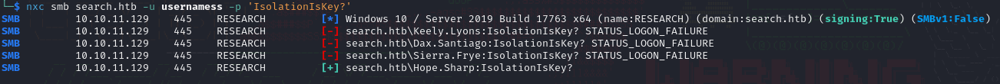

Coooooool stuff! now we have access to a valid account and we can explore a little bit more ehehehe. Let's start from the SMB share

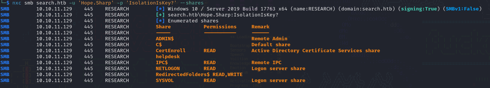

Also let's collect the LDAP info with `ldapdomaindump`, I took a look and we have a huuuuge list of user, computers and groups.

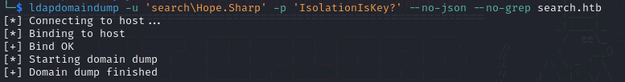

I was so happy to have an user controlled by me that I have jumped directly to possible Kerberoasting and surprise surprise we have it!

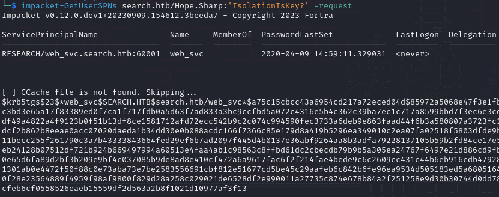

Tell me no more the powerfull cat is ready to roar!

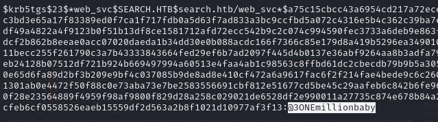

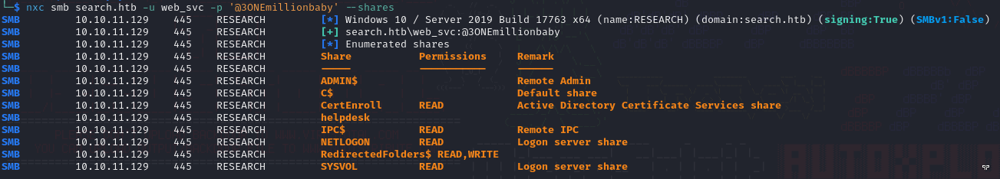

Nice we have a second user available. I get inside the **<u>CertEnroll SMB share</u>** and is just a fodler with boring crt files. I want ot have access on the `HelpDesk SMB` share instead so makes sense to collect all the user in that group thanks the power of grep files retrieve from LDAP

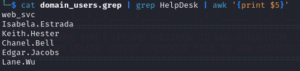

Now back to password spraying!

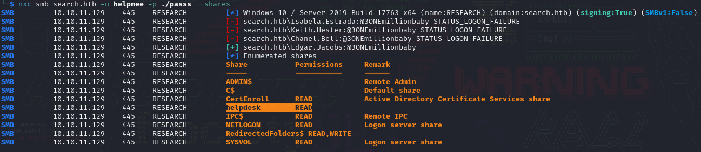

Oh yeah, Active Directory ILY <3

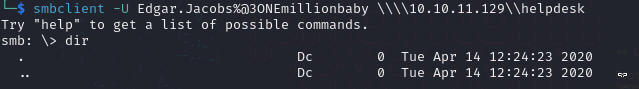

AHAHAHAHAHAHAHA no way! Well at least we have a new user but omg what a pain, come on! :(
Well we got something else, the share `RedirectedFolder$` is just a link to the home folders, using the credentials of **Edgar.Jacobs** I get inside his home directory and the Desktop have something cool!

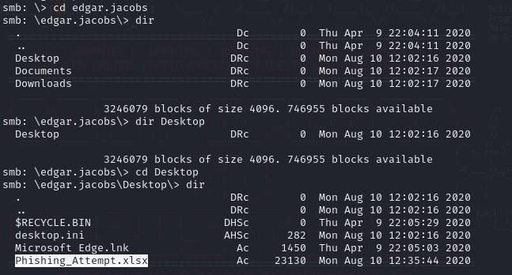

We can take a look at it on a online viewer, something is strange....

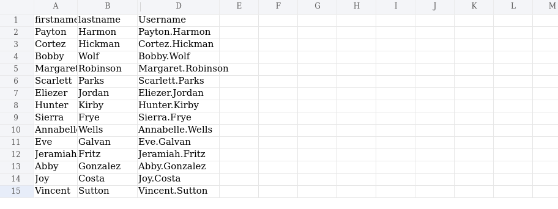

Look closely, the column `C` is missing. That's bad probably is protected from an optional password which is displayed only on Excel (or LibreOffice), the online viewer simply don't ask for it and simply hide it. Go and look at other writeup and make a laugh on how much simple this was compared to the intended way lol (but really usefull to understand how to bypass that).

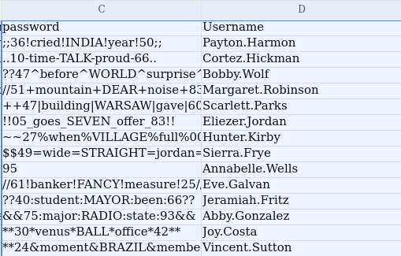

Gottch'a we have a new list and passwords let's see if they are still working

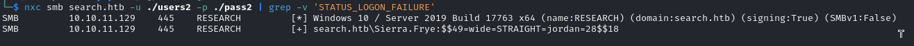

Good morning Sierra I'm going to take your account for a while see ya! I get back to the `RedirectedFolders` share and we have our flag, finally the first half of the reward!

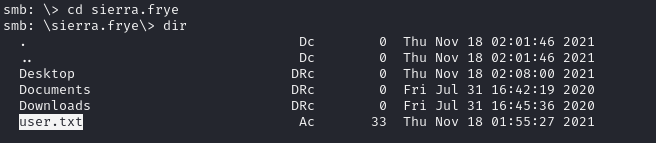

   

# PRIVILEGE ESCALATION
Now is time to get inside the machine, no need to rest let's go. We have a backup folder with inside a PFX and a p12 file

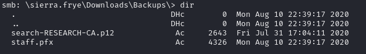

Trying to export on firefox required a password, uauauuau time to use pfx2john and crack it. Didn't require too much before retrieving the plaintext

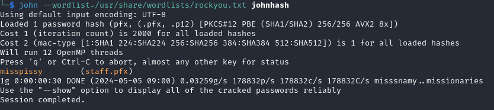

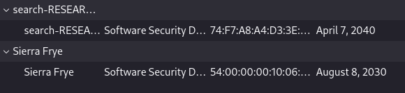

I forgot to say that during the dirbusting process the path `/staff` has been found, probably now with this certificate we can acces it and look what we have

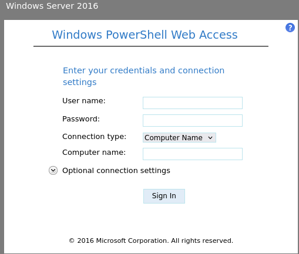

Using the credentials don't work but probably because we need to specify the computer name. LDAP info now are usefull as hell I need to find the FQDN of the domain controller

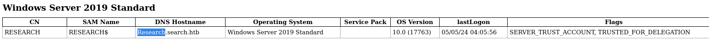

Boom easy, gottch'a

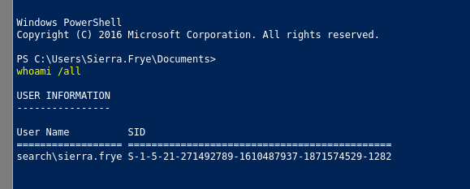

I cannot spawn a meterpeter shell with the web delivery module but that's fine we would use this not so beauty interface. I think is time to feed bloodHound and start analyzing permissions from there, let's see where we can get.

First thing first we have a non-standard user part of the administrator group

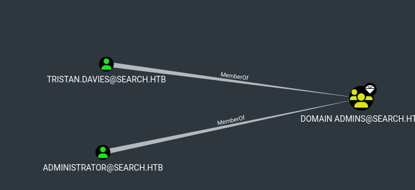

How we can reach this bad guy right here? Well let's ask to our favorite AD sniffer dog

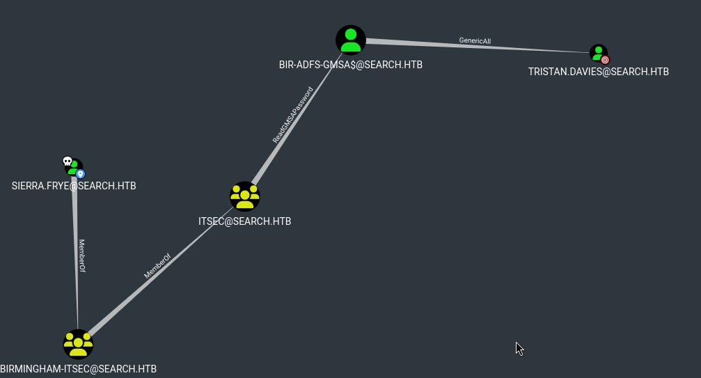

Hell yeah, I know how to abuse this! Simply talking we can read the **<u>GMSA</u>** password, the **<u>Group Managed Service Account</u>** members are accounts that don't need human interaction and permits to other object to read their password in order to execute service/program with their privilege on remote machine (for instance running the same service but on different hosts, a sort of benefic crackmapexec). Since we have the possibility to read it means we have control of the account as well.

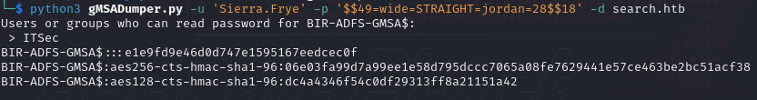

We are in AD so the hash is fine for our objective, `BIR-ADFS-GMSA$` have **GenericAll** permissions to the Administrator user. We can change the password with `pth-net` and than is officially game over!

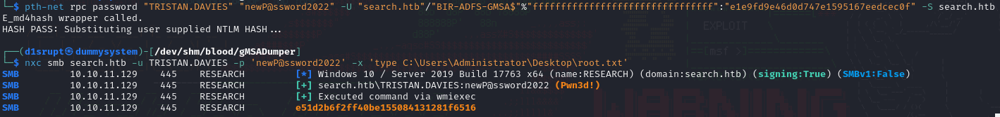

Oh yeah the web-powershell was useless because I prefer playing with my sweet Kali machine but a good refresh on how to use certificate hurts just the ones that are not going to do it ;)
