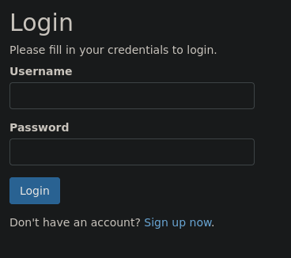
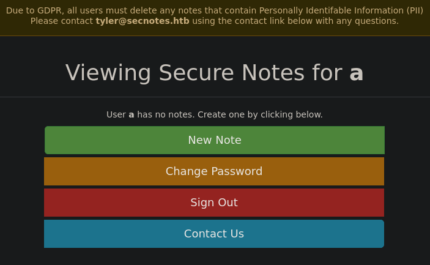
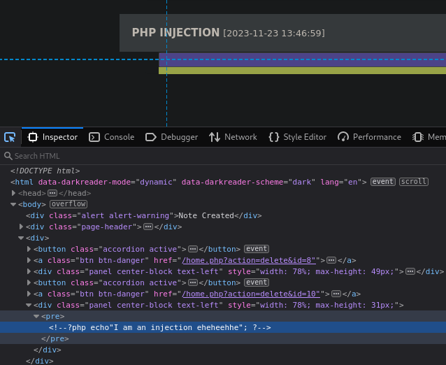
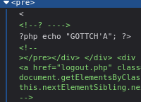
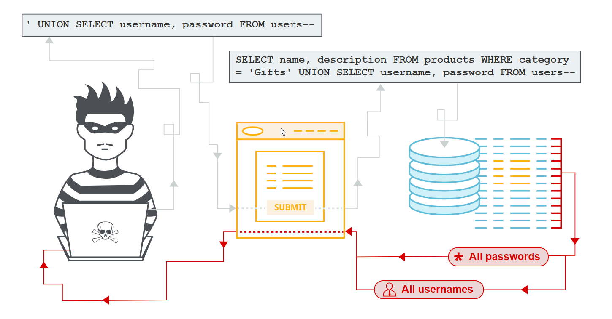
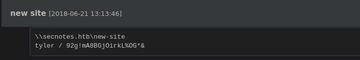
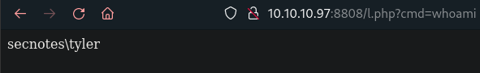
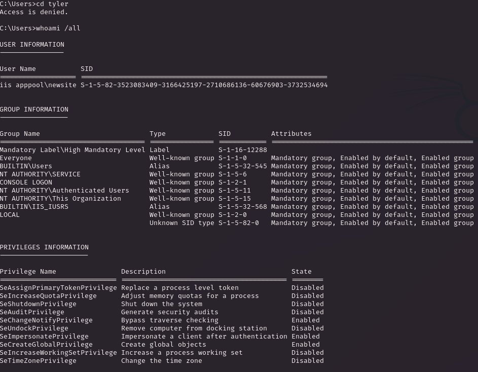
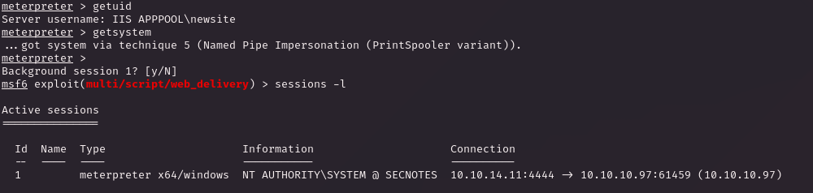

# PORT SCAN
* **80** &#8594; HTTP (IIS 10.0)
* **445** &#8594; SMB
* **8808** &#8594; HTTP (IIS 10.0)

<br><br><br>

# ENUMERATION & USER FLAG
SecNotes homepage (port 80) present us with a simple login page, where we can create a brand new account



When we get access we have full access to the website functionality (also a potential username)



When we create a note we can view it on the user homepage, I tried with a PHP injection and well something happened



Probably there is a sort of sanitization that transform the php tag in comments, interesting

If we inject something like this 
```
<<? -->?php echo "GOTTCH'A"; ?><!-- >
```

We have this results, we are pretty near to retrieve a php line if it wasn't for that first `<` that should be attached to the `?php`


I was not able to get closer to the line on my head and after some attempts I decided to drop, probably will not even work

Good try but I decide to restart taking a look behind the curtains

> Yeah, probably will be more professional check from the start with burp what type of request we are sending but, hey! I like to play!

I tried some way but actually no results at all, this time I faile :( (webapp pentest is my weak point uff) but I found only a cute way to solve this puzzle, **<u>second order SQLi</u>**

This is something slighty new for me, in second order SQLi we will store the value of the SQL statement that will be called in a second request



That's cool now the "poison" will not be injected directly at the first request instead we will stored on the DB and than reused in a second request.

Stay with me:
1) Create a new user called `' OR 1='1` with whatever password you want
2) Login as `' OR 1='1` and what happen here is that we will see every notes stored from every used, smart ah?

Well at least I have learned something new, btw we have some free credentials, thanks tyler to trust secnotes!



We have a directory inside SMB called **<u>new-site</u>** but contain just the standard of a IIS brand new created site but we can append data like a php shell. Actually the "new-site" is hosted on the port 8080 and we will put a reverse shell and get the user flag after we conncet...but I have a surprise here while I was struggling to find a working reverse shell and we will pass directly on privilege escalation :)

<br><br><br>

# PRIVILEGE ESCALATION
Ok this will sound different for the majority of writeups and sounds like a noob way to solve it but hey, was cool found this easy way.

A said above I was struggling because none of the reverse shell worked (not even upload netcat executable and run it through php, idk why) but I know that with the simplest of the php reverse shell I have access as `ryan`



Fine ah? Well you can find the "default" way to get root in every writeup I saw online, in my reasearch of a reverse shell I found the [Ivan Sincek PHP reverse shell](https://github.com/ivan-sincek/php-reverse-shell) on [revshells.com](https://www.revshells.com/) and surprise surprise we are in BUT as `iis appool\newsite` and we have no access to the user flag. But my surprise was grater than the (apparently) delusion so I tried to enumerate this user and see how much different was from ryan user.



Uau, we have the powerfull `SeImpersonatePrivilege` enabled (now that I am more keen than before on windows I am starting to love when I see this <3)

So what I did was spawning a meterpeter shell through the **web delivery metasploit module** and while I was going and try to use the juiy potato module I said "Why don't give a try at `getsystem` command", usually I skipped but this machine was full of surprise (in any case the juicy module work as well)



BEAUTIFUL! BEAUTIFUL! BEAUTIFUL! We are root and free to get both flags!

I have communicate the issue to **<u>0xdf</u>** (was a honor to chat with him a little bit) and confirmed that no one rooted the machine in this way. I am still figuring out the real motivation behind it but for now I think the point is that the `Ivan Sincek` PHP reverse shell code fork and use a deamon to spawn an interractive shell (calling cmd.exe or bash) so probably bypass the user who is running the webapp and use the one who is running xampp or whatever **WBMS** supported by the reverse shell

> I know this is really a noob kiddo script kiddie move but is really surprising and most important personal. I have litteraly spent half and hour and check if there was at least 1 writeup or osmeone who encountered this way and I have not found (this also can be because in writeup people describe the "right" path not the best one ehehehe) someone else with my root path. The actual intended path was to access on a WSL Ubuntu OS inside the windows machine and check the .bash history where the Administrator password lies and use PSexec but with this method we bypass all of that thanks the IIS account's privileges

> Lately hacking (well idk if CTF can be actual called "hacking" lol) has become more fun and addicting, even if I don't feel skillful enough I am really enjoying and starting to think with the right mindset, persistence is power and sometimes (like this machine) obstacle can be as much rewarded as fraustrating, now I will for sure keep in mind to try this PHP shell and see if I get access as a more powerfull user than the intended one. Hacking is cool!
