# PORT SCAN
* **22** &#8594; SSH
* **80** &#8594; HTTP (NGINX 1.18)
* **3000** &#8594; NODE JS (EXPRESS MIDDLEWARE)

   

# ENUMERATION & USER FLAG 
The webpage is quite self-explenatory, to get foothold we have to play with API

We can download the files that are used by the server side and the server itself provide the documentation where we can find some technical details about this <u>API Authentication System</u> : **JWT tokens** and **MongoDB**

I am pretty bad on whatever is involved with Web Pentest so I will start from the files the sites allows us to download, what's interesting is the `.git` folder where I found some interesting logs

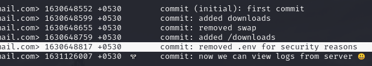

Cool stuff, actually we already have the `.env` but the token has been censurated. We can use `git show [GIT_COMMIT]` to view the changes and the moral of the story is to never ever give you **.git** away like is nothin'

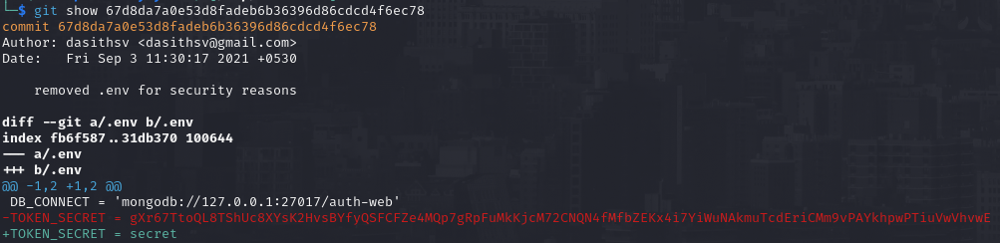

Now (with a lot of patience, LOL) I used the API to register a new user 

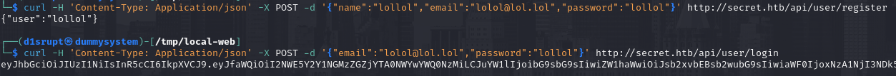

Now I was pretty lost but luckly we can see what the webserver is running and we have collected a good amount of information but is actually not enough for now. The `private.js` file contains some interesting stuff starting from a potential **<u>OS injection</u>** through the `/logs` endpoint 

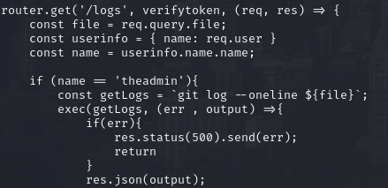

Also highlight the fats that only the user `theadmin` can access this feature and here's the issue we have to solve, obviously we can't create this specific user because it alreasy exists

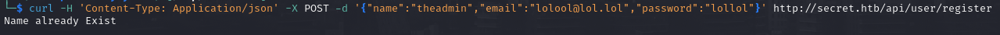

Pretty unlucky but we have the SECRET TOKEN which is used to create valid JWT and in short our job here is to replicate the JWT creation by ourselves, cool! We can use the JWT we get when we have create (and login as) the new user on [jwt.io](https://jwt.io/) changing the username to **theadmin** and using the SECRET TOKEN in the signature field

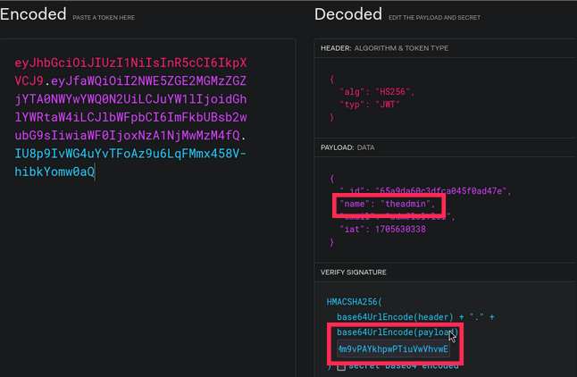

I can check this using the `/api/priv` endpoint and is valid!

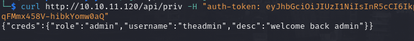

We made it now we can move on the `/logs` endpoint and with the code in our hands is a child game

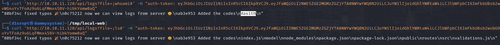

Hell yeah! OS injection work well now let's try to get a reverse shell (my way was to create it locally, use wget on the remote machine to upload it and finally execute the reverse shell from the OS injection) after that the flag is waiting for us

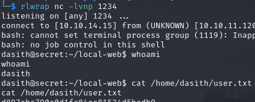

   

# PRIVILEGE ESCALATION
We have an interesting file with SUID on `/opt/count` so I tried to run it and the behaviour looks like a summarty of a specifc directory/file

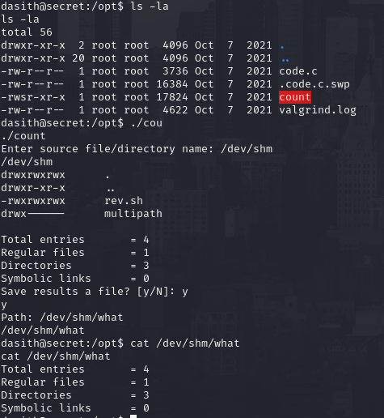

Obviously we can abuse the SUID to set directory or file unaccessible as standard user but there is not much output just some scan summary. We can read the code of the binary located on `code.c` and we have the **PR_SET_DUMPABLE** set to true!

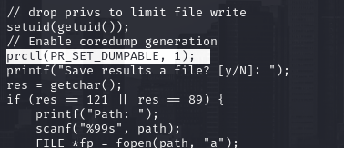

When a process crash, linux make a core dump and save it on `/var/crash` and usually they report what thet process "were doing" before crash, maybe we can retrieve the flag in this way. We need to crash the process we launch manually and the **<u>SIGSEGV</u>** low level signal can become pretty handy for this. I spawned another reverse shell, execute the process and on the other shell kille with `kill -SIGSEGV [PID]` and we have made the process crash! 

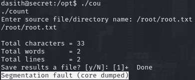

After that in `/var/crash` the core dump file will spawn and we have enough permissions to read and move it wherever we like!
On this `.crash` file we can use `apport-unpack [.crash_file] [destination]` which read the crash file and create a directory as report with different file but the one we need us is `CoreDump`. If we use strings on it we can read the flag!

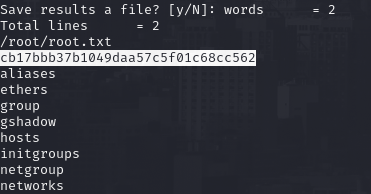

  

> Another workaround was through <u>**File Descriptors**</u>, if we look carefully the C code we (should) note that every descriptor opened is not closed and thanks to PR_SET_DUMPABLE are not flushed. this means that we can open the file `/root/root.txt`, put the process in background and visit /proc/[PID]/fd and choose the ID which is linked with the file we want to read. In this manner we bypass the restriction on `/root`!
