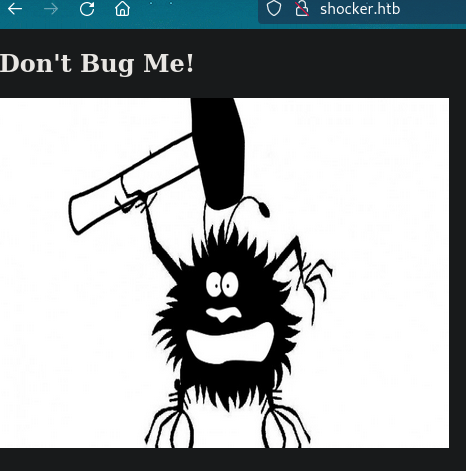
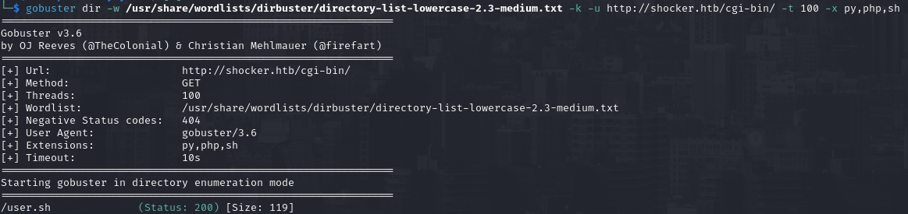
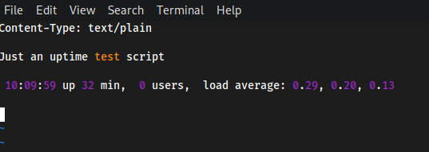
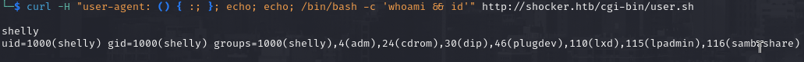
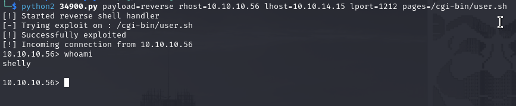
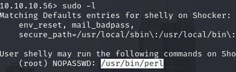
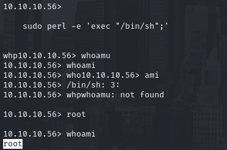

# PORT SCAN
* **80** &#8594; HTTP ()
* **2222** &#8594; SSH

   

# ENUMERATION & USER FLAG

Interesting choice to move the SSH service to another port (2222) by the way is pretty useless without credentilas so let\s take a look at port 80

"Don't bug me"? uhm, I think I will soon or later. This is just a static page and the webserver doesn\t seems to support PHP so we need a strong enumeration before proceed to out attack
Dirbuster found the `/cgi-bin` this special directory is **Common Gateway Interface** and allows to communicate directly with the hosting server with usually the [allow-script set to true](https://stackoverflow.com/questions/1913894/cgi-bin-directory-contents-what-else-can-be-stored-there-apart-from-the-cgi-sc) it makes sense to force enumeration on specific file format like Python,Php and bash script

Cool stuff! I had to take a look at the official walkthrough because I was pretty lost, it appears the machine name is a hint for [ShellShock](https://github.com/opsxcq/exploit-CVE-2014-6271)

Cool now we can perform RCE and spawn a user shell! I had some issue doing it manually but with searchsploit we can retrieve the module **<u>34900</u>**

Good, we have access to the user flag now!

   

# PRIVILEGE ESCALATION

This looks pretty simple, with `sudo -l` we can execute as root without password the perl binary!

We can execute perl code with the `-e` flag and spawn a high level shell!

We made it!
