# PORT SCAN
* **22** &#8594; SSH
* **80** &#8594; HTTP (nginx 1.23.1)
* **9093** &#8594; copycat(?)

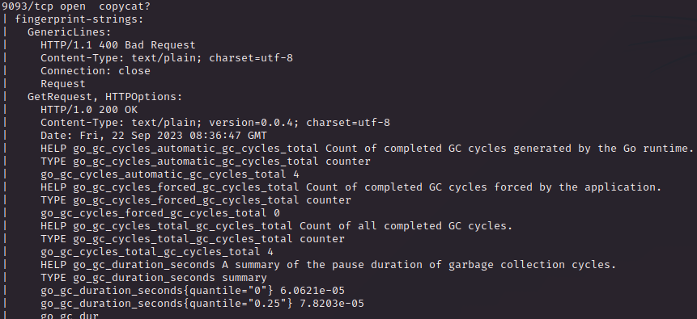

  

# ENUMERATION & USER FLAG
The website homepage have just a counter acting as release time to wait for the actual website 

But with a directory busting I have found **/admin** which, obviously, redirect to **/login**

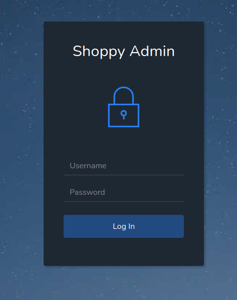

I have tried a bunch of default credentials but none works, so I decided to use burp to analyze the request and find a way to abuse it. Unfortunetely there is no SQL or OS injection, so while I was running a **hydra bruteforce sessions** and a **wfuzz subdomain busting** I start to investigate on the `9093` port, as much as we can see is the **<u>GO language used</u>** and something called `playbook`

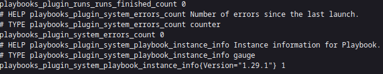

With some research online the closest thing can be running is [mattermost](https://github.com/mattermost/mattermost-plugin-playbooks) which is a secure HUB that allow tech teams to collaborate (a sort of Microsoft Teams). I have already used this service on a previous machine so will be fun to use it in a different scenario.

As far as I know is that we would probably find a subdomain like `mm` or `mattermost` so I waited for the sesion of `wfuzz` to end and see the results

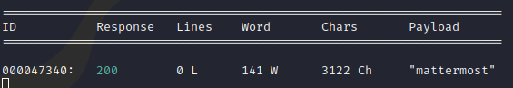

So I added `mattermost.shoppy.htb` t the host file and let's see what we have

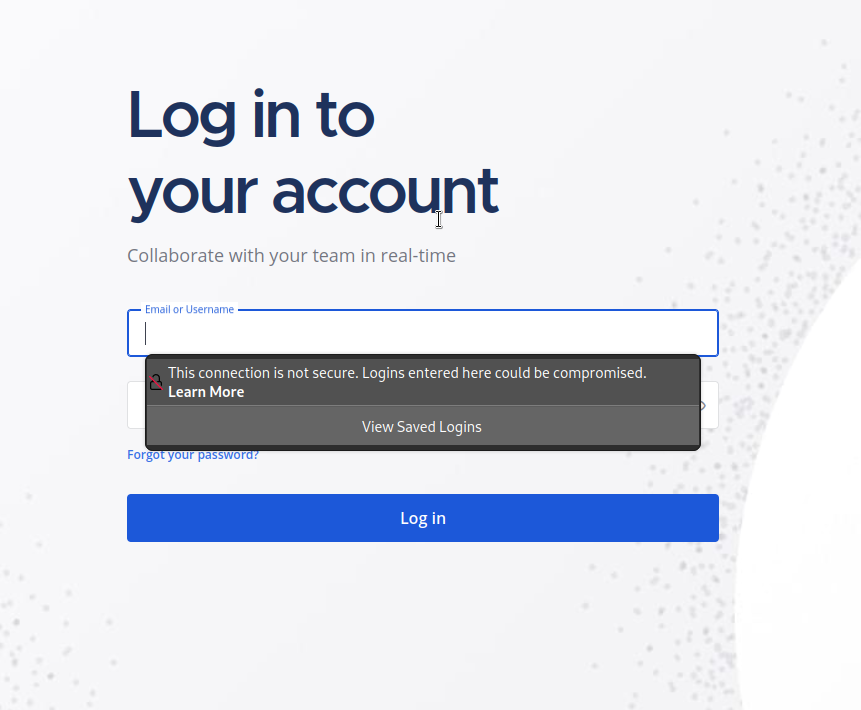

Cool, here too I try to use some defaul/weak credentials but none works...

Try with a step back, on **shoppy.htb/login** I have tried SQL and OS injection but what about NoSQL injection? Let's try!

After some try (based on different NoSQL DBMS) apparently the webapp is running **<u>MongoDB</u>**, using the username `admin' || 'a'=='a` and whatever password value we are able to bypass the login phase.

Assuming the `admin` as valid username, the backend would check the credentials like this

`this.username == '{username_value}' && this.password == '{password_value}'`

So what happen with this malicious username is the following

`this.username == 'admin' || 'a' == 'a' && this.password == 1234`

Which is equal to

`TRUE || (TRUE && FALSE)` &#8594; `TRUE || FALSE` &#8594; `TRUE`

This works because the [precedence](https://developer.mozilla.org/en-US/docs/Web/JavaScript/Reference/Operators/Operator_Precedence#table) of javascript of the **OR** and **AND** operator

 

Btw this is the admin panel

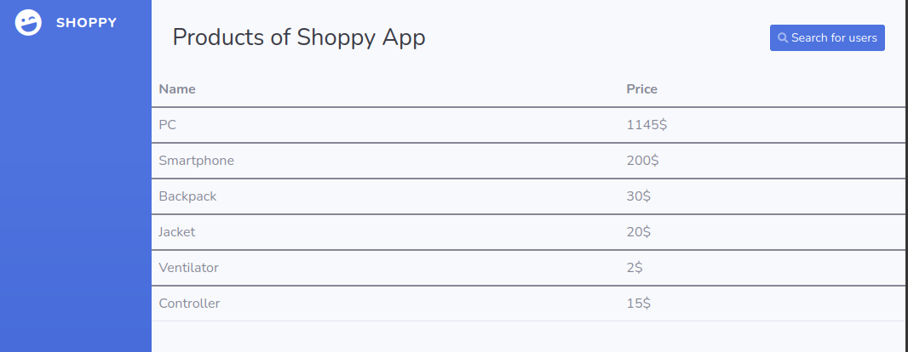

What's interesting here is the `Search for users` feature, searching for admin we got this results

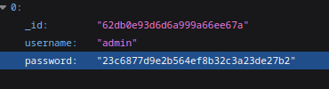

Cool, the hash seems MD5 but what if we do te same NoSQL trick here too? With `' || 'a'=='a` we have another user

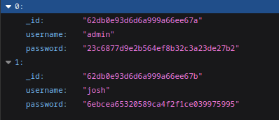

So I saved both hashes in a file and use hashcat to obtain the plaintext

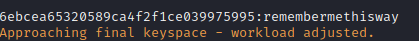

This is the josh hash, so we have a set of credentials that we can use on the mattermost webpage and we are inside

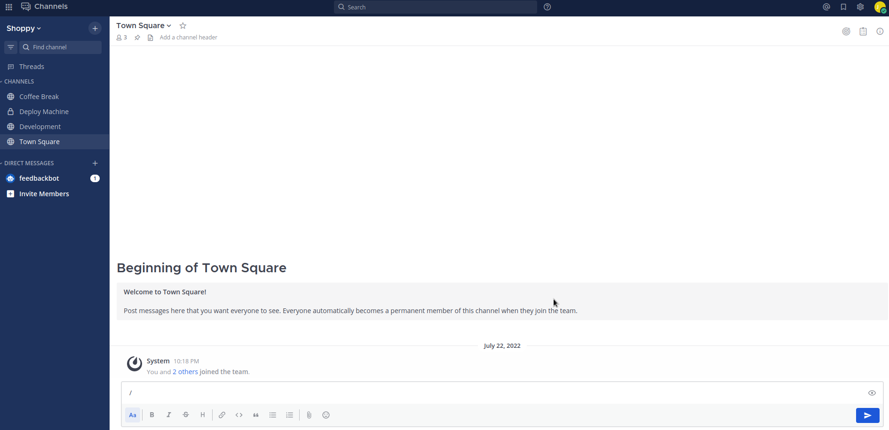

Inside `Development` you can find another username and a hint about a docker installation in the machine and a C++ password manager (will be usefull for the priv escalation, maybe)

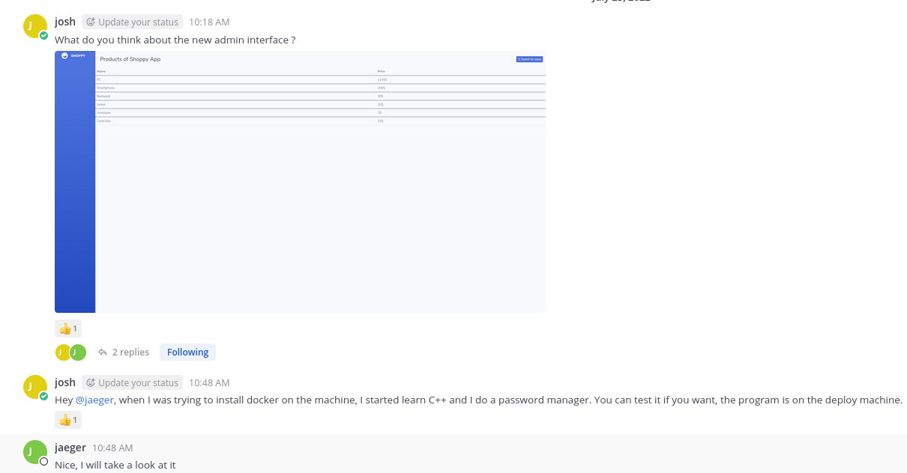

 And in `Deploy Machine` a set of credenials

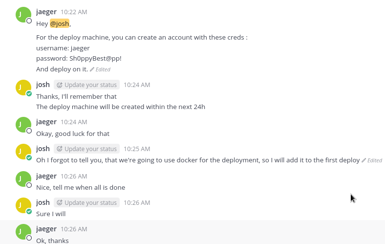

In `Coffe Break` another username and a cool cat

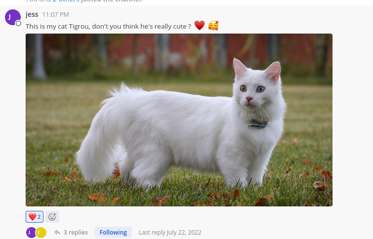

Using the credentials we get acces to the mchine through SSH adn we can grab the first flag

  

# HORIZONTAL & VERTICAL ESCALATION
With `sudo -l` we can run as **deploy** the password manager script

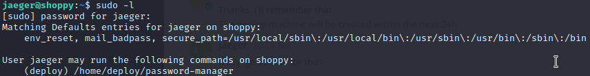

Running the password manager we have to enter a master password

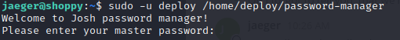

So I get the file locally and use **<u>Ghidra</u>** (for the first time <3) to decompile the binary, even without proper training I get something that seems the password, in the `main` function after asking the passwrd the binary read a local variable which seems to be **"<u>Sample</u>"** and than comparre with the string read

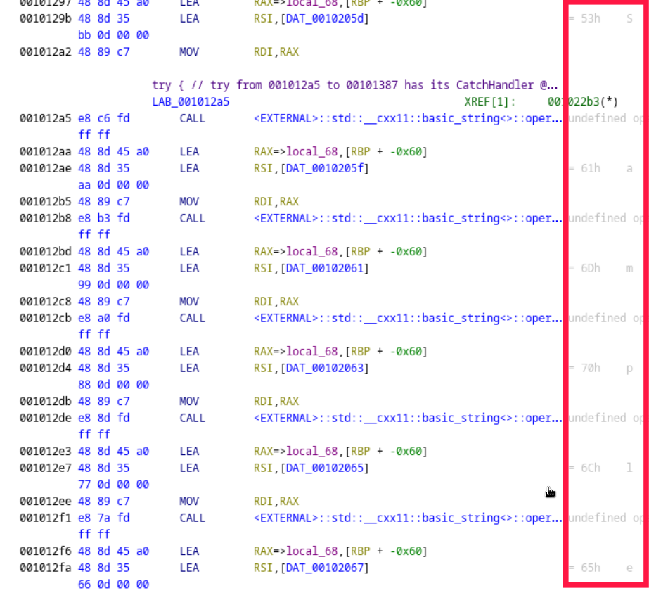

Is right! We have the password for the user deploy!

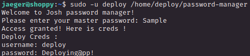

  

With the `deploy` user we can't run `sudo -l` so I decide to run linpeas and looking at the output. The main difference with this user is that we are in the `docker` group, so we can use docker (as anticipated from the mattermost chat) and with a quick search on GTFObins I have found a way to get root

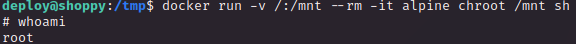

In short, create a container (based on Alpine) with a root directory `/` accessible through `/mnt`, using chroot on it and spawn a shell with root privileges, we are inside the container but we can get the root flag (we can also access it through the `/mnt` directory without spawning a shell in the container)
