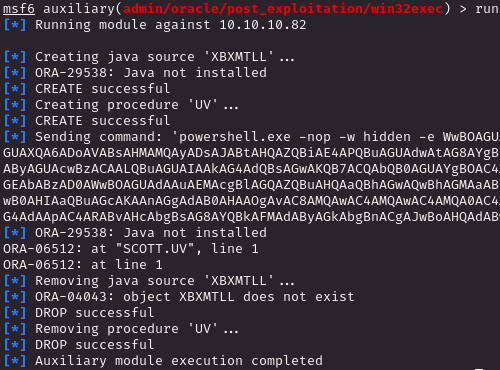

# PORT SCAN
* **80** &#8594; HTTP (IIS 8.5)
* **135** &#8594; MSRPC
* **139 / 445** &#8594; SMB
* **1521** &#8594; Oracle TNS Listener (11.2.0.2.0)
* **5985** &#8594; WinRM

   

# USER FLAG & ROOT FLAG (or viceversa this time lol)
The OS is `WIndows Server 2008 R2` and the webpage is just the standard IIS one. The **<u>TNS Listener</u>** is a separate database process that runs locally on the (DB) Server and the purpose is to receive connection from the clients and establish a connection with the DB 

We can try to enumerate and was something new for me, I have started with `SID enumeration` but since we have no access (anonymous not allowed) we get unsuccess, we can move to `SID bruteforce` instead and we have something here

With [ODAT](https://github.com/quentinhardy/odat) we have also one more 

`XE`, `XEXDB` and `PLSEXTPROC` are valid, The **SID** stand for Service IDentifier and in short is the (Relational) Database Name

Standing on some lectures (like [this one](https://www.blackhat.com/presentations/bh-usa-09/GATES/BHUSA09-Gates-OracleMetasploit-SLIDES.pdf)) the basic methodology is to brute force the credentials, I used `patator` and the hacktricks wordlists

`SCOTT:tiger` is a valid account, now we can go on the next steps we can decide different way based on the server configurations, the slide linked above suggest to use the `admin/oracle/post_exploitation/win32exec` metasploit module but we get unlucky because Java is not installed, good to know....

Other 2 methods exist to execute RCE (`scheduler` and `externaltable`) on the server side but for both we don't have enough permissions

We need to make some PE onthe DBMS, sounds great. Searching online we can use `--sysdba` flag on odat to get SYSDBA (sort of root on Oracle) privleges and it worked actually, at least to retrieve file

Cool if we can get the root.txt flag means the Oracle services is running with high priv, we need to get a shell
If we can get files this mean we can also uploaded it maybe(?), well we can and we can abuse the IIS website that will host our aspx reverse shell!

This shell is enough to get the user flag plus we already have the root one, mission completed really fun to play with new things like the Oracle DB and tool like `odat` are cool framework for attackers.

In any case we can get SYSTEM shell easily since the user shell we have returned with `SeImpersonatePrivilege` enabled!

> Even if short, this machine took quite a lot of time but that's fine was cool to understand the Oracle internals and all different ways to exploit it
