# PORT SCAN
* **80** &#8594; HTTP (IIS 10.0)
* **135** &#8594; MSRPC
* **139 / 445** &#8594; SMB

   

# ENUMERATION & USER FLAG
Well really poor open ports here, the webapp maybe can help us further

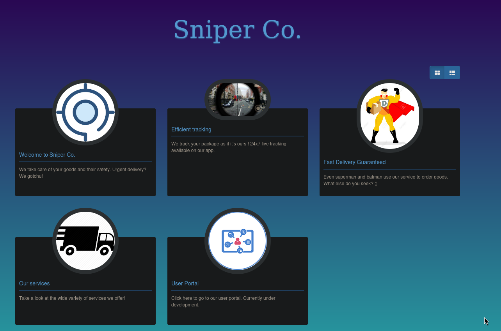

Only **<u>Our Services</u>** and **<u>User portal</u>** have something inside, the former redirect us to `/blog/index.php`

The latter is a simple login form

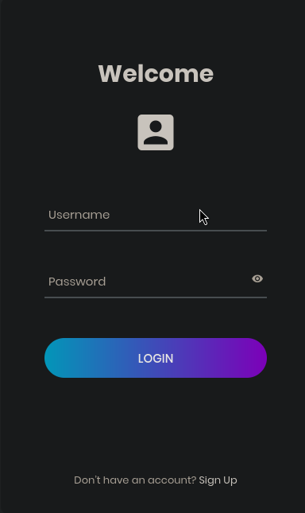

when we create an account and login something curios occurs

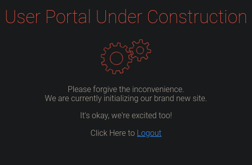

The blog have a pretty interesting feature that makes able to change the language of the blog (english, spanish and french) changing the URL with `http://sniper.htb/blog/?lang=blog-en.php`. We can play with this a little and after a few attempts if we swap the languag php page with `/widnwos/win.ini` apparently raise no errors and if we look the source code we now know the **<u>LFI is a success</u>**

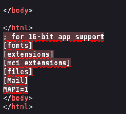

Since there is the only vuln (I have) found we need to leverage this to a RCE, I have read of something called <u>Log Poisoning</u> were you can use the header of the HTTP packet to inject som PHP code and use the LFI to execute it. This is simplier in Linux but the theory behind it can be used in windows somehow (at least is what I hope).

When we signin as the user we have create a `PHPSESSID` and looking at this stackoverflow thread highlights the fact in Unix the cookie configuration is saved in `/tmp`

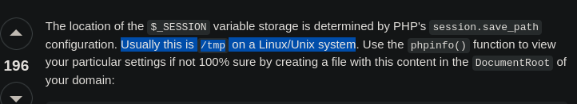

We can check the same thing in windows looking at `/windows/temp/[cookie]` and we can try with the PHP cookie given to us. At first I have no success at all so I decide to look around the web on how/where PHP cookies are stored, the path is fine but the format of the file is `sess_[COOKIE_NAME]`. With tis small change it works!

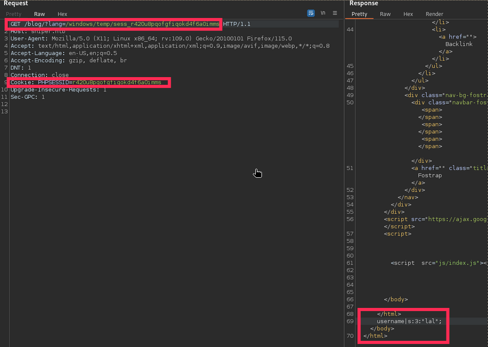

As you can see the usernam `lal` is the one I used to login, changing the username with some PHP code can lead to poisoning the cookie file and RCE can be established. With `<?php system($_GET['cmd']) ?>` as username we can register but maybe some filtering is happening behind the curtains making impossible with this type of username. According to [HackTricks](https://book.hacktricks.xyz/network-services-pentesting/pentesting-web/php-tricks-esp#code-execution) we can perform <u>Code Execution</u> in a similar manner to bash abusing the backticks characters. I tried injecting the `whoami /all` (and echo it) in the username and when I tried to look the cookie file the username is value is empty so something is not working!

Looking around a good suggestion to bypass good amount of filtering is to use **base64** encoding on a **UTF-16LE** character format

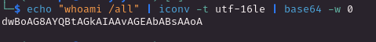

Now I used this payload with a `powershell /enc [payload]` and we have it now!

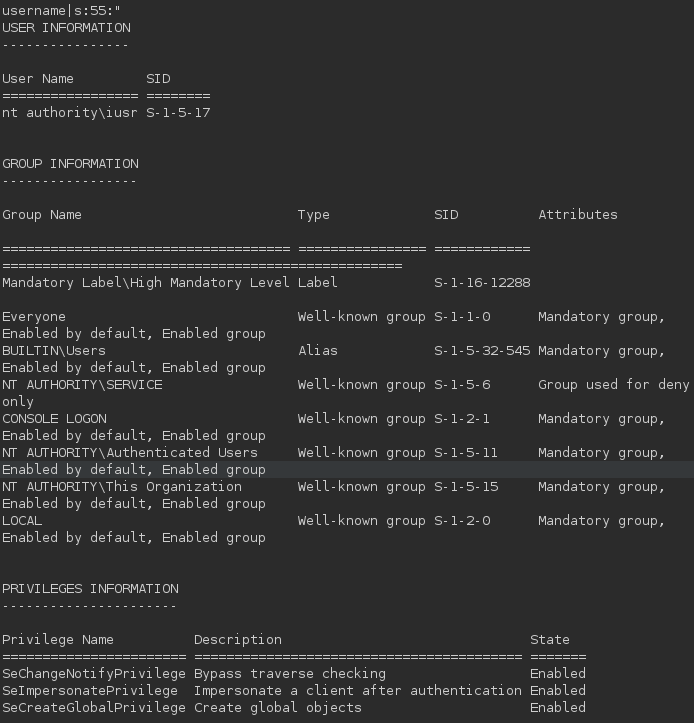

Gottch'a we put a step inside let's bring the other foot inside with a reverse shell hosting a SMB server with `nc.exe` inside it and remotely execute it with the poisoning process we have found. I tried but failed, so let's split the problem in 2 making it simple, we first upload the netcat executable and than execute it in the remote target!

This time it worked and we have a shell on the target, cool sometimes good old tricks like **problem splitting** worked smoothly

We can now lookup at `db.php` which have hardcoded credentials

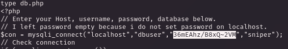

I can use mysql to access the DB which is empty but the user directory containt the `Chris` user. There are a lot of way to check this, you can use the runas script or something similar but I prefer to stay naive and create a credential objects and than generate a new PS session

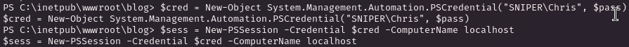

No error this means the credentials are correct, now is time to execute a reverse shell with `Invoke-Command` downloading and using netcat (we need to re-download it because we don't have access as chris in the previous netcat location)

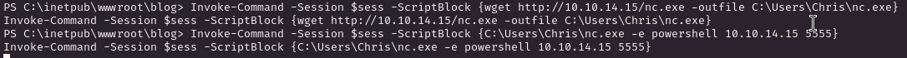

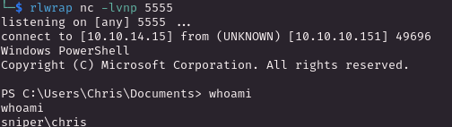

Now we are free to grab the user flag!

   

# PRIVILEGE ESCALATION
Inside the download directory we have a windows help file  

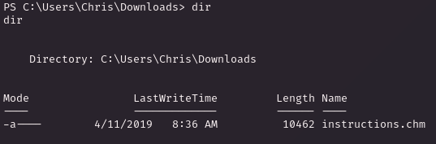

I uploaded to my local machine and use `xchm` to display it and apparently Chris is not really happy to work in this company

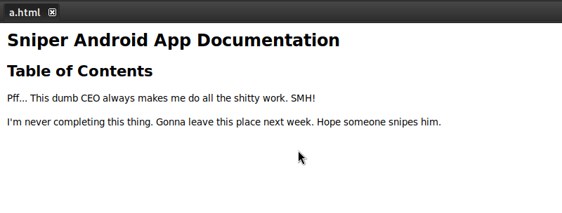

We have a good blog about [weaponize CHM](https://medium.com/r3d-buck3t/weaponize-chm-files-with-powershell-nishang-c98b93f79f1e) but I don't know if will be triggered or not and by who. Inside `C` there **Docs** folder with inside `note.txt`

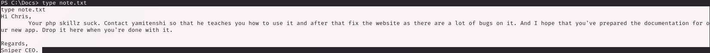

Cool, probably the CEO (which I assume use the machine as root) will open the CHM file which if correctly poisoned can lead us to RCE!

I am gonna use the blog post to create the malicious CHM file and since no changes are needed I am not gonna rewrite the same thing here, I have than copied a netcat executable in the ones the malicious chm is pointing, than rename it and lastly uploading in the Docs folder.
After a few seconds we have pwned the box!

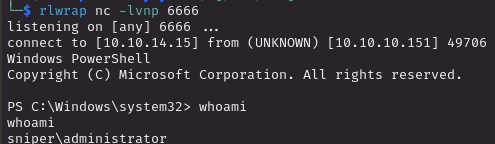

Pretty simple root!
