# PORT SCAN

* **22** [SSH]
* **53** [DNS]
* **80** [TCP]
* **14904** [UNKNOWN

 

# ENUMERATION & FOOTHOLD

This is the webpage, the 2 anchor (on here) allow us to download a video and a pdf of the company (**GET** `/download`)

Also in `/team` there are a bunch of potential usernames and emails

And on `/contact` there is a standard contact form but with a peculiare message

I found a LFI through the request to get the pdf file using some simple bypass techniques

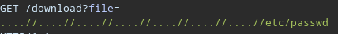

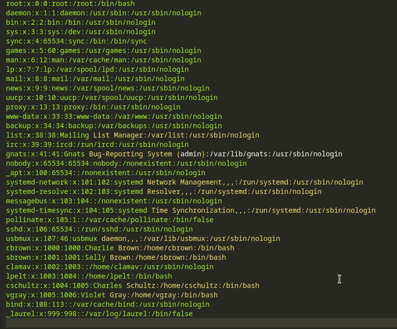

I have made some enumaration with **dig** and with `AXFR` record I found some cools domains, the AXFR query stand for **<u>zone transfer</u>** and we are getting all the members of the zones covered by the DNS server leaking multiple attack vectors

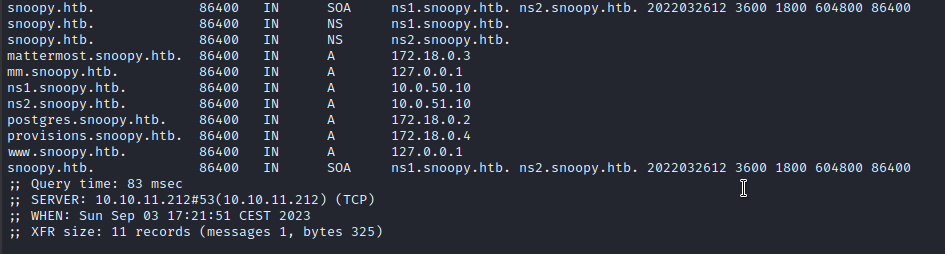

Cool now we can get whatever file we want, since the server is running linux and is acting like a DNS server is **probably using BIND** (nameserver service for linux based server). I try to search on the web some path where configuration file are supposed to be stored and `/etc/bind/named.conf` is pretty cool

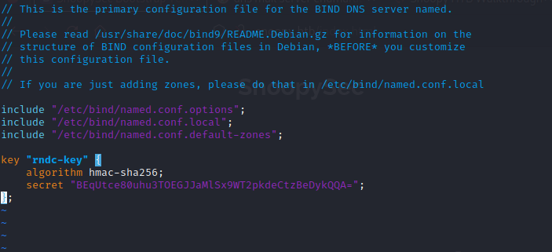

Cool stuff, we have the key supposed to be used on DNS service, since the message above told us the mail server is down should be cool if we could access it

Using `nsupdate` we can change remotely the DNS records of **mail.snoopy.htb** to the attacker machine and running a smtp server with python

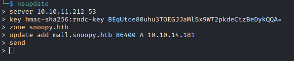

Now we are impersonating the mail server, cool stuff. On `mm.snoopy.htb` is running [mattermost](https://mattermost.com/) service but we need credentials, so I decide to make the password change procedure and use one of the email found above (sbrown@snoopy.htb).

The magic here will do the rest, the email will be interceppted by out python smtp server with the url to change the password

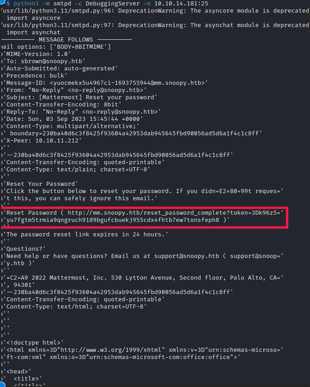

After changing hte link I was able to be inside the platform

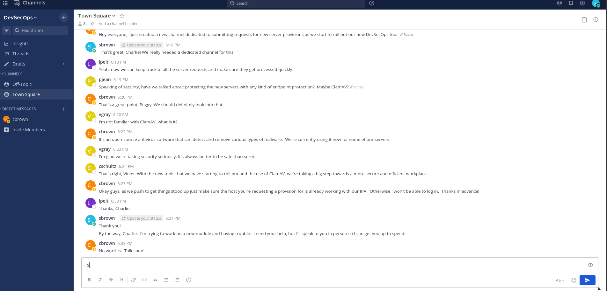

On the chat the staff is talking about to use **ClamAV** for secure endpoint and of the development of their new DevSecOps tool

MM is similar to discord and allow user to use commands (even costum ones) with the `/`

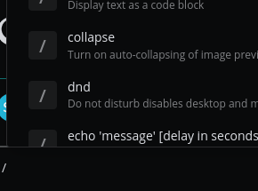

One of this commands is pretty food to get a ssh connection back to us even if unstable (`/server_provison`)

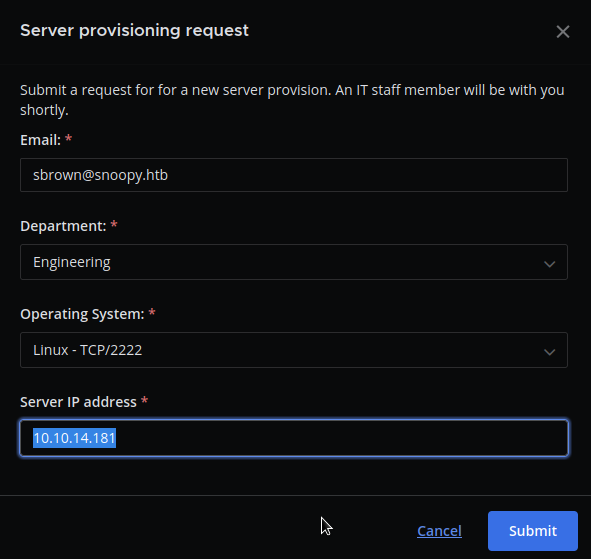

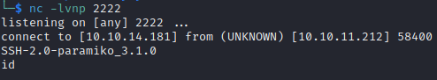

The shell is not usable but we have a connection, this mean that the credentials have been sent.

A tool called [ssh-mitm](https://docs.ssh-mitm.at/) is usefull for this kind of situation an we can retrieve the password

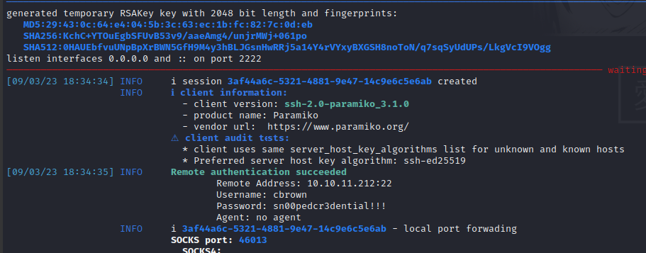

 

# USER FLAG

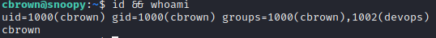

We don't have the user flag yet so we need to make some horizzontal movement, there are 2 folder in home directory **cbrown** (the one we have acces) and **sbrown** this would be my next target

We can use sudo to impersonate sbrown user like this

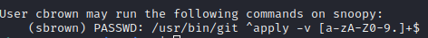

The version of git is 2.34.1 and is vulnerable to [CVE-2023-23946](https://github.com/git/git/commit/c867e4fa180bec4750e9b54eb10f459030dbebfd) which allow to overwrite a path outsid the working tree using symbolic links with a crafted patch, new things to learn!

After some time studying the git patches and the CVE I was able to get access to sbrown with this step

1) Create ssh key pair with `ssh-keygen`

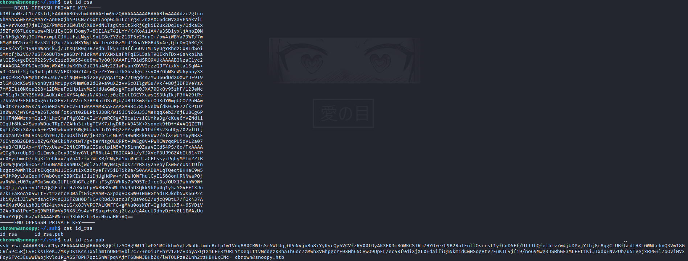

2) Create the malicious patch (in order to add the public key created previously) and the symbolic link pointing at `/.ssh` directory of sbrown user

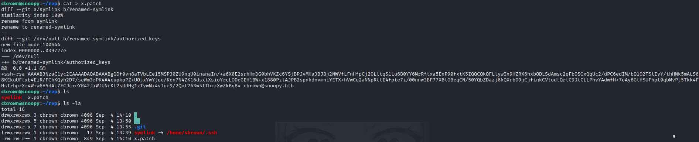

3) Run git apply with sudo as sbrown privileges and ready to ssh as sbrown

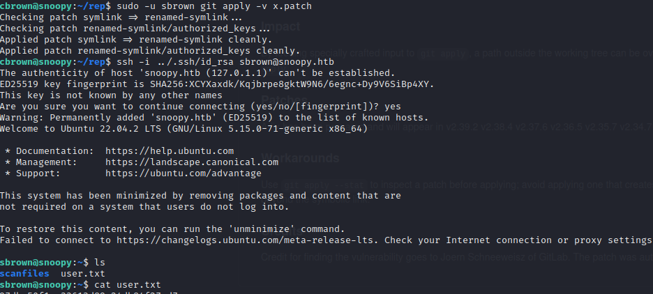

 

# ROOT FLAG
Remember of **<u>[ClamAV](https://docs.clamav.net/manual/Usage/Scanning.html)</u>** talked previously? This is a command we can run as root

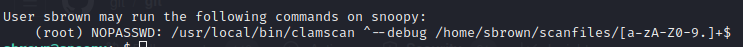

The version is **1.0.0** with a quick search I found is vulnerable to **[CVE-2023-20052](https://nvd.nist.gov/vuln/detail/CVE-2023-20052)** which allow to read file using a malicous DMG file through a misconfiguration of the DMG parser

With [this PoC](https://github.com/nokn0wthing/CVE-2023-20052) we are able to build the malicious DMG file (just change the file to read). I choose to read the flag directly but an alternative method should be read the private ssh key in order to be sved on attacker machine and gaining persistence on root

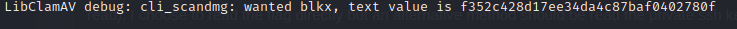

ROOTED!
