# PORT SCAN
With surprise, the port scan is really cool

* **22** &#8594; SSH
* **80** &#8594; Apache HTTP
* **111** &#8594; RPCbind

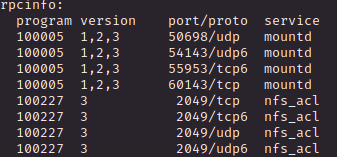

* **2049** &#8594; nfs_acl
* **32897 / 55267 / 60143** &#8594; mountd
* **40499** &#8594; nlockmgr

 

# ENUMERATION & USER FLAG
Let's start to the webpage

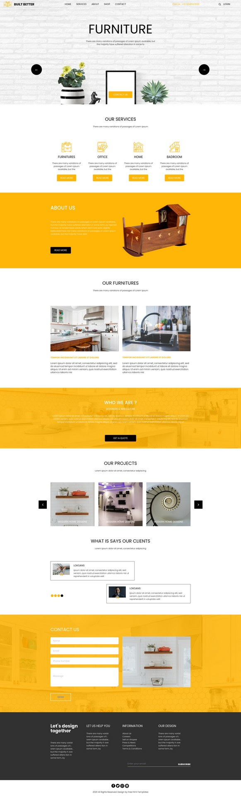

....Nothing, really nothing is just a static page with no interaction (all anchor and form redirect at the homepage). Just a phone number an no email, names or other info about some potential users

 

So let's move to **port 111**. rpcbind service. We can use `rpcinfo` to retrieve all the registered RPC services

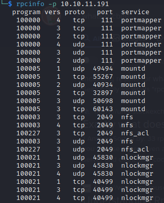

What's cool here is **<u>Network File System</u>** (NFS) which is used ti share through the internet file system, don't need to say more :).

Let's see what is available (mountable) for us in order to get some information (I personally use metasploit module but `showmount -e [IP_ADDR]` is good as well)

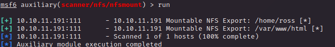

Damn, we can have the home directory of the user `ross` let's get it.

1) Start the NFS services
2) Create a directory in `/mount`
3) use the `mount` command to get the dirctory you need

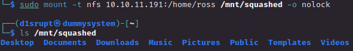

Than I quickly checked what there is inside and we have a **<u>KeePass</u>** file inside `/Documents` folder, cool stuff!

The file sytem is read only but. as hacktricks said, we can create a user with the **<u>UID of the owner</u>** of the filesystem in order to get the privilege I need to interract with the KeePass file, in this case the UID is 1001 so I just need to create a standard user on my local machine to have the permission on the filesystem.

I have created a user called "**squashsquash**" and you can see that we have the right permission on the NFS filesystem checking the output of `ls -la`

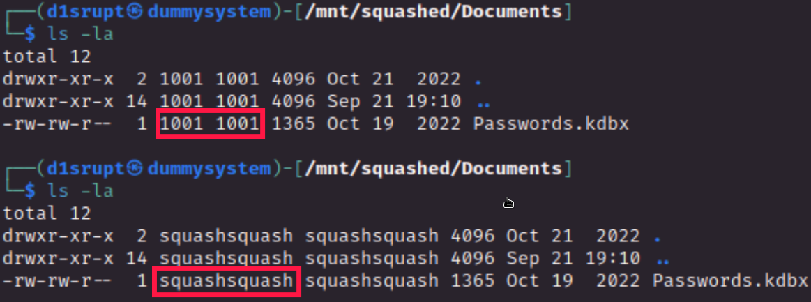

But sometimes thing are not smooth as we first tough and this is the case, somehow the fileversion of the KeePass file is not supportedby `keepass2john`

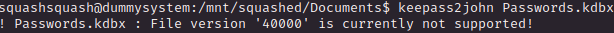

Cool, probably this is something we need to use it after we get foothold.

Let's move and mount the NFS of the `/var/www/html` directory, if we use the same trick of the **<u>UID impersonification</u>** we can upload a reverse shell and execute it to get foothold, let's try!

The filesystem have UID = 2017 so after the user creation I used `groupmod` and `usermod` to change the ID. After a quick check this is exactly the directory where the website is stored

I create the [pentest monkey](https://github.com/pentestmonkey/php-reverse-shell/blob/master/php-reverse-shell.php) php reverse shell on the webapp and obtain a shell as `alex`.

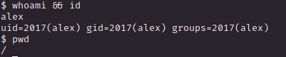

Check in the home directory and we have the flag, urray!

  

# PRIVILEGE ESCALATION

What is interesting here is that in the `ross` folder, is the **<u>.Xauthority</u>** file, which is used to connect on a X (network-transparent window system service for managing a windowed GUI) server, more in detail contain the authentication cookie.

Also we have `.xsession-errors` file in the home directory, this can mean the windows have been already configured.

We can't access it directly from the shell but we mounted it locally and with the UID trick we can interract with the system, so I get the `.Xauthority` on the mounted NFS and copied on the shell in the tmp file and use `export XAUTHORITY=/tmp/.Xauthority` to hijack the ross session

Now with `w` we can list all the active sessions

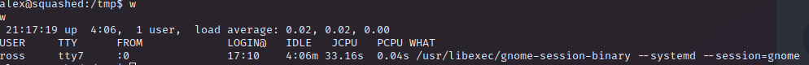

With `xwd` (X Window Dump) we can retrieve an image of the X window (in our case `:0`) we can take a screenshot, following the hacktricks guide is pretty easy 

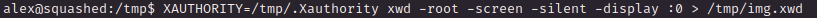

Now we get the screenshot of the X window, I have passed it to my local machine (using netcat), converted and we have the final png image

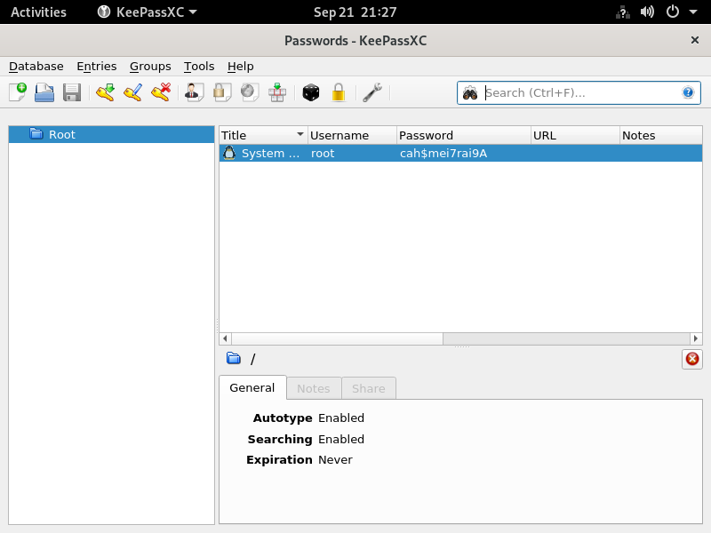

This is the root password, try to use it on `su ` and voila we get the root flag!
