# PORT SCAN
* **22** &#8594; SSH
* **2379** &#8594;
* **8443** &#8594; HTTPS (MiniKube API Port)
* **10249** &#8594; HTTP (GolangNet)
* **10250** &#8594; HTTP/SSL (GolangNet) &#8594; **<u>Kubelet</u>**

   

# ENUMERATION & USER FLAG
Uau pretty strange port, this is one of the few times where I am pretty lost with a port scan output. Looking closer we have some trace of **<u>Kubernets</u>**

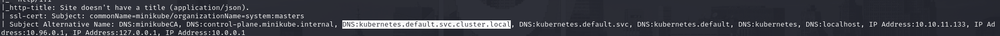

Cool stuff! This will be my first experience with the second mot famous container platform. Is pretty similar to Docker but with a different role in development, the **<u>orchestration</u>** a set of automation feature of software development cycle (self-healing, horizontal scaling, lload balancing and a lot more) commonly used in cloud enviroment as the box name suggest.

Before going through the machine let's make a small overview on Kubernet components

* **<u>POD</u>** = smallest deployment which is the abstraction layer of a host(s) compatible containers (the difference between pod and container is that the former creates wrapper with dependencies which allow kubernetes to manage application container)
* **<u>NODE</u>** = bare metal/VM that host POD(S) where the <u>master node</u> have a control plane that controls pod scheduling while pods rely on <u>worker node</u>
* **<u>CLUSTER</u>** = set of nodes with (at least) 1 master node wuth pods scheduling on various node (max to 5000 worker nodes per cluster)

Cool let's jump inside the box now! Obviously there is an authentication method which is blocking us for enumeration of API 

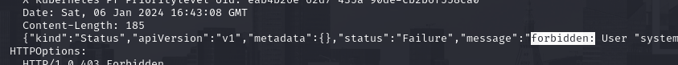

With some patience and research (the holy grail hacktricks is always the perfect place to start) we can list the pods visiting the `/pods` on **kubelet** port (<u>10250</u>)

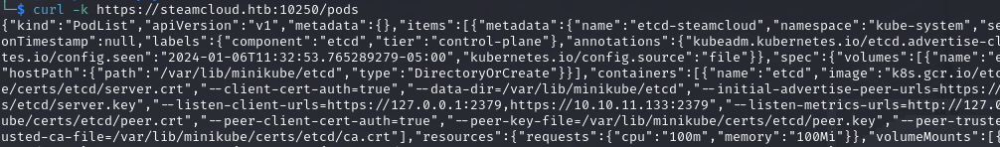

Holy Molly pretty confusing right? Moreover this ervice have a lot of undocumented API. A tool to fix this 2 issues is **<u>kubeletctl</u>**

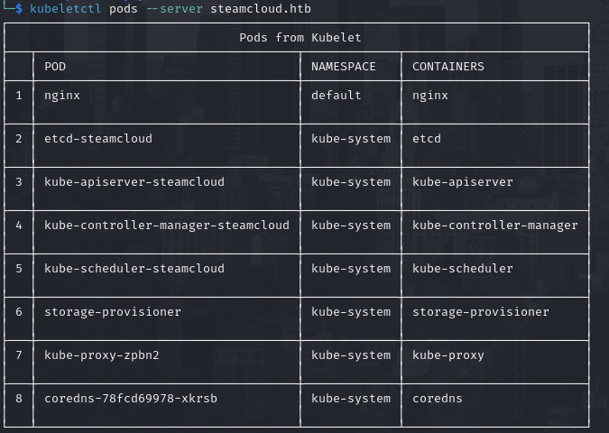

Now we talk the same language, good stuff! We can see more with `scan rce` and retrieve where we can execute commands (where `+` symbol is present)

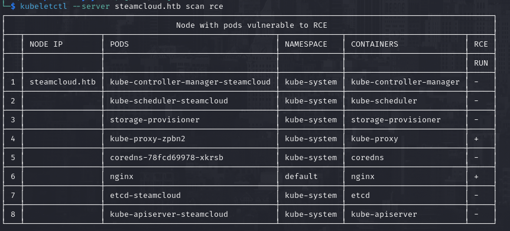

Now we can perform RCE specifying the pod (`-p`) and container (`-c`)

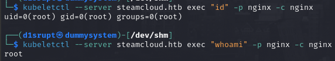

Now that we can execute command will be cool if we can spawn a reverse shell and differently on standard VM we can just invoke the bash to get a shell on the POD

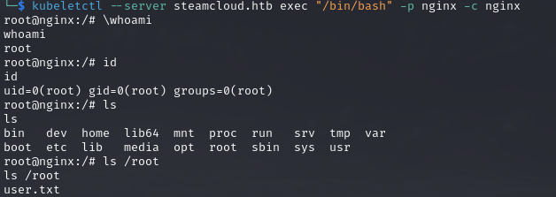

   

# PRIVILEGE ESCALATION
OkOk we are root on the **<u>nginx POD</u>** but the root flag will probably be located on the steamcloud pod

Remember that we have some issue with anonymous authentication, well now we can exfiltrate the info we need from the inside (I followed hacktricks guide to be more oriented)

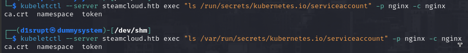

Hell yeah we can retrieve the content of the <u>TOKEN</u> and <u>ca.crt</u> so we can authenticate now! (pods which contains privilegd user that can read such files are called **<u>hot pods</u>**)

I have exported the token in the enviroment variable called "token" and the certificate in the file `ca.crt` which will be used to authenticate on port **8443** for instance to list all the running pods

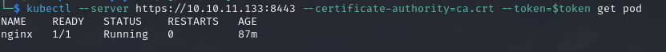

Cool stuff but we have no new info right now but we can list all the action we can do with this authentication thanksto `auth can-i`

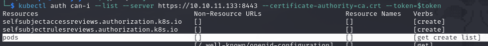

The line **pods** tell us we can GET, CREATE and LIST pods. "Create" permission is pretty interesting because we can create a pod with access to the `/root` filesystem in order to retrieve the flag (or simply `/` if we wanna have full access). Pods are created thanks to a YAML file like the following

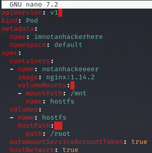

The important fields are the `volumes` and `hostPath`. Now we create the pod using **<u>apply</u>**

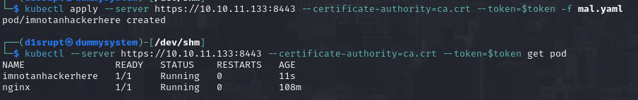

Reusing the `scan` options we can see that we can execute command inside the new pod and the contents of **/root** are in the **/mnt** folder!

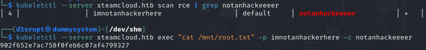

This was my first touch with Kubernetes, I learned something new but in a really general way. I will catch this opportunity to read more about this platfrom!
