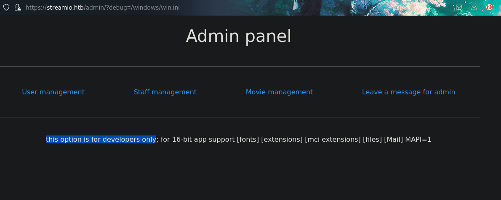
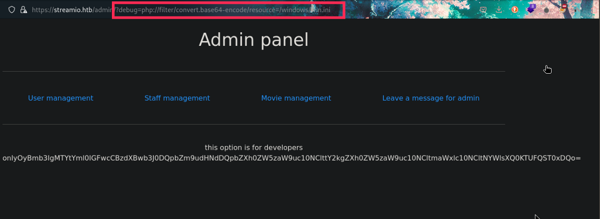

# PORT SCAN
* **53** &#8594; DNS
* **80** &#8594; HTTP (IIS 10.0)
* **88** &#8594; KERBEROS
* **135** &#8594; MSRPC
* **139/445** &#8594; SMB
* **443** &#8594; HTTPS
* **399/636** &#8594; LDAP
* **3269**
* **5985** &#8594; WINRM

   

# ENUMERATION & USER FLAG
The (AD) domain of the target is `streamio.htb`. As usual I will start from port 80 and 443 (`watchio.htb`), the former is the traditional IIS welcome page while the latter return error 404 but the certificates contains an interesting alt name `watch.streamIO.htb`

After appending this to the hosts file we are finally in

Pretty good number of subdomain so is worth running some subdomain bruteforcing while I enumerate more, I tried with `https://streamio.htb` and we have the actual web service

Now we are talking the same language, there is a login page (also a register page but after account credential no way to login, probably is disabled). I strat a simple instance of `SQLMap` and was able to confirm MSSQL as DBMS and found that the username parameter is injectable with a time based heuristic. Since `SQLMap` started to dump the full database I let it work and wait for some credentials to be found (forcing with the `--tables dbo.users` because we don't care about all the films in their database). While is slooowly retrieving data I wanted to take a look at the `watch.streamio.htb`, there should be some others PHP pages to visit

Interesting, the `search.php` can be really usefull and faster than the SQLMap execution

Is actually a well defined search page because if we search for something like `a` every movie title containing the `a` character will be displayed this means we will have a `WHERE` clause of this type `[...] WHERE title LIKE '%a%'` so I tried to inject in the search query the the following `a%' WHERE 1=1 ;--` but they have some sharp security measure right here!

Is not an actual block is just a redirect to a costum PHP page so we can go back and retry from scratch, is time to experiment whitout waking up the Goliath. Well probably the `AND` keyword is not well accepted so we can replacing that with `UNION SELECT` and try to guess the number of collumns, I know there is the film **300** and the sequel so I will use it as dummy variable for the test. After a few attempts we have it!

Exactly 2 results like querying the simple `300` string, now that we have the number of collumns we can move further and try something different

Now we can use the few information retrieved from SQLMap and with some manuality, it founds the `dbo.users` table which I assume will contain the collumns `username` and `password` so I made some try and guess what? It worked

 

Gotch'a we can easily put togheter this 2 results with `concat`

Such a beauty! Now hashcat have a juicy file containing a lot of hash ready to be cracked (apparently MD5), thanks to the genius who created such tool we can do it pretty easily 

Now I can search every hash and corresponding username but this a good opportunity to use `Hydra` using our costum username and password files

Cool stuff now we have some valid credentials and I was able to login but nothing changed...fear not we just need more enumeration like we did previously and we will discover a `admin.php` page

The admin panel use a PHP variable to show the different pages

I am not enough satisfied with the 4 given here, there should probably be something else (also if I assign something on the variable nothing occurs) so again let's FUZZING! We got something

Even if gives a warning message `this option is for developers only` we can still view content through a LFI

The first thing I tried was to connect it on my SMB server in order to have hte NTLM hash but was uncrackable even with different wordlists pretty bad :(

I was pretty lost here because when I try to access `index.php` raise an error

Well the good news is that I learned a good tricks which can be usefull in differents situation, [PHP Wrapper](https://github.com/payloadbox/rfi-lfi-payload-list#lfi--rfi-wrappers-). This feature allows to encode in base64 the resource we exfiltrating so I tried on the `win.ini` file

Well I do the same on `index.php` and than decoded it, we have some hardcoded credentials of the database

There is no exposed port which host MSSQL service but probably will turn back usefull when we have a step inside the network, I tried other fuzzing at `https://streamio.htb/FUZZ.php` and check each of the results. When was the `master.php`  we had something interesting

We are pretty close to the end of the tunnel for the first flag, there is an hidden form which set a POST paramter called `included` if we are lucky enough we can perform a RFI.
At first the plan was not working so I decided to look at the writeup and as always the details matters because I had to add the right `Content-Type` header 

Cool stuff now we are on the right path whatever we are writing inside the PHP will be injected inside an `eval()` but somehow nothing happend. We have used this new trick of PHP wrapper so we can use it as payload in the POST request creating a PHP webshell, encoded in base64 and decoded using the wrapper. With this we can add a GET parameter injecting OS commands

Finally we have a shell! The user we are impersonating doesn't have a directory in the `Users` folder so we have to make some horizontal movement. We can use the SQL credentials we found previously and finally have free access to the database, there is no trace of a SQL client executable but we can use [sqlcmd utility](https://learn.microsoft.com/en-us/sql/tools/sqlcmd/sqlcmd-utility?view=sql-server-ver16&tabs=go%2Clinux&pivots=cs1-bash). After checking the presence of this tool we can now access the database `streamio_backup` and list all the contents of the `Users` table, inside we have the hash of **<u>nikk37</u>** (the only one in the list with a user directory).

Hashcat successfully cracked and extract the password plaintext `get_dem_girls2@yahoo.com`, I used with Evil-WinRM and we have access to the user flag!

   

# PRIVILEGE ESCALATION
From the Evil-WinRM session I launched WinPEAS and it founds some firefox credentials saved in a `.db4` file, finally I have the opportunity to use [LaZagne](https://github.com/AlessandroZ/LaZagne)

Cool we have a good amount of credentials so i create a list of user and passwords to use with **<u>crackmapexec</u>** on SMB (on WinRM no of that worked) and we have a valide credentials

The SMB shares seems pretty standard maybe BloodHound can help us understand the purpose of this account

Pretty good the `JDGOD` user own the `CORE STAFF` groups (with **<u>WriteOwner</u>** permission) which can read [LAPS password](https://learn.microsoft.com/en-us/windows-server/identity/laps/laps-overview), so we need at first to add as owner JDgod user and than try to read the LAPS password. I choose to to the first objective in windows and than use pyLAPS to read the password.
Well, for the first objective we can use `Set-DomainObjectOwner`and `Add-DomainObjectAcl` from powerview to make us owner and give full rights on the group before joining (really easy thanks to the help of bloodhound documentation)

Now is time to use the python script, the password is the administrator one. We have defeated this box!

