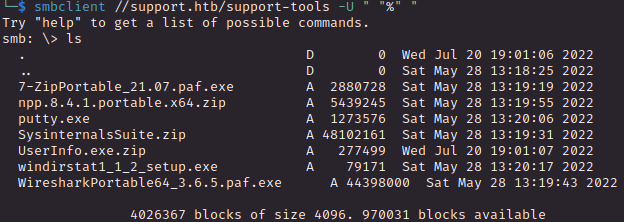
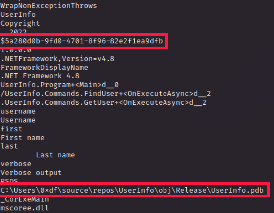
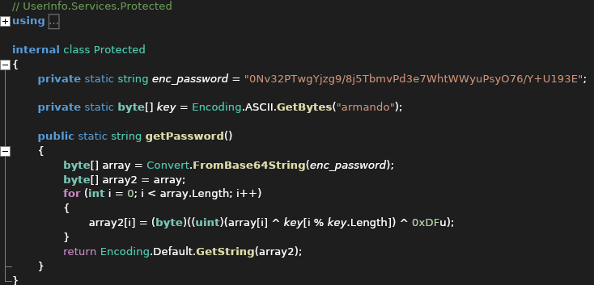
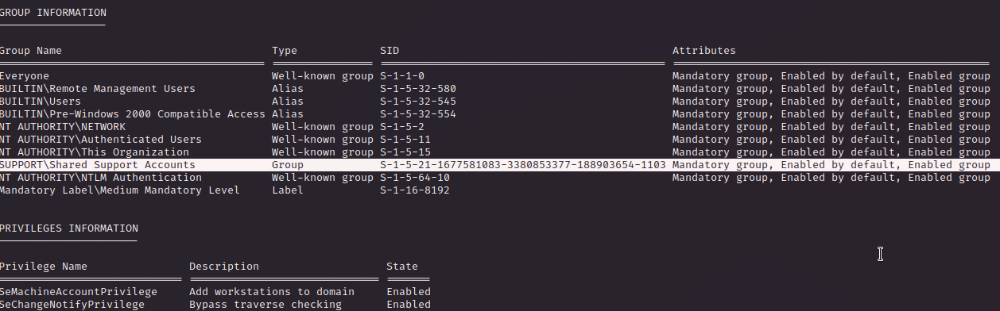
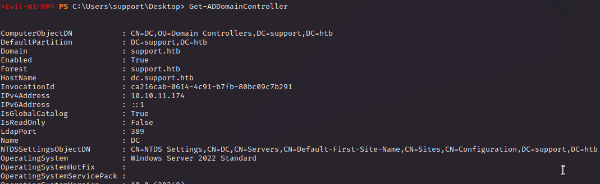
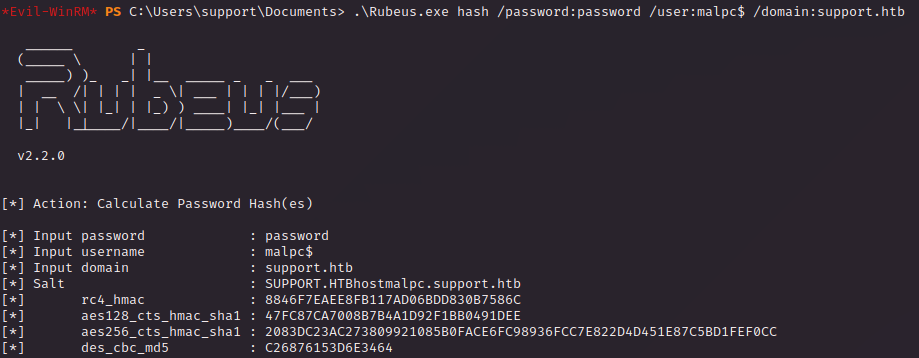
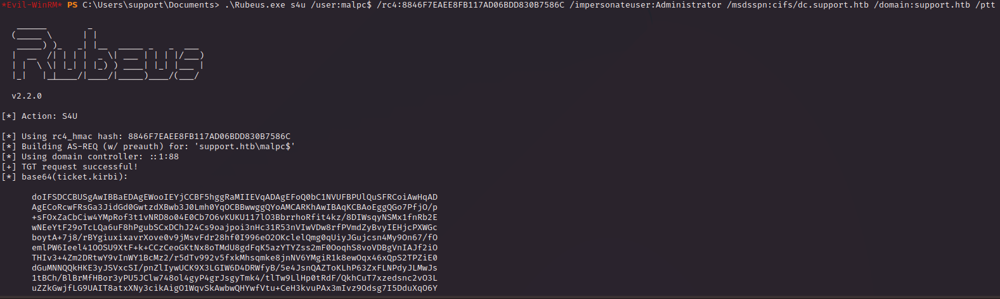

# PORT SCAN
* **53** &#8594; DNS
* **88** &#8594; Kerberos Key Distribution Center
* **135** &#8594; Microsoft RPC
* **139** &#8594; Netbios-SSN
* **389** &#8594; LDAP
* **445** &#8594; SMB
* **464** &#8594; KPASSWD
* **593** &#8594; Microsoft RPC over HTTP
* **636** &#8594; LDAP over SSL/TSL
* **3268** &#8594; LDAP catalog for AD
* **3269** &#8594; LDAP catalog for AD over SSL
* **5985** &#8594; UPnP 

   

# ENUMERATION & USER FLAG
Now I am starting to understand (a minimum) of Windows Pentest so first thing first **<u>SMB</u>**

Obviously let's check the `support-tools` directory

Wow pretty neat directory here, almost all the the executable/files are well known software but UserInfo.exe.zip is not. Let's download and extract it

We can know that we have a **<u>.NET binary</u>**

Running the `strings` command we have something that seems and ID and a Windows Path

There should be more juice within this binary so I discovered **<u>ILSpy</u>** to reverse the `UserInfo.exe`

  

First of all the ID previously found appear to be a GUID

In `LdapQuery()` we can have some info about the user that appears to be used to login in **<u>LDAP</u>**

But here's the prize, a encripted password in the protected class with the key, PERFECT!

I used ChatGPT to explain me the behaviour of the code

 

***
Just a little digression about using IA, I don't think using chatGPT (or whatever GPT available) is cheating especially in this type of scenario, it gives valuable information with a quick response so I can save time and work on the box itself. Obiously the information are really generic (especially in complex topics like reverse engineering) and we don't have to abuse the results pretending they are absolute truth. Make your own research and deep the task yourself we don't have overstimate the IA but not be left apart in the industry etiher, is a cool thing to understand how to use new tools/software especially in the security field!
***

 

So we have a really simple and weak encryption, I tell to my IA friend to recreate this code in python so I can run locally and check the results 

Cool stuff let's see if is right with `ldapsearch` and analyze the output aiming for something like a password or similar. There is a field that usually (bad trained) sysadmin use to put sensitive info thinking that without a sysadmin privilege nobody can read it, I'm talking about `info` field. Well we can read it :P

We have access through **<u>WinRM</u>**

Grab the flag and move on the next step

   

# PRIVILEGE ESCALATION
As `support` user we are part of an interesting group

That's cool, now let's check some of Active Directory information

We now know that we the group found above is a `Security` group 

Is time to use my favorite pentest tool for Active Directory, **<u>Bloodhund</u>** so we can see what type of privilege we have on the Domain Controller

We have a `GenericAll` privilige on the DC of `support.htb`, this mean **<u>Resource Based Constraint Delegation Attack</u>**

Here's the step-by-step approach

 

### 1) **<u>Create a new Computer Object</u>** 
I used impacket because I am not that good in powershell yet :(

We can check the existence of this new object directly on the victim machine

 

### 2) CONFIGURING <u>RBCD</u>

We need to set the `msDS-AllowedToActOnBehalfOfOtherIdentity` attribute to a computer in our controll (malpc). In this way Kerberos will be responsible to authenticate our account and later we can check some SPN that are available to abuse

With the `PrincipalsAllowedToDelegateToAccount` attribute set we are setting `msds-
allowedtoactonbehalfofotheridentity` too

Let's check the results

And on the DC side the SecurityIdentifier is the same as the SID of the malpc

 

### 3) S4U ATTACK
Service-for-user (S4U) attack abuse the Kerberos delegation (especially unconstrained delegation!) to generate a ticket of Administrator

First thing first let's obtain the password hash of `malpc`, using [Rubeus](https://github.com/GhostPack/Rubeus)

Using the `rc4_hmac` we can get the ticket

The last ticket (which impersonate) the **Administrator** account is what we need

I saved the ticket locally and decode it in a new ticket file and use a metasploit module to convert in **<u>ccache</u> format** 

Now we get a shell using **PsExec** with the `KRB5CCNAME` variable set to our final ticket

Cool stuff and cool box, I admit I used the writeup to get priv esc but I learned this cool vulnerability abuse, really usefull and formative!

We get the root flag and we are done, I will check some videos about this type of abuse to have a better understanding even in different scenario
