# PORT SCAN
* **22** &#8594; SSH
* **80** &#8594; HTTP (nginx 1.18)

   

# ENUMERATION & USER FLAG

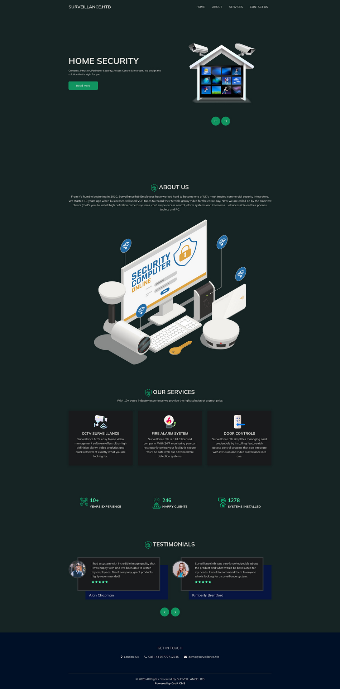

The webpage is really simple but have an `/admin/login` page

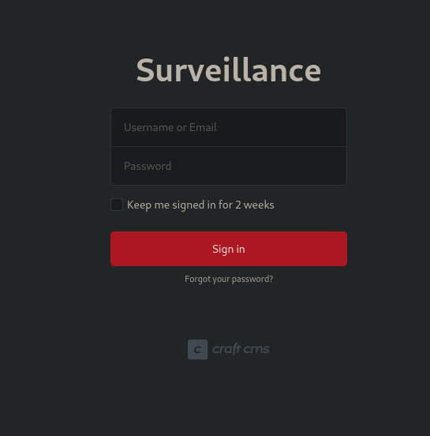

Looking at the source code we have version `4.4.14` which is vulnerable to [CVE-2023-41892](https://nvd.nist.gov/vuln/detail/CVE-2023-41892)

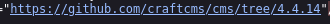

Following this [small blog post](https://threatprotect.qualys.com/2023/09/25/craft-cms-remote-code-execution-vulnerability-cve-2023-41892/) I was able to replicate what they did

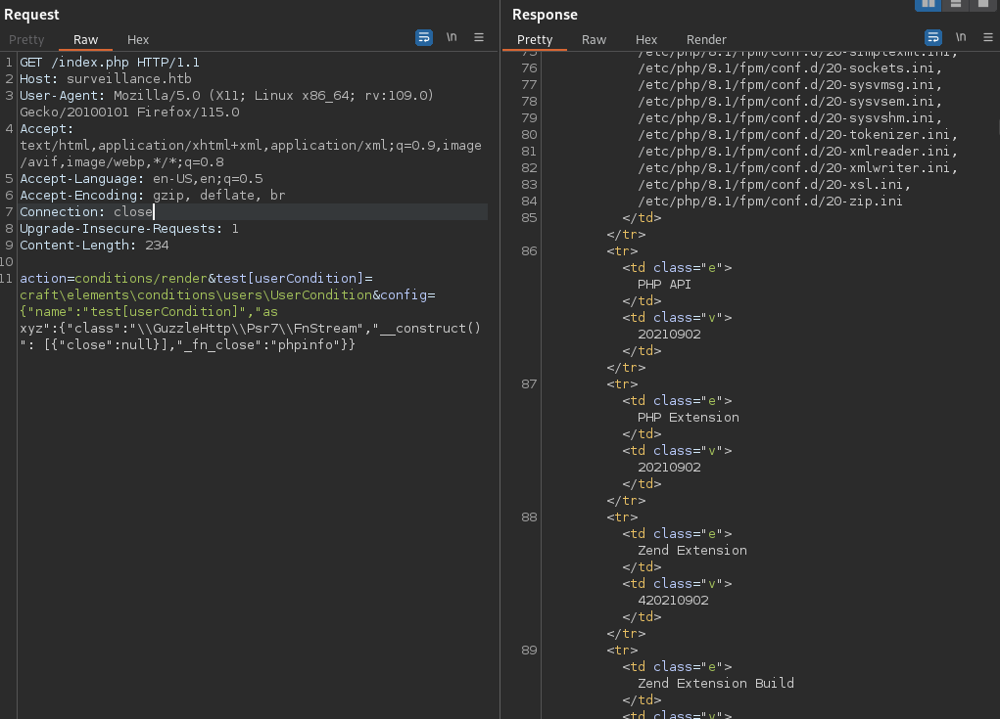

Cool now I need to find a way to leverage this simple PoC to something usefull and [this other PoC](https://gist.github.com/to016/b796ca3275fa11b5ab9594b1522f7226) is the one that allowed me to perform foothold keeping attention at what the creator told us

> This POC is depending on writing webshell, so <u>finding a suitable folder with writable permission is necessary</u>.

I changed the location of the path where the shell will be created to `/cpresources` and we hve a shell as `www-data`

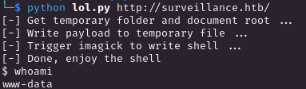

Now with a run of linpeas I found some **credentials for the mysql** server

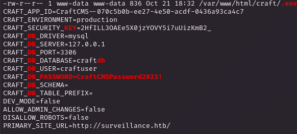

Inside there was the table `users` which contains the bcrypt `password hash for matthew`, this type of hash require a lot of time to crack but was worth to try while I was searching around.

Makes sense to take a look at `/html/craft` maybe we have a simpler hash for the matthew password and inside `/html/craft/storage/backups` we have a zip file containing a sql file

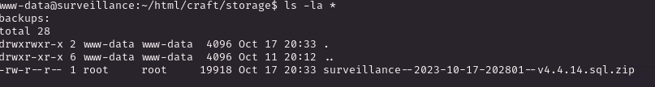

Inside we have our reward!

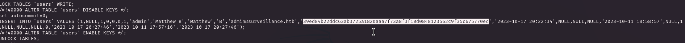

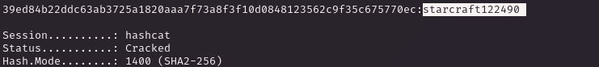

With this we have access through SSH and the user flag!

   

# PRIVILEGE ESCALATION

The previous linpeas output highlighted the port 8080 open on the target so with chisel we can forwarded to attacker machine 

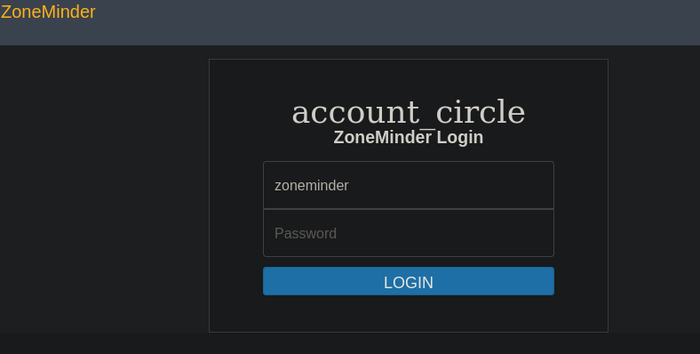

[ZoneMinder](https://zoneminder.com/) is a open source surveillance software system and now we know why the machine is called like that so we are in the right path

We need some credentials to get inside and after that we can use the metsploit module `exploit/unix/webapp/zoneminder_lang_exec` exploiting [CVE-2022-29806](https://nvd.nist.gov/vuln/detail/CVE-2022-29806) but since there is no way to get credentials (I have searched everywhere butno hash, hardcoded or default credentials) but let's not lose hope too quickly because the version of zoneminder (which is the `1.36.9` you can check it at `/usr/share/zoneminder/db`) is vulnerable to an [unauthenticated RCE](https://nvd.nist.gov/vuln/detail/CVE-2023-26035) through snapshot which have missing authorization.

By the way, metasploit have a fresh module for this vulnerability called `unix/webapp/zoneminder_snapshots`, pointing this to the localhost port forward will spawn a shell as **<u>zoneminder</u>** user

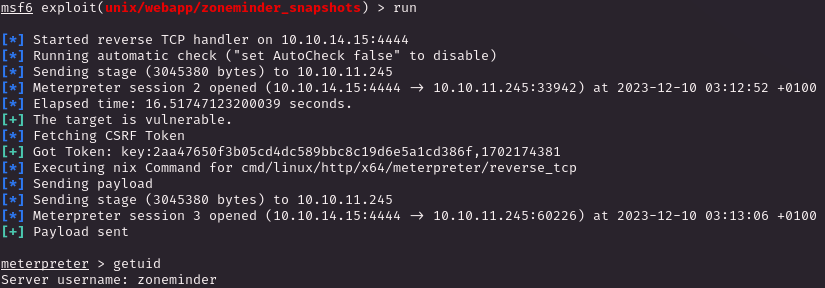

This user have a pretty strange sudo permissions

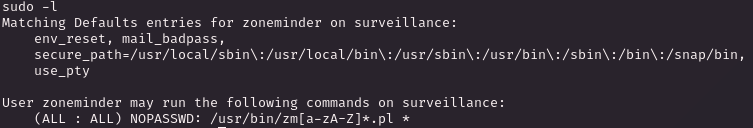

Now I take some time to check every perl script and I come with this but was not what I expected....

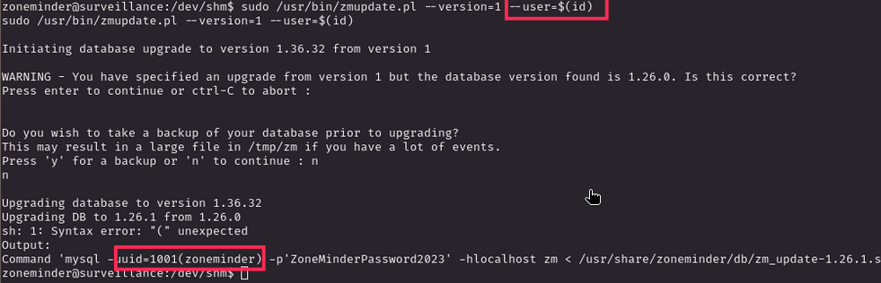

uhm unlucky this was my bad because the nested command for instance `$(whoami)` will take the permission of the main bash command and even if we launch something with sude the owner of the nested command will be the low priv user, cool BUT we can add a layer to this OS injection.

the `--user` parameter is going to be used as `-u` parameter of the **mysql** command, obviously with `system()` function that will run under `root`. So if we use the nested command as strings instead of directly execute as low priv and then use it as parameter for the sql login we will do the opposite pasing our malicious parameter as a string!

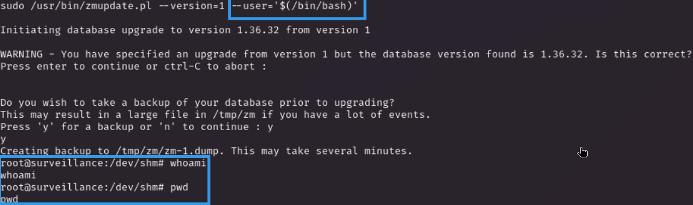

Yeah it worked! even if we have no output from the new shell we get it as `root`, so we can create and execute it with this method. the results will be our wanted high privileged shell! 

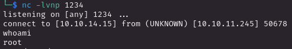
