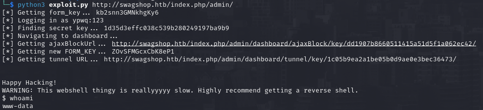

# PORT SCAN
* **22** &#8594; SSH
* **80** &#8594; HTTP (APACHE 2.4.29)

   

# ENUMERATION & USER FLAG
As expected the website is a bad clone of the HTB swagshop powered by [Magento](https://about.magento.com/Magento-Commerce)

I have played around a little bit and what I get is a potential SQL injection

I used sqlmap to go a little bit deeper but without results so maybe we need to make some small cahnges or at the worst do it manually but everything is useless whitout enough information and the tool [magescan](https://github.com/steverobbins/magescan) can help us to retrieve some more! 

First of all we have the version

Plus we have an interesting xml files with inside credentials of MySQL with plaintext password

With some research I discovered **<u>ShopLift</u>** a SQLi in Magento directly from 2015 and [this PoC](https://github.com/joren485/Magento-Shoplift-SQLI) exploit it to create new admin account

We can go in the admin panel and use the brand new credentials to login where we can see the last 5 search terms (is just for fun we can look some content of the SQLi queries)

Now another [PoC](https://github.com/0xBruno/MagentoCE_1.9.0.1_Authenticated_RCE) needs to be used to gain foothold. This version of Magento (1.9.0) is vulnerable to authenticated RCE thanks to a **<u>POP chain</u>**

Nice now should be a good thing to change to a netcat reverse shell in order to be moer stable and fast. The flag will be located at `/home/haris/user.txt`

   

# PRIVILEGE ESCALATION
Pretty easy let's take a look at `sudo -l`

Now is pretty sure the way to get root, we open vim on the specified path and use it to spawn a shell with `-c`

Cool stuff!
