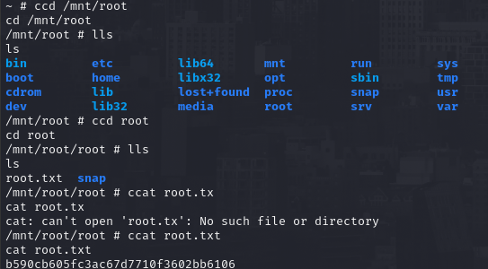

# PORT SCAN
* **22** &#8594; SSH
* **80** &#8594; HTTP (APACHE 2.4.41)
* **8080** &#8594; APACHE TOMCAT

   

# ENUMERATION & USER FLAG
Port 8080 highlight the Apache Version which is the `9.0.31` and have 2 link that point inside `/manager` but  a set of credential through Basic Authentication is required to access this type of pages (common thing on tomcat). Default credentials don't work so we need to hunt for a valid ones

So I started enumeration on the port 80

First thin I noticed is that the hostname is `megahosting.htb` (and not tabby.htb) and the only accessible page is `/news.php` and if we click on the anchor located in the image above will redirect to `/news.php?file=statement`.
I trained my eye enough to notice there is a potential **<u>LFI</u>** thanks to the `file` pjhp variable. I tried with `/news.php?file=../../../../../etc/passwd` and we have our requested file as output!

Now that we have a way to see file contents inside the target filesystem we need to understand **what file we need?** **where this file is located?**
Well I already know what I need since we are running tomcat but is always a good thing to use the standard errors pages 

The first piece of the puzzle is setted and we know (thanks to the nmap scan) the target OS is **Ubuntu** and with some online search we can figure out some standard location. After afew minutes I found that the path `/usr/share/tomcat9/etc/tomcat-users.xml`

Finally our hunt concluded successfully and we can access to `tabby.htb:8080/host-manager/html` and we have `manager-script` role. A common abuse of this role is to upload a WAR (containing a JSP reverse shell) and than access it trhough the browser to gain RCE!

We are impersonating the service user **tomcat** and we need to get controll of **<u>ash</u>** user to retrieve the user flag so let's analyze the filesystem!
Looking around I found `/var/www/html/files/16162020_backup.zip`, this is really interesting so I moved on my local machine (copy and paste the base64 format of the zip) but to extract the files we need a password.
I tried to reuse the same secret of the `tomcat` user bu no way for that so let's crack it!

The backup files are nothing usefull but we can use the password to change user and grab the flag!

   

# PRIVILEGE ESCALATION
We are not in the sudoers and there is no interesting SUID binary but we are in the `LXD` group, this specic group allows to create and manage of low-level Linux containers in a similar way to Docker.

I found pretty handy this [blog post](https://steflan-security.com/linux-privilege-escalation-exploiting-the-lxc-lxd-groups/)  on how to create and set up the container image. Following all the steps on the blog post is enough and to access the whole filesystem just change directory to `/mnt/root` after that we have full controll

