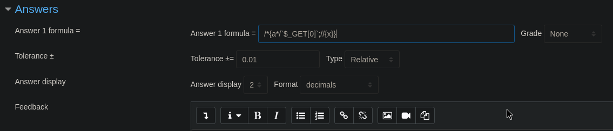

# PORT SCAN
* **80** &#8594; HTTP (APACHE 2.4.25)

   

# ENUMERATION & USER FLAG
The website is a static brochure that act as a presentation for a highschool

Dirbusting found nothing interesting but the `/images` path where a file is significatively small than others

Since I was not able to retrieve the contents I tried to curl it directly and well is a sort of steganography on this fake image file

After that, nothing interesting at all, just a little bit of time and the endpoint `/moodle` has been found! Makes sense with the box name

Cool, now we know the prefix of a password and we need the last character to find, we can use moodle login to test out bruteforce but first of all let's create a password wordlist. I used `crunch` to generate a worldist with same base string and adding a last character (letter, number and special char) and I used `cupp` for username creation. Now is time to unleash the `hydra` and wait for results

Cool stuff, both of the username work (probably moodle is insensitive on username) and we are ablo to log in. Pretty empty from the inside so I used **moodlescan** to retrieve the moodle version which is `3.4.1`. This version is vulnerable to RCE through an exploit called **<u>[EvilTeacher](https://www.sonarsource.com/blog/moodle-remote-code-execution/)</u>**. We are inside moodle as Giovanni with Teacher role and we own the Algebra course (ID=2), EvilTeacher abuse a quiz feature that permits to a user to add a calculated question that will be automatically resolved using `eval()` PHP function, with some tuning we can abuse it to run OS commands. I created a new quiz with a calculated question and use the following payload to abuse this feature

After the creation of the question we can display the question and when we add `&0=[COMMAND]` to trigger the RCE, I test it with a ping command on my local machine and it worked! Now we can use the same procedure to gain a reverse shell (through URL encode payload)

We need some horizonatl movement if we want to read the user flag so is time to enumerate back again (the password used on moodle did not worked). Pretty easy, inside the file `/var/www/html/moodle/config.php` which include database credentials

Inisde the database `moodle` I retrieve a MD5 saved under the username **GiovanniBAK** in the `ml_user` table, running hashcat I get hte plaintext **expelled**. Now we can impersonate the user and grab the flag!

   

# PRIVILEGE ESCALATION

There is an interesting folder inside `/home/giovanni/work` where a backup of the courses has been created with root permission, so running `pspy`found a cronjob executed by the root user

Interesting we have `tar` being used so we can abuse symlink in order to retrieve the contents of `root.txt`. I created a a symbolic link to **root.txt** using `ln -s /root/root.txt root`, than use `tar -cvf test.tar root` to transform the symbolic link to archive file and than moved on the **~/work/courses** path.

After that we just need to wait a few minutes that thte script gets triggered and after that we can finally retrieve the flag contents!

Really easy, tar needs to be used with appropiate flag to avoid this issues!
