# PORT SCAN
* **21** &#8594; FTP (FileZilla)
* **22** &#8594; SSH
* **135** &#8594; Microsoft RPC
* **139** &#8594; NetBios
* **443** &#8594; HTPS (Apache / Debian)
* **445** &#8594; SMB (signing enabled but not required)
* **5985** &#8594; WinRM

   

# ENUMERATION & USER FLAG
This box is a windows machine but the port scan report Debian distribution, plus the FTP port accept anonymous login and inside we have `docker-toolbox.exe`

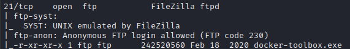

Docker-Toolbox is just the installer and automatic setup for docker for older version of Mac and Windows (in this case appears to be **Windows 7**)

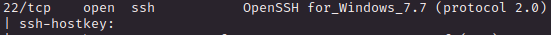

 

About the HTTPS page, it act like a maritime logistics company (make sense with docker machine theme)

The home page is just the traditional static page with no user interaction but if I look closer at the NMAP scan we have a clue of a subdomain

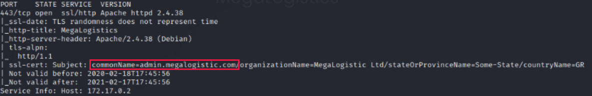

This can also be discovered manually looking t the certificate 

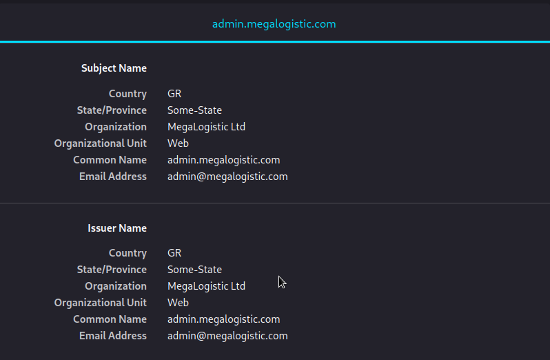

We have a simple login form, I tried with the traditional `admin` as username and `' OR 1=1;--` as password.

I was not able to bypass it but we have some cool error that we can see in the background of the template

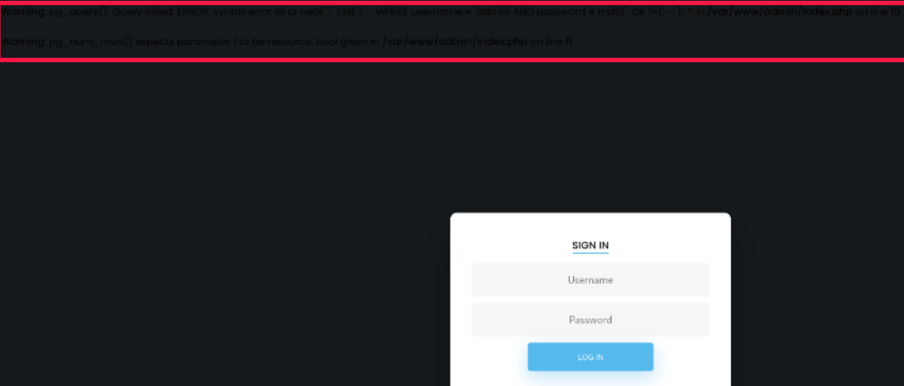

So I set the sql string on username and we are in

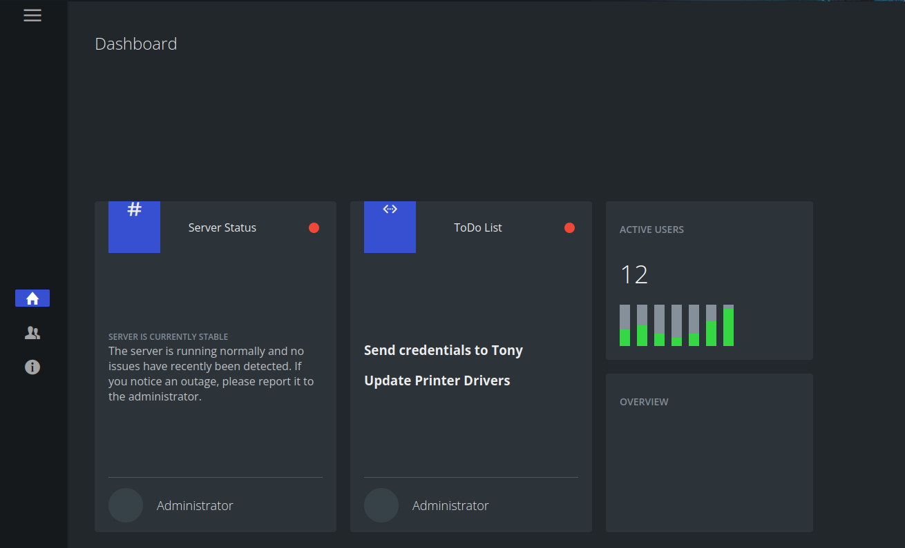

Actually inside there is nothing usefull but we can use the `--os-shell` on SQL map to get command execution 

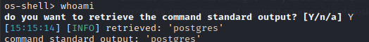

Cool stuff now we can inject a reverse shell 

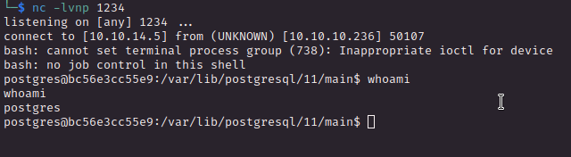

In `/var/lib/postgresql` we have the user flag

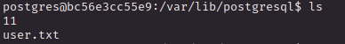

   

# PRIVILEGE ESCALATION

Inside `/` we have the `.dockerenv` file and the home directory have a user called **<u>tony</u>** but we already have the user flag.

Now we should run for root privileges, I was pretty lost than with some research I have discovered that [boot2docker](https://hub.docker.com/r/boot2docker/boot2docker/) usually run togheter with the docker image and the default credentials are 

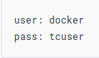

Docker was designed to run on Linux system but toolbox is for Windows and Mac, **<u>boot2docker</u>** is a (light) Linux distribution (officially deprecated and unmaintained) that is created in order to run docker. 

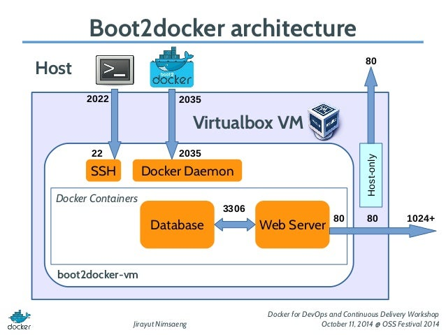

So both the container and boot2docker deamon run inside virtualbox so somehow have to communicate, what's bad is not have binaries like `ping` or `pingsweep` so we have to guess the IP address

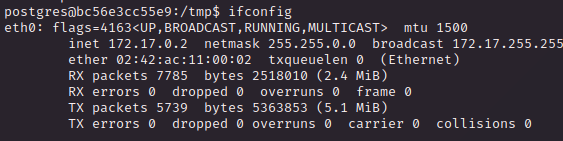

In addition to the **loopback** interface we have `eth0` with IP `172.17.0.2`

We have to guess here, knowing that boot2docker is created BEFORE the docker container make sense tha the boot2docker IP is `172.17.0.1`

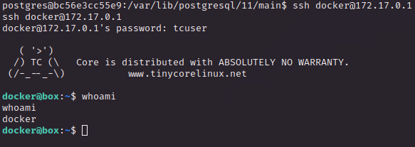

We are inside cool and WTF the `sudo -l` output is overpowered, probably becuase inside the boot2docker doesn't require as password since is only used as support for the containers

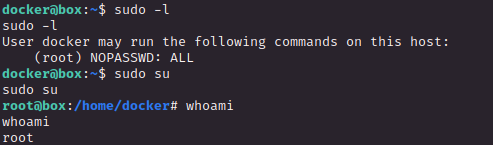

There is no flag here but in `/` we have a unexpected directory called **c**

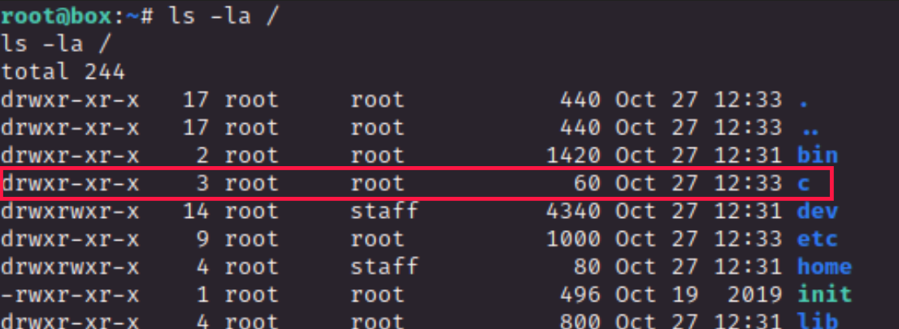

This is the `C` folder of the Windows host and in the Administrator's Desktop directory we got the flag

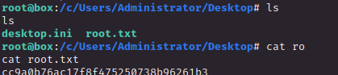

(There is also the .ssh folder with the private keys of administrator for persistence)
