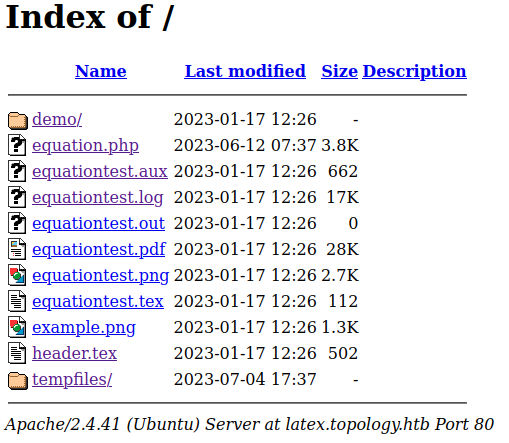
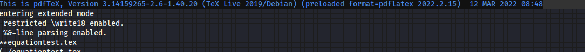
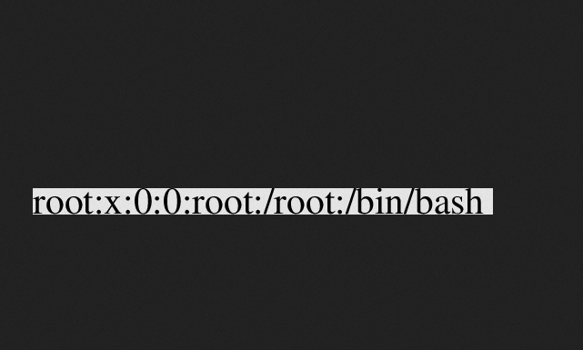
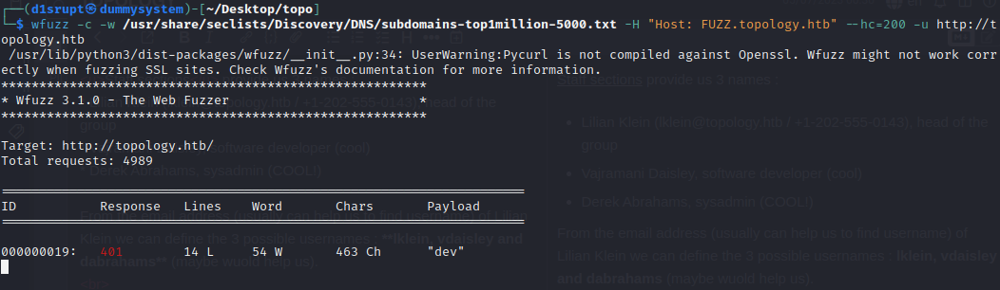
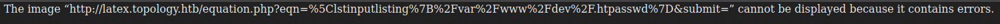
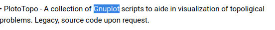
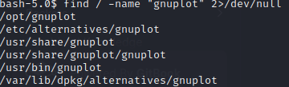
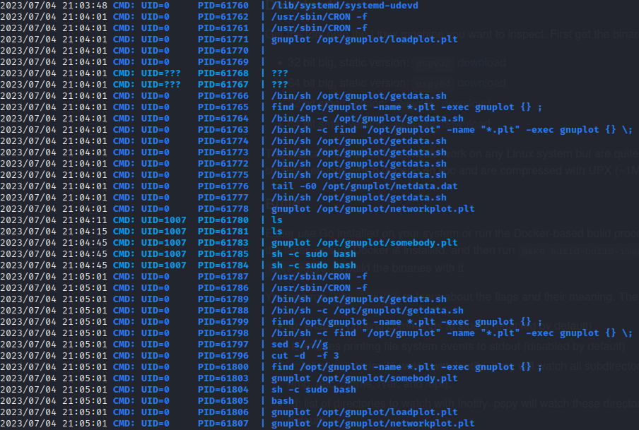
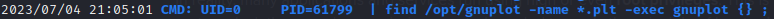

## PORTS
* **22** [SSH]
* **80** [HTTP] &#8594; Apache httpd 2.4.41

Ok this machine seems cool we are presented with the homepage of Topology Group of Miskatonic University (Math dept.).


Fun fct the university is a  fictional one based on H.P. Lovecrat story "Herbert West-Reanimator", the creator is a real nerd for sure.
<br><br>

I've run **dirb** for some directory busting but nothing interesting came out so I decide to focus on the webpage itself and try to extract more information as I can :

<u>Staff sections</u> provide us 3 names :
* Lilian Klein (lklein@topology.htb / +1-202-555-0143), head of the group
* Vajramani Daisley, software developer (cool)
* Derek Abrahams, sysadmin (COOL!)

From the email address (usually can help us to find username) of Lilian Klein we can define the 3 possible usernames : **lklein, vdaisley and dabrahams** (maybe wuold help us).
<br>

On software project we have a list of project developed (or still developing) from this group while 3 of them are not interesting for now (I've googled them and no one of them exist or is similar to something in the wild) the first one let us jump to `latex.topology.htb/equation.php` so I added it on `/etc/hosts` and here is what we get


Simple as expected you write the latex code and return a png of the equation. Here we can do something but we need to discover what's running behind the curtains.



Here the files stored on the server but the most interesting is `equation.log` and inside....



So they are using **pdfTeX** 3.14159265-2.6-1.40.20, with a quick research there is a vulnerability **CVE-2018-17407** but is a buffer overflow so I don't think we can do much remotely.

Following this [blog post](https://0day.work/hacking-with-latex/) I've jumped directly to this piece of code 
```
\newread\file
\openin\file=/etc/passwd
\read\file to\line
\text{\line}
\closein\file
```
and boom we can read the first line of a file



Other piece of code (including the version of the above code but reading multiple line) return me "Illegal command detected. Sorry" so for now we can just read files inside the machine, this means a sort of blacklist is enabled...and here I start to smash my head on the wall.

Ok let's makelatex wait for a bit, while I was going to drink something I start a sub-domain enumeration with `wfuzz` and at my return we have something interesting



So we have the domain `dev.topology.htb` available but we need credentials to access.

Ok gonna be honest here I have to take a quick look at some writeups but /i lean something important that I will keep in mind. The credentials should be provided by the HTTP sign in so usually the credentials are stored in the default file stored at `/var/www/dev/.htpasswd` and here is where latex equation generator abuse can comes handy.

Using the malicious code (I've just discovered that's called LFI-Local File Inclusion) used to read "/etc/password" doesn't work.

This [hacktricks article](https://book.hacktricks.xyz/pentesting-web/formula-doc-latex-injection#latex-injection) give us other methods to read the file but the error we have now is pretty different from the others 



So the problem right here is about the result of the code not the code itself, luckly I've endend my bachelor (which was written in latex obv) so I am quite familiar with it.

Honestly speaking I've done something that in hacking is not seen  professionally by others...I've start doing random things :)

So I added some `\` at the start, at the end and than both of the string but nothing but when I add at the start and the end the `$` character we got what we need, the hash of **vdaisley** user (as we guessed from the previous enumaration, easy to guess but cool it worked)


Now i will copy the hash and use **john the ripper** trying to crack it
and the result is `calculus20` so now we can access at that login page and here it is, another website


Nothing can be done here so I tried the credentials on ssh and we are in let's try to get a root shell!
<br><br><br>

Using **linpeas.sh** for a quick enumeration I've discovered that `stats.topology.htb` is another subdomain and is just a page with the plot of the server load, for now nothing cool, but maybe a hint(?). If I refresh the page the plot will be updated so something in the background is running if this is a hint this means we got a way.

I returned back to the first homepage and on Software Projects this got my attention...



Maybe gnuplot is the key let's search it on the machine and see what we can do



Also I need a better understanding of the process that are running (I don't like that linpeas output section) so I used  `pspy64`



Yeah gotccha gnuplot is running as root (`/opt/gnuplot`) so now I started studying how to abuse it.

ROOT is going inside th gnuplot directory and running `getdata.sh` that (as far as I can see) create a .dat file and with a combo of sed+cut extract the data than use it to create the plot.

More in depth we have to note 2 things : 
* We have write permission on the folder
* This action, with this piece of code ROOT is searching for all `.plt` files and execute it



Gnuplot is written in C so a one-liner like this should work (we can do a reverse shell or a sort of backdoor which is what I chose)

`system("chmod u+s /bin/bash") > /tmp/uau.plt`

Than I've copied inside the gnuplot directory, wait couple of minutes and than just execute `/bin/bash -p` (the -p flag don't reset the id of the user so will have the one of the owner, root).

We got root access and we can read the flag, machine completed!
