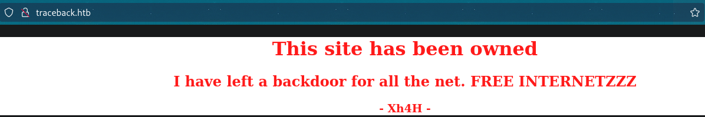
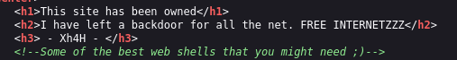
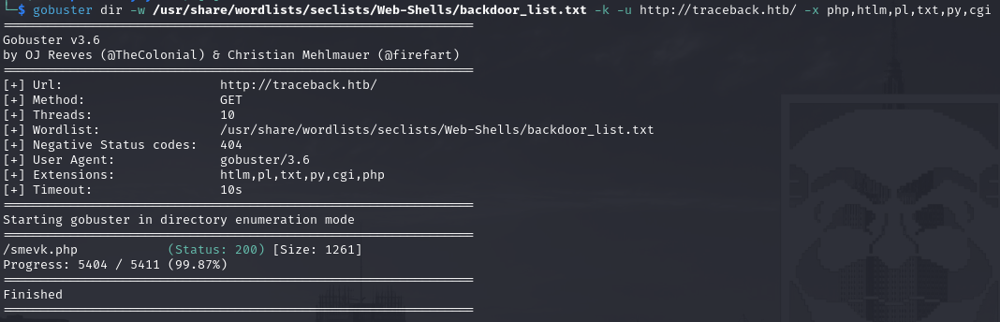
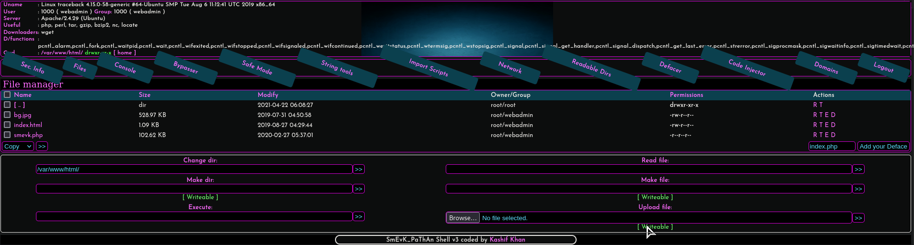
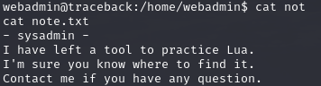
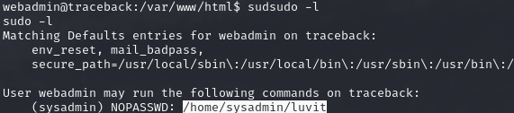
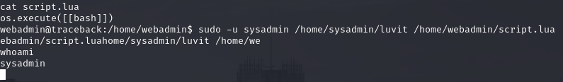
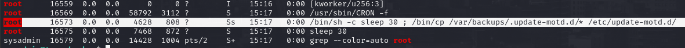
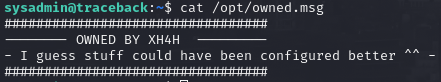
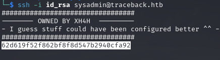

# PORT SCAN
* **22** &#8594; SSH
* **80** &#8594; HTTP (APACHE 2.4.29)

   

# ENUMERATION & USER FLAG
Oh no someone hacked this website :(

I started to enumerate the web service like usual and while my tool were running I got a pretty good hint in the source code

This moved me and use GoBuster with ad-hoc wordlist provided by SecList with a focus on backdoor

Gottch'a. the `/smevk.php` have a login form and I try with the weak `admin:admin`. Surprise surprise it worked and we can play with this cool backdoor!

Now I use it to get a reverse shell as `webadmin` and in his home folder I found a pretty interesting text file

I spent some time going through the filesystem but the location of this file could be retrieved using `sudo -l`

**<u>luvit</u>** is CLI tool that allows to run LUA script and in this case we can do it as `sysadmin` so I create a LUA script containing just the line `os.execute([[bash]])`, the magic happen when we combine all those elements togheter and we can spawn as `sysadmin`. The user flag is our!

   

# PRIVILEGE ESCALATION

I took a look at the running process and there is a specific one that run every 30 seconds....

Interesting stuff! With some search online I was able to understand the purpose of the motd file, responsible to show the banner message when a user SSH inside the machine. This makes sense because the banner in this machine is not standard

I went inside `/etc/update-motd.d` and the one responsible for the banner is `00-header` and I changed the content as `cat /root/root.txt` (after all is just a bash script that run as root!) and when I re-login inside the machine the flag would be in front of my face

Obviously for get persistence we can abuse this file like a simple script that run as root so the possibilities are infinite
