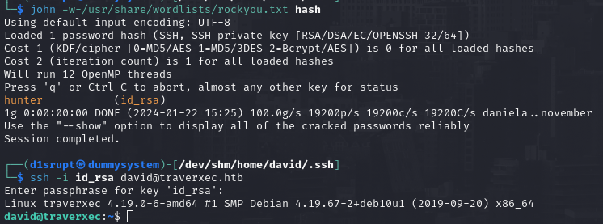

# PORT SCAN
* **22** &#8594; SSH
* **80** &#8594; HTTP (NOSTROMO 1.9.6)

   

# ENUMERATION & USER FLAG
Port 80 runs a [nostromo](https://www.gsp.com/cgi-bin/man.cgi?topic=NHTTPD) instance, pretty uncommon! This specific version `1.9.6` is vulnerable to a [RCE](https://nvd.nist.gov/vuln/detail/CVE-2019-16278)....well not just a RCE is a directory traversal that permits to connect to `/bin/sh` and through a POST request execute commands

I used the metasploit module (the ExploitDB version is pretty bugged) to obtain a shell!

This is not enough to get the flag so we need to get access to `david` credentials, inside `/var/nostromo/.htpasswd` we have what seems to be an hash

This hash require a lot of time to be cracked so is worth checking out for something else while is working. One of the configurations file in nostromo directory tell us something very specific....

Pretty interesting, all the web file can be accessed as `www-data` and looking at `HOMEDIRS` section we can try to access `/home/david/public_www`, luckly it worked!

Inside there is an archive file called **<u>backup-ssh-identity-files.tgz</u>**, this osunds great so I downloaded on my own machine and extracted the files which are a copy of `.ssh` david directory. I tought it was done but when I SSH with the private RSA key but it ask for a passphrase

I used `ssh2john` to retrieve in a crackable format the ssh key and using `john` I found **hunter** is the plaintext! Now we can access through SSH and get the user flag!

   

# PRIVILEGE ESCALATION
We can't use `sudo -l` because it require a password and it seems there are no SUID binary to abuse but inside the home folder we have an interesting file `/home/david/bin/server-stats.sh`

As you can see it use sudo on **<u>journalctl</u>** so I tried to run the same but on my shell

Gottch'a we can execute this command, no changes. Interesting the fact that **<u>journactl</u>** use ess as pager but only when the number of lines doesn't fit the ones that can be read by the terminal. We can't change the value of `-n` but we can change the size of the terminal with `stty`. If we set that to 1 and than recall journactl this time the `less` will triggered and we can invoke a shell with `!/bin/bash`

We got root!
