# PORT SCAN
* **22** &#8594; SSH
* **53** &#8594; DNS (ISC BIND)
* **80** &#8594; HTTP (NGINX)

   

# ENUMERATION & USER FLAG

The webpage is a simple form which is not activated

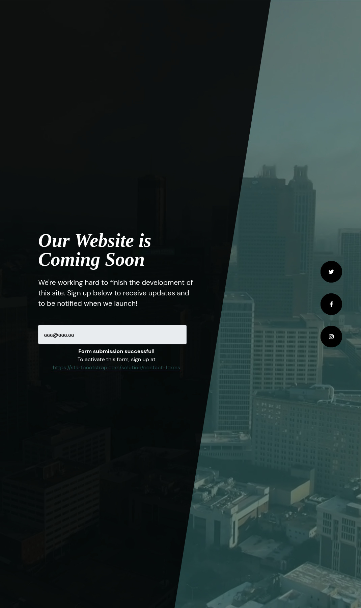

Making some consistent enumeration, I found something new in **<u>DNS Transfer Zone</u>**

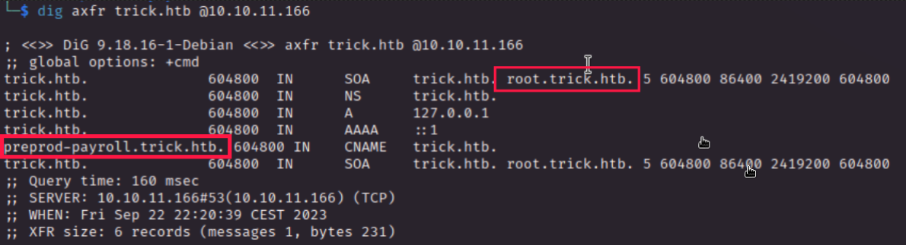

Cool we have a new domain to checks, at  `root.trick.htb` we have the same version of the website of the original domain....interesting but not cool at all :(

In `preprod-payroll.trick.htb` we got something new, finally!

Ok cool, I run a hydra and dirb instance while I was trying some simple SQL injection and with the parameter **username** equals to `' OR 1=1#` and whatever password we can get access inside.

 

#
Looking at the walktrhough after the SQL injection I found that the title of the site is  `Admin | Employee's Payroll Management System`, **<u>Payroll Management System</u>** is an [exisisting management software](https://www.adp.com/resources/articles-and-insights/articles/p/payroll-management-system.aspx) (this is what was slowing me, I tought was just a random name) and searching for some known exploit we have a [SQL vulnerability](https://nvd.nist.gov/vuln/detail/CVE-2022-28468), is cool to discover something simple by yourself and than checking that someone already discovered that
#

 

We are in as **Administrator** account, good let's see what we have here ready to be discovered

In `Attendance` we have a name and the time record 

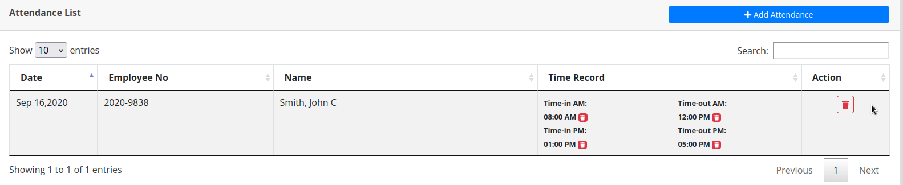

`Employ` give us more info about our guy john

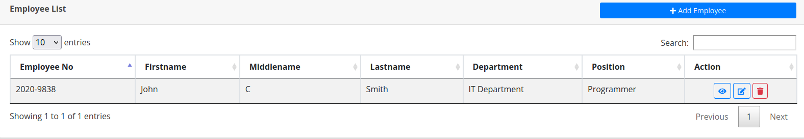

I user something interesting, we have just a user called `Administrator` and username is `Enemigosss`, when we click edit we have hte password field and with a simple tik tok trick we are able to change the type from password to plain-text

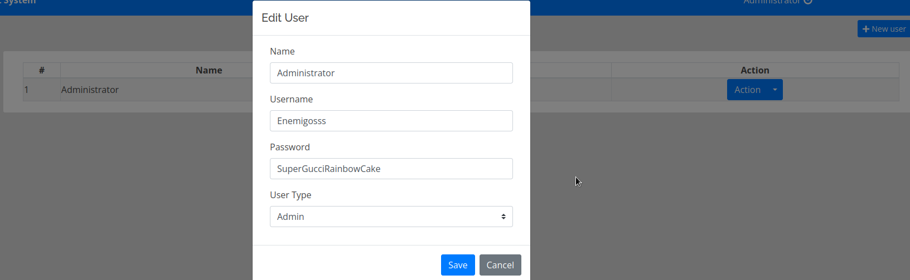

Try to use this set of credentials through ssh but no access at all, no good

`Payroll List`, wow we can see how much john gain as salary

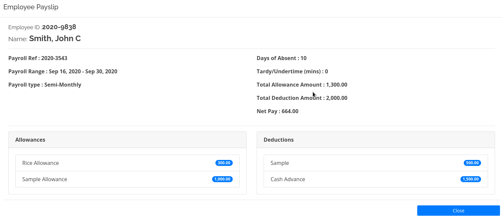

Here I was pretty lost nothing interesting we can do about it and yeah...I saw the writeup but I learned that sqlmap can be used not only to test adn retrieve database contents

 

We already know that the username is injectable so we are using that in the `-p` flag and we can use the `--privileges` to check what privileges the DB account have in  this case **<u>FILE</u>**

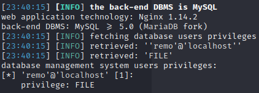

Now we can rerun sql map with `--file-read=/etc/passwd` to retrieve the file which is saved locally and we can check the contents

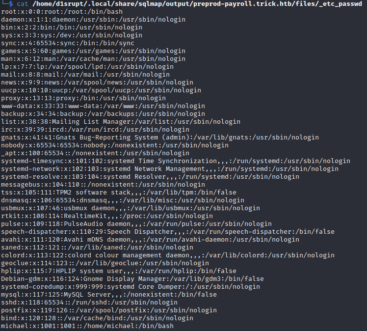

We gotta it, we can check the contents in the nginx dirctory and retrieve another host if present especially in `/etc/nginx/sites-
enabled/default`. We have a new subdomain, gotcha!

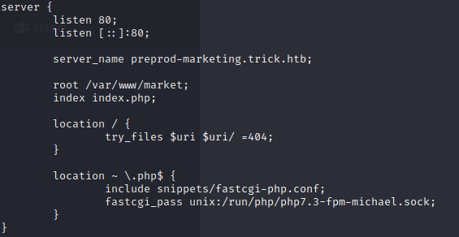

Let's add it to host file (`preprod-marketing.trick.htb`) and navigate there

Ok, enumeration again nothing new lol

In the `about` page we some employes names which is cool

What's interesting here is the use of the **?page** parameter

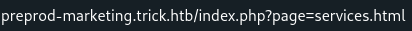

So the **?page** parameter is used to select the file to show in the webpage, maybe we can make a **<u>LFI</u>** pretty easy with the `....//` trick

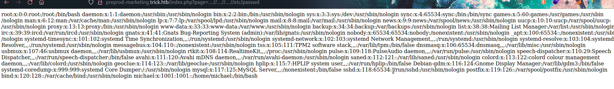

In [this article](https://medium.com/@Aptive/local-file-inclusion-lfi-web-application-penetration-testing-cc9dc8dd3601) I found a cool way to use the email to make a reverse shell, we know that the user `micheal` exist looking at the `/etc/passwd` (I checked through the LFI).

 

This is the commands I used to upload the php reverse shell

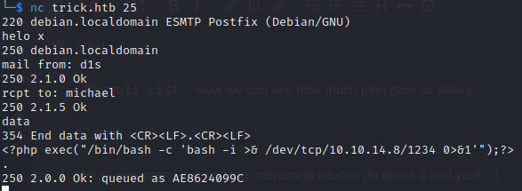

Than just use the **LFI** to activate the reverse shell

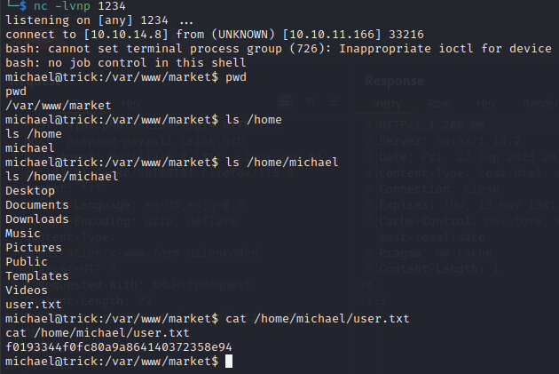

   

# PRIVILEGE ESCALATION
Ok cool stuff now we don't need to make a lot of enumeration, `sudo -l` was enough

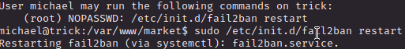

Checking the id we know we are inside the security group

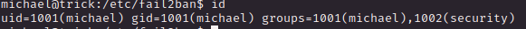

Checking some configuration file inside `/etc/fail2ban` look we have the `action.d` directory that is own by the security group

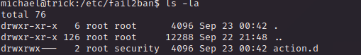

So it is writable by us, eheheehhe cool let's use [this article](https://juggernaut-sec.com/fail2ban-lpe/) to get what I want!

 

1) We can't write in the fles but with this TRICK we can make it happen, in details we need to edit the `iptables-multiport.conf` file

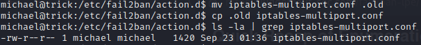

2) We write inside the `iptables-multiport.conf` file changing the actionban to whatever we like (I directly copied the `root.txt` file and give me the permission to read it, originally use iptables to blacklist the malicious address)

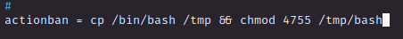

3) We need to get ban, try to login in ssh missing the password and after few attempts the command we decide to use will be triggered, enjoy!

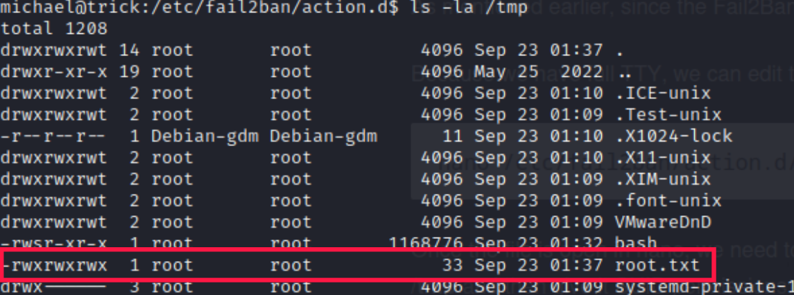

