# PORT SCAN
* **22** &#8594; SSH
* **80** &#8594; HTTP

   

# ENUMERATION & USER FLAG

The website is a simple login page, the `Admin` button redirect to the `admin` subdomain

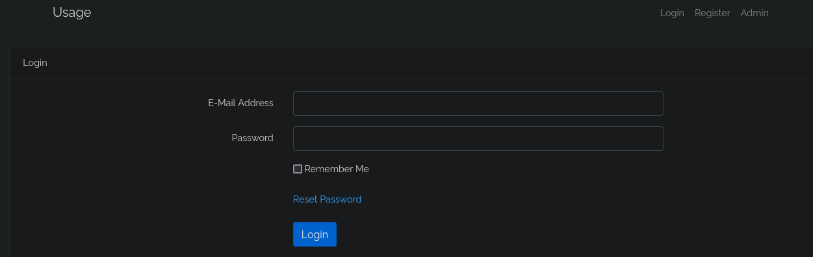

I will start creating a new user and try to understand what we have over the login form to get a better idea of the capabilities, nothing interesting becausewe have a static website. Nothing more

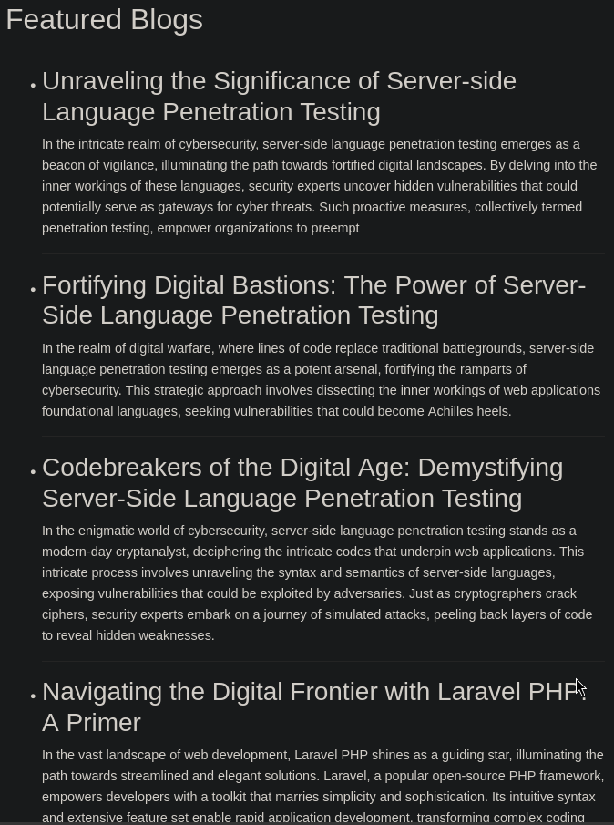

Using GoBuster with the cookie the server forged after the authentication I have discovered a "hidden" page taht allows to change password giving an email at `/forgot-password`

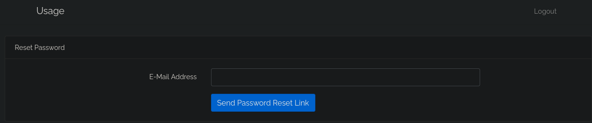

The website isn't that interactive and nothing else has been found, I saved the request of the login process and password reset, save them and use it on SQLMap hopingf for a SQL Injection entry point. While the login request returned nothing (but discovery the MonetDB DBMS is used) the latter contains a "wound" on the **email parameter**

[..................................................................]

Now we can login inside the administrator panel, I need to find a way to get RCE on the machine if we want to grab the user flag. We can note in the depenencies table the plugin `encore/laravel-admin 1.8.18` is active

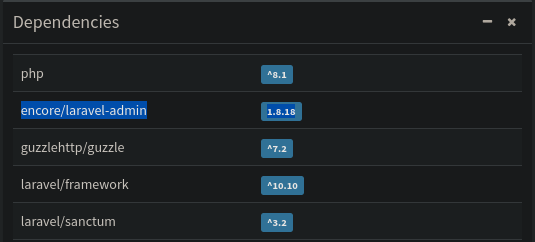

This plugin version is vulnerable to [CVE-2023-24249](https://flyd.uk/post/cve-2023-24249/) that allows to get PHP upload through file upload on the user image, we create a PHP reverse shell and renamed with a JPEG extension. Before uploading it (as profile picture) we proxy the request to Burp and cahnge the extension to PHP before forward it back

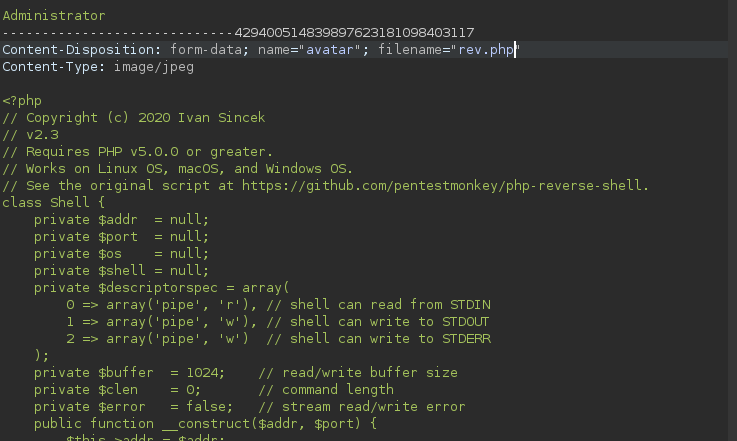

Then the file would be accessed and trigger the reverse shell

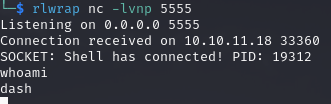

Just spawn a full interactive shell and the user flag would be in the home directory

   

# PRIVILEGE ESCALATION

In the home directory we have somefiles, in one of them called `.monitrc` we have an hardcoded password, the other user in the `/home` directory is **<u>xander</u>**

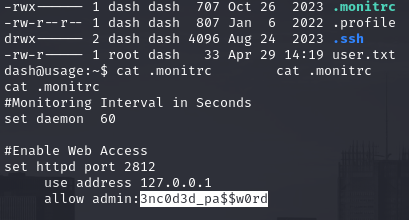

Trying to SSH with this username and password worked and we can run a costum binary with SUDO

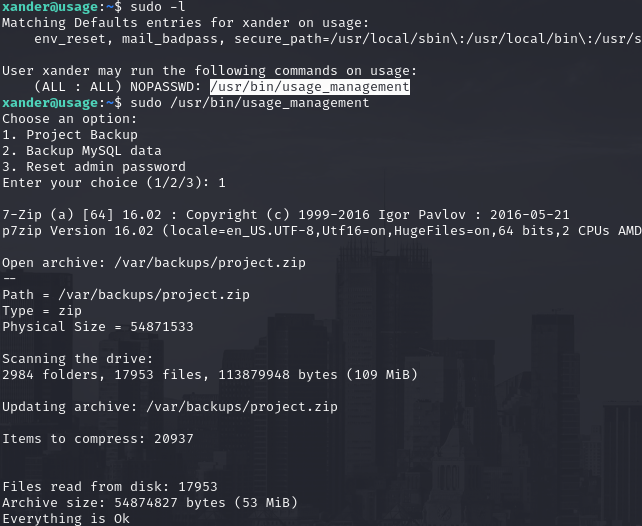

Interesting behaviour when we use the Backup option but to be 100% sure of what is used I decidd to export it locally and use Ghidra to look inside

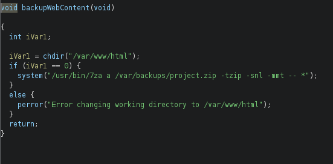

`7z` utility is used on al the files inside the backup option, we can abuse it in a tricky way. We can force an error message to read the content of the root flag, we create a symlink to the root flag (`getthis`) and a special file called `@getthis`.  

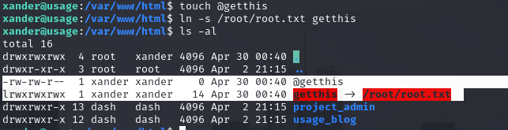

The latter would specify that the former is a list of file taht would be compressed, with the SUDO permissions would open the flag file, read the contents, try to compress the file on that path but obviously would create an error displaying the contents of the flag (that are interpreted as filename)

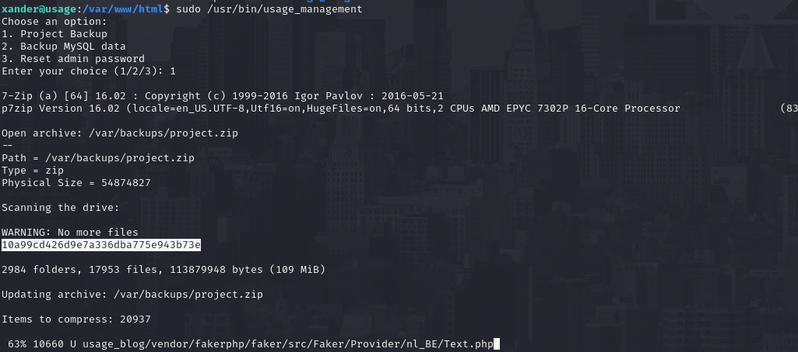

This can be used to read the SSH private key and directly SSH inside as root!
