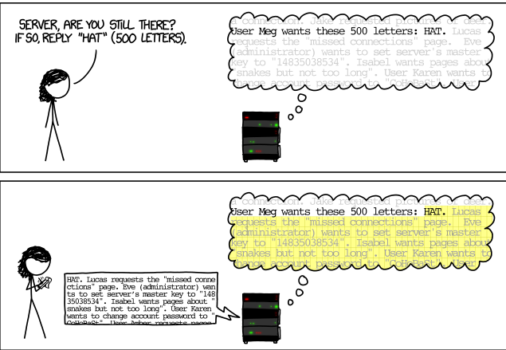
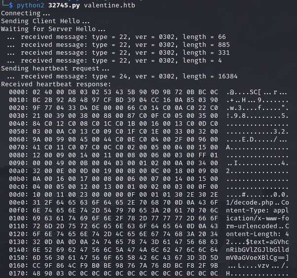
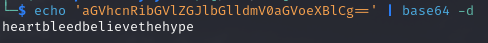
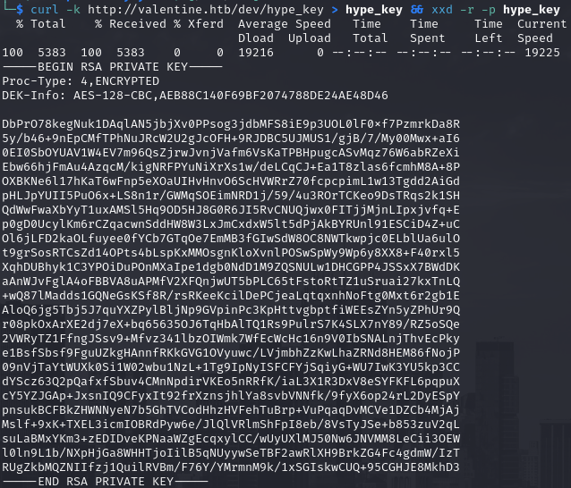
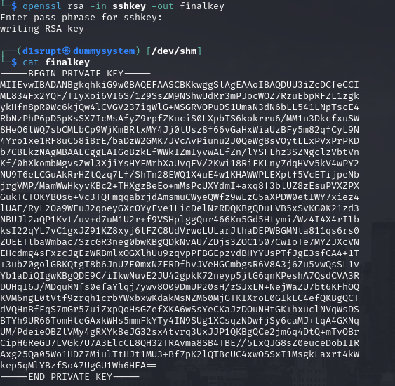
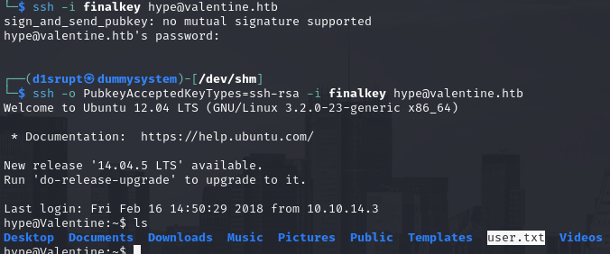
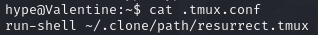
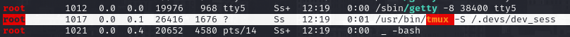
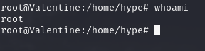

# PORT SCAN
* **22** &#8594; SSH
* **80** &#8594; HTTP (APACHE 2.2.22)
* **443** &#8594; HTTPS (APACHE 2.2.22)

   

# ENUMERATION & USER FLAG
The web service is just a simple image in combo with the box name

Now I have searched this image with google image and something curious pop up....

**<u>Heartbleed</u>**...with some research it appears to be a SSL bug and look so much powerfull that have [his own website](https://heartbleed.com/).
Labeled with [CVE-2014-0160](https://nvd.nist.gov/vuln/detail/CVE-2014-0160), the vulnerability affects OpenSSL crypto library (OpenSSL 1.0.1 before 1.0.1g) allowing malicious actors to steals information protected with SSL/TLS encryption.

Uau, pretty cool ah? But why this name? The TLS layer have an extension called **<u>HeartBeat</u>** is responsible to `echo data back` from B to A where A send data first.

What A sends is thedata itself and the length specified, here the vulnerability kicks in. Similar to a buffer overflow we can send a length greater than the actual data we are sending and the server will reply back sending back maximum 64KB of data inside the RAM!

Pretty strong in this way attackers can read the key to decrypt communication between clients and server (shoulder surfing for free) as much as other data

Now time to use it, searchsploit have a [PoC](https://www.exploit-db.com/exploits/32764) ready for us to be used against a target! Here's the result

The text value have a base64 string which decode looks pretty interesting

Pretty good it looks like a password but we have no knwon username but we now understand that the endpoint `/encode.php` exist so a run of **<u>gobuster</u>** is a must right now. Good decision because the `/dev` have the file `hype_key` which contains a lot of HEX values
We can download the file and translate in human eradable language

Interesting stuff is a RSA key probably used for SSH access, as you can see is encrypted but we have the password thanks to heartbleed so we can decrypt it and have the rsa key

We know that `hype` is the user so we can now try to get foothold in the system, I had a problem with the traditional command I used to connect with RSA through SSH but using [this thread](https://stackoverflow.com/questions/73795935/sign-and-send-pubkey-no-mutual-signature-supported) I get with a quickly solution to enabled the RSA+SHA1 signature alghorithm. After that small tune we can grab the user flag

   

# PRIVILEGE ESCALATION
There is a interesting file inside the home folder called `.tmux.conf`

The web have put my attention on [tmux-resurrect](https://github.com/tmux-plugins/tmux-resurrect) a plugin of **tmux**. Is not all here we have the `root` user is actualling using tmux!

We can use tmux and connect to the same socket used by root to privilege escalation quickly (actually we are doing the sae command done by root, lol).

Here we go we have full controll now!

