# PORT SCAN
* **80** &#8594; Apache HTTP 2.4.56 (Win64)

   

# USER FLAG
Uau, really poor port scan so we don't have other options than visiting the webapp

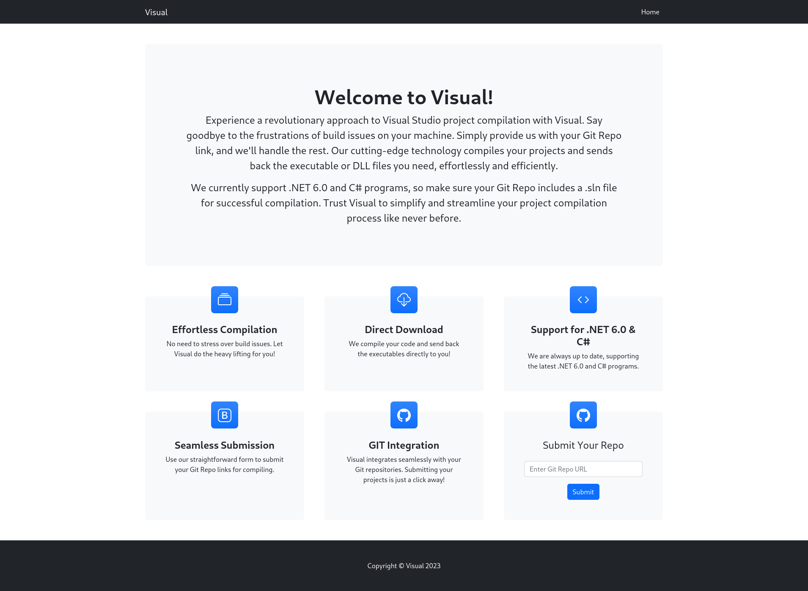

Interesting stuff, interesting stuff. So the first thing sound weird to me is the fact that I have to give a Git Repo at the webpage, is widely known that the boxes are not connected to the internet in any way, so I need something like **Gitea** to selfhost a Git repo by myself

So apparently (this is my assumption) the webapp recover the repo and build the .NET/C# file and compile it for us giving back the DLL or executable, if we can find a way to execute a powershell command and get a reverse shell we would take the user flag 

So  I first used `dotnet` to create a project with a simple Hello World programm inside

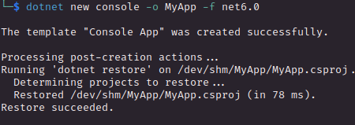

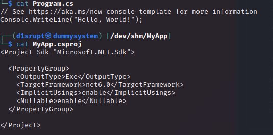

Following [this article](https://github.com/MicrosoftDocs/visualstudio-docs/blob/main/docs/ide/reference/build-events-page-project-designer-csharp.md) I was able to discover how to inject some

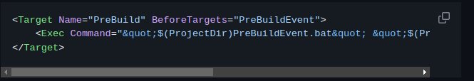

Which I changed to this 

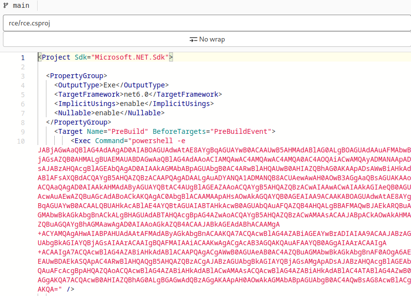

Than I have just set up a docker container running gitlab, I take some configurations json files on existing GitHub repository of VS build (fllowing the error returned through the webapp) and than give the repository link to the webapp while netcat is running.

After few seconds I have my user shell and I am free to take the flag (finally!)

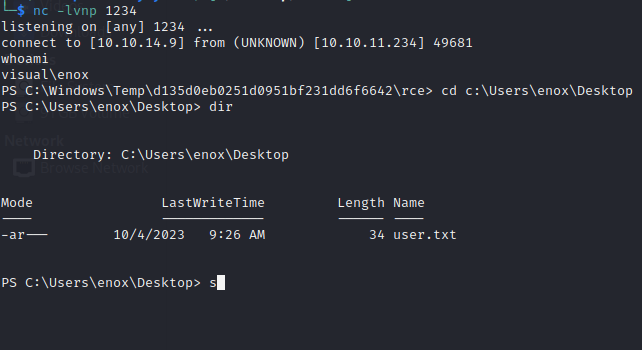

   

# LATERAL MOVEMENT & PRIVILEGE ESCALATION

Let's take a look at the groups we are part of

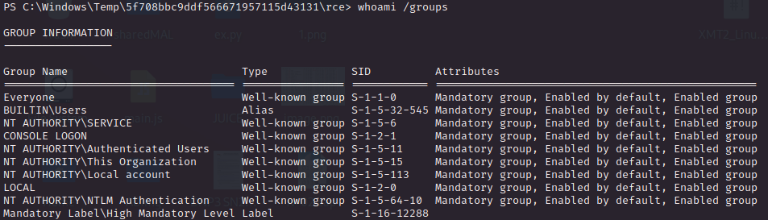

Plus we don't have enough privilege so we probably have to make some lateral movement. During the experience with this machine and some discussion with other HTB players I have acknowledge that **<u>in Windows Service Account are usually more powerfull than standard user</u>** (`NT AUTHORITY\System` is like being root in linux enviroment), running something like a web server service as local service is a misconfiguration (like running it on a user with `sudo NOPASSWD` in linux) and this is the case

  

So first of all I have checked all the service running in the machine

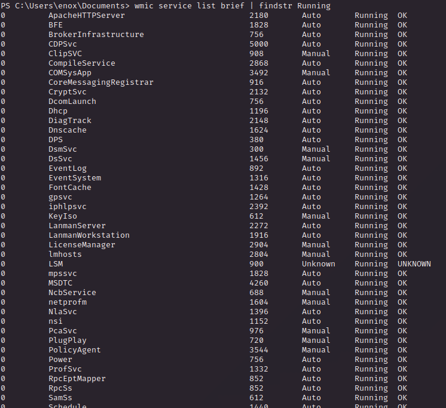

What's catch my eye is obviously the **Apache Web Server**, so let's pick information about it

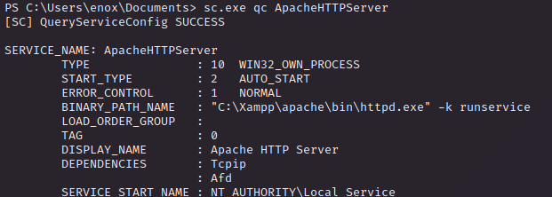

Cool stuff so we have the directory where Apache is hosting the webapp so let's see if we have enough permission to abuse it and take controll of `NT AUTHORITY\Local Service` 

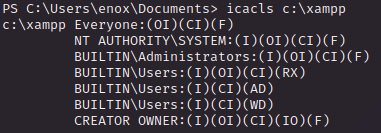

Oh yeah we got it, we can upload a simple pp reverse shell and access it through the browser to check everything is smooth. Here we go

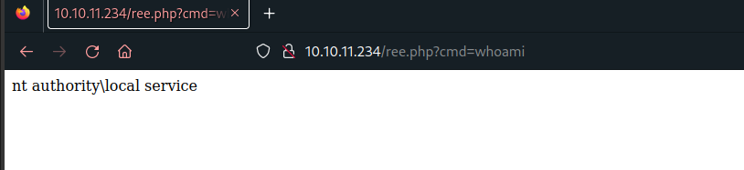

Let's bring a reverse shell

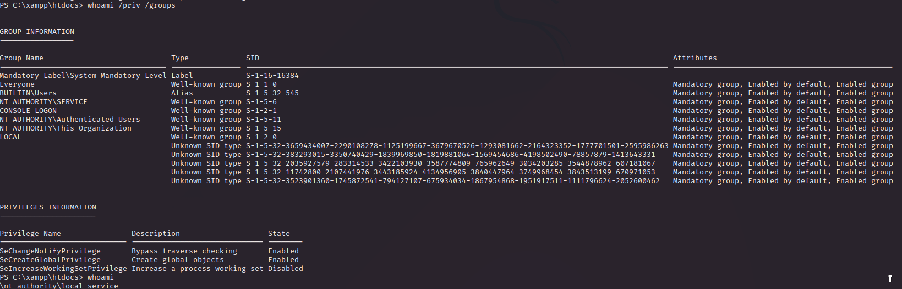

 

Gotch'a cool cool stuff, researching how to abuse this type of user I have encountered [FullPowers.exe](https://github.com/itm4n/FullPowers), this executable is powerfull wehn have access as service account (database or web server for instance), it create a scheduled task and the process created (by the Task Scheduler) have all the default privileges set. In this way we can have more space to get root 

 

Than I used to get a reverse shell with the same user but with wider privileges

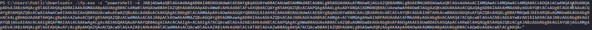

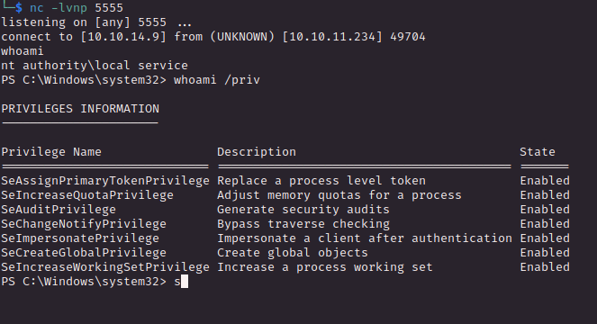

Look how beautiful it is now, we have the overpowered **<u>SeImpersonatePrivilege</u>** token set and with a quick web search [GodPotato](https://github.com/BeichenDream/GodPotato) is what it fit in this scenario

GodPotato is the overpowered and versatile version of the [Potato Privilege Escalation series](https://jlajara.gitlab.io/Potatoes_Windows_Privesc), this version exploit some defect on RPCSS (service that must be openend by the system account) dealing with oxid makin it possible to run on every WindowsOS (that's why is the GOD)

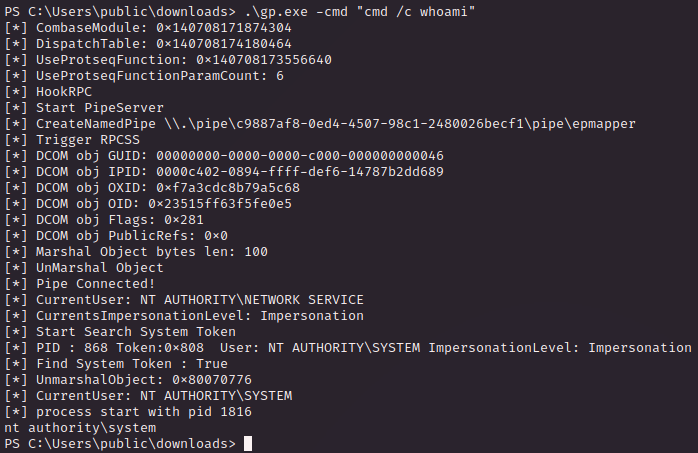

It works! Now I just set he command to read the root flag and I have successfully rooted this windows box but most important learn a cool Privilege Escalation technique!
