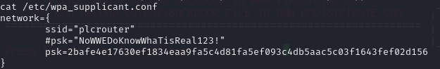
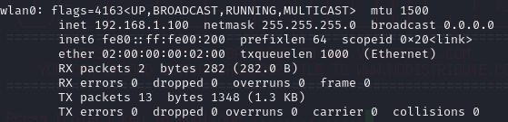

# PORT SCAN
* **22** &#8594; SSH
* **8080** &#8594; HTTP 

   

# FLAG 1
Finaly something related to ICS! We have an `openPLC webserver` dashboard login at 8080! 

The default credentials `openplc:openplc` works so we have access to the dashboard. What's interesting is that inside this dashboard we have full access and an interesting feature is present, we can write C code inside the PLC. Interesting this means that we can run a reverse shell that phone back to us! Lucky lucky there is an [PoC](https://www.exploit-db.com/exploits/49803) just for that which will make the job faster and smoother!

Already root? well cool stuff but we have just a user flag here so we need to dig deeper!

   

# PRIVILEGE ESCALATION

The name of the box is pretty self-explanatory so I check for some wireles interface and et' voila'

We can use some default linux command to scan the Access Points around the machine

This is cool the Access Point support WPS for authentication and is not really a good feature if you care about security enough! After some research I remember of the [Pixie Dust Attack](https://firewalltimes.com/wps-attacks/) a simple method to obtain a Wi-Fi password without online cracking. Usually I perform this attack with Reaver but is not that simple to copy and use that on the attacker machine, it didn't take long before I discovered [OneShot](https://github.com/devocator/OneShot), a python script easy to upload and use without the need to switch the wireless interface in monitor mode!

Now we have the plaintext password and we can connect to the AP, one way to do this is creating a new supplicant configuration file and reuse some command in linux to connect and obtain an IP adress!

Well now the road is pretty straight, usually the AP last octet is `1` so in this case we can connect to 192.169.1.1 is the address of the router, we can connect with SHH using **root** as username and the WiFi password as passkey, after that we are spawned inside a OpenWrt machine where the root falg reside!

