# PORT SCAN
* **21** &#8594; FTP &#8594; Anonymous login allowed
* **22**  &#8594; SSH

  

# ENUMERATION & USER FLAG
We have no webapp but we can login as "Anoymous" in the FPT folder, here's the content

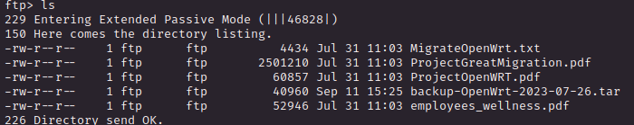

Let's download all the files and take a look at the content

 

### <u>ProjectOpenWRT.pdf</u>
A PDF version of an internal email (we have 2 internal email, `olivia.walker17@wifinetic.htb` and `management@wifinetic.htb`) where Olivia have communicated to the management team a propose for a migration to OpenWRT to Debian. We now know that the machine is running [OpenWRT](https://openwrt.org) 

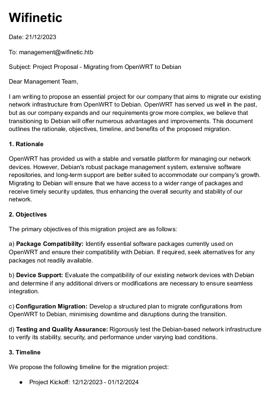

  

### <u>ProjectGreatMigration.pdf</u>
This PDF store the slides of the migration project discovered above (called `TheGreatMigration`), nothing usefull unless the last slides where we have a phone number, another email address and an adress

  

### <u>MigrateOpenWrt.txt</u>
This txt file is a (cute) planning of the migration project, this can become usefull when we get inside the system

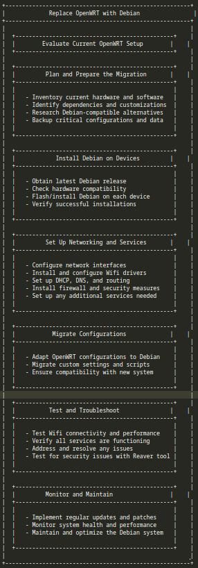

  

### <u>employees_wellness.pdf</u>
Another PDF version of an email (to `all_employees@wifinetic.htb` from `samantha.wood93@wifinetic.htb` the HR manager), is just an announcement of a wellness program

  

### <u>backup-OpenWrt-2023-07-26.tar</u>
This is a backup of an `/etc` folder

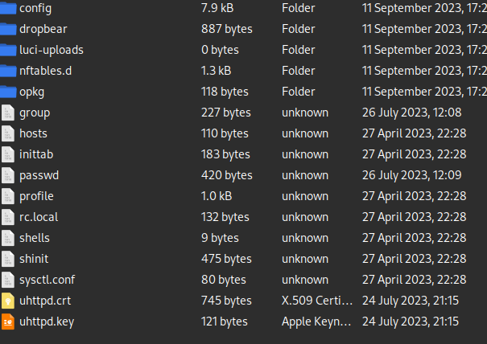

Checking the contents of all the files, I am now sure that the host is running OpenWRT plus I got an interesting password (WI-FI password, the name of the box is usually a hint!)

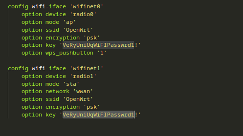

Using the `passwd` file I tried some usernames with this password and **netadmin** is our guy here

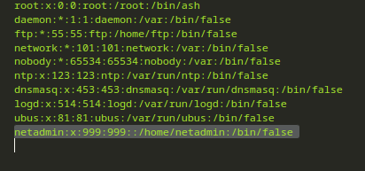

Now we can grab the user flag and submitted it

   

# PRIVILEGE ESCALATION
As **netadmin** user we can't run sudo (checked with `sudo -l`) so we need another way to get root.

What's peculiar is the home directory which have a good amountof profile (usually you see max 2 different user with a directory in `/home`)

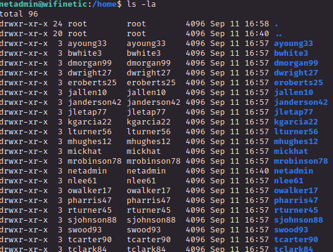

Running **linpeas** one of the cronjob really caught my eye

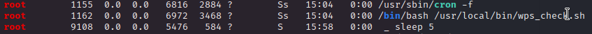

This script have no permission for other user unless root so I can't check the contents in no way, so nothing we can do about it

 

Looking deeper we can see that the **<u>host access point daemon</u>** (hostapd) is being used

Plus there is a strange wireless interface on the victim called `mon0`, with a little knowledge of Wi-Fi hacking this interface is usually created with `airmon-ng` but what we need to know here is the interface is in monitor mode, so is used to inspect all the wifi traffic which intercept even if is not address it to the victim directly.

Let's summarize what we have

1) The root user call every 5 seconds a script called `wps_check.sh`
2) We have a `hostapd` deamon running, so the victim is used as Access Point (makes sense since is OpenWRT)
3) We have a interface in monitor mode (`mon0`)

 

This sounds like a setup for a wireless attack that we can start remotely using the monitor interface, what was bugging my mind is the `wps_check.sh` script, if we have to attack WPS reaver is the tool we need and guess what? Is already installed on the victim machine, the puzzle is starting to compose (looking back to the text file inside the FTP reaver is used to test security issues this is why is here)

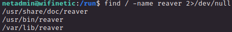

Cool but what interface we are using as target? Well, just run `iwconfig` :)

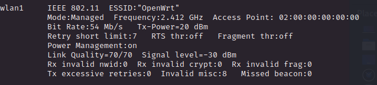

This one seems to fit on our scenario plus we have the BSSID, let's run reaver and boom we get what we need

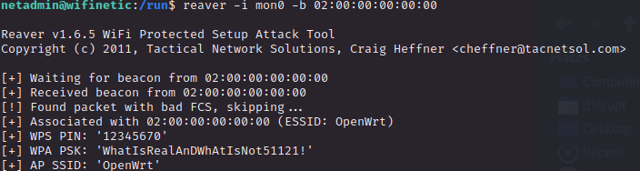

 

Now let's use this password as root user and we have the flag!
