# PORT SCAN
* **80** &#8594; HTTP (Microsoft IIS 10.0)
* **3690** &#8594; SVNSERVER Subversion
* **5985** &#8594; WinRM

   

# ENUMERATION & USER FLAG
The HTTP port is just the standard page of IIS so probably will be usefull later so I decide to focus to the **<u>SVNSERVER</u>**. This type of service is version control used for store historical versions of projects, Subversion is open source made by Apache. We have a built/in command to approach this type of service called `svn` (really simple to remember lol) and we can use to execute commands like `list`

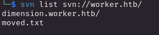

Ok cool we have something let's see what are the contents of that text file

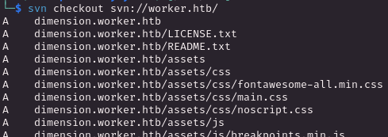

We have multiple files downloaded as much as our `moved.txt` file which revealed to us a new subdomain

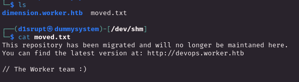

This is the `dimension.worker.htb` subdomain

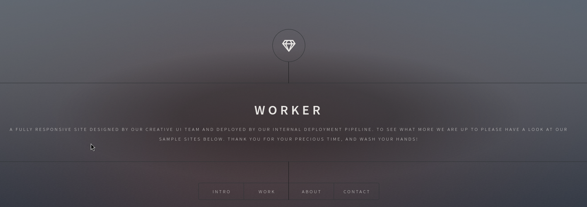

The `devops.worker.htb` is protected with <u>Basic Authentication</u> so we need a set of credentials to access it, since I am not satisfied enough with SVN I wanted to checkthe changelog and see what else we can access through this service using the `log` command

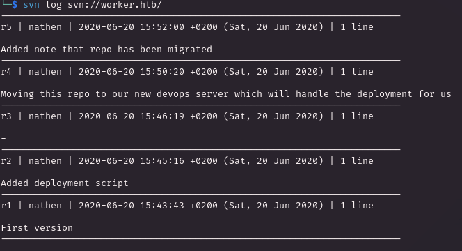

Ok cool so starting from **<u>r4</u>** the dev teams moved everything in the protected devops domain and the **<u>r2</u>** looks interesting because add a <u>deployment script</u>. Through the `up` command we can update to the specified revision with the `-r` flag

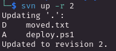

Guess what? The `deploy.ps1` script have some credentials ready to be used ehehehe

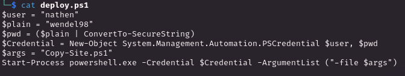

This works on the <u>Basic Authentication</u> at `devops` subdomain and now we have access to it!

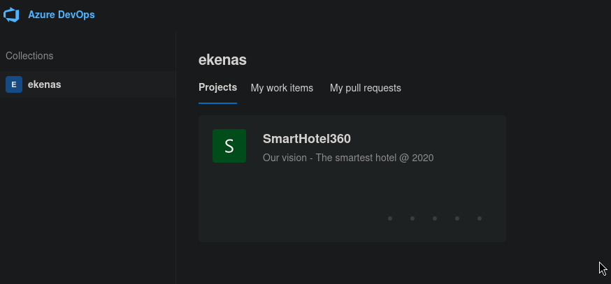

Something new again! `Azure DevOps`, a Microsoft SaaS (Software-as-a-Service, a sort of Git) offering a DevOps toolchain to develop and deploy applications. We can now see the page as `nathen` user and the only active projects is the **<u>SmartHotel360</u>**

Into the `Repos/Files` section we can have all the files for each branch, I have analyzed each of it but nothing cool. 

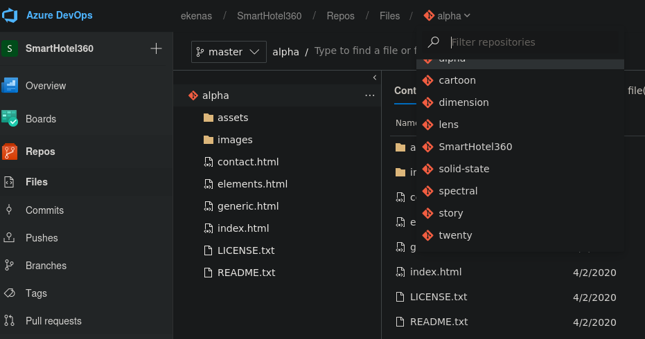

We can move on another feature of Azure DevOps, the **<u>pipelines</u> (CI/CD)**, let's pick the `Alpha-CI`

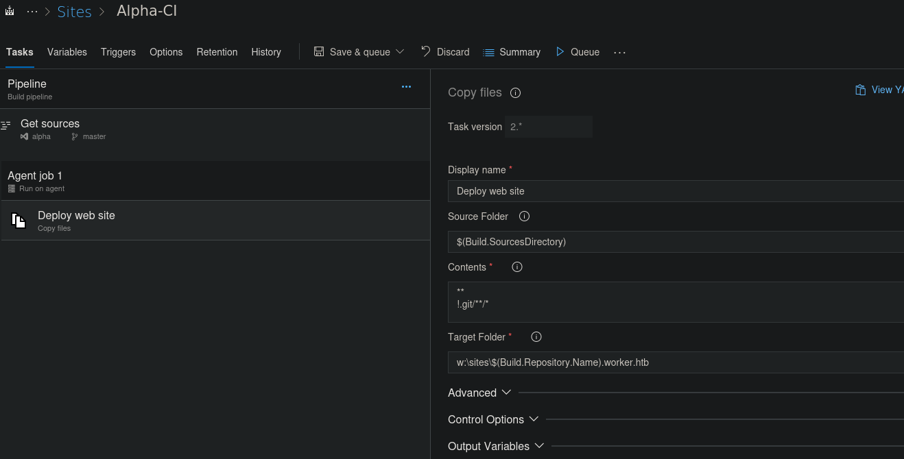

The **Target Folder** is interesting on how is built and the pipeline deployment is done with the use of a YAML file

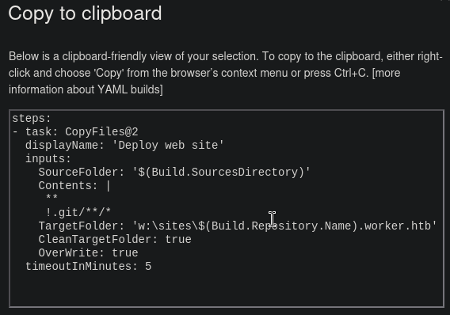

Interesting, what we needto achieve here is to upload an <u>aspx reverse shell</u> somewhere where can be triggered easily and gain foothold, let's find out how since we don't have enough permission on the existing branch

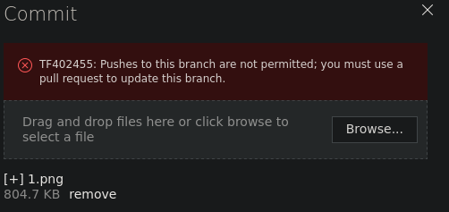

But if we create a new branch (in my case named `malicious`) we can freely commit new files

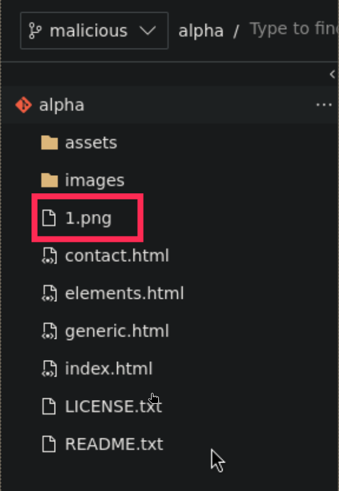

I have created with msfvenom the aspx reverse shell and uploaded in our brand new branch now is time to use the pipelines to integrate our changes in the actual subdomain, I am going to `Pipelines > builds > Alpha-CI > Queue` and set the malicious branch

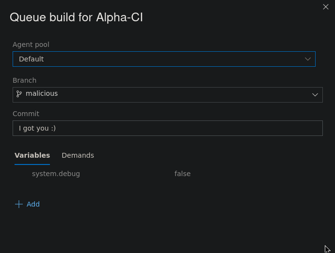

Wait some seconds and everything would look fine!

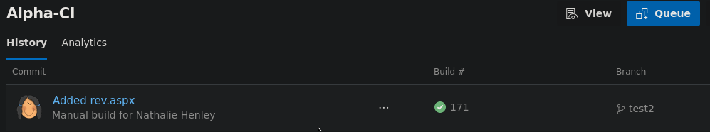

Now we can add the `alpha` subdomain to the hosts file and trigger the reverse shell!

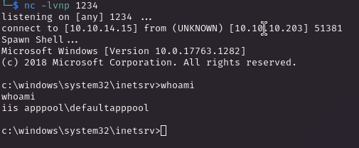

Obviously we don't have enough permission to grab the first flag, now we are spawned in the `C` volume but we noted before the existance of a volume `W` so we cab swap it and see what we have inside that simply entering the command `W:` we are changing the volume and we can note organized differently 

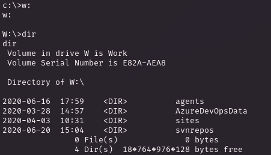

Surfing around I found a file at `W:\svnrepos\www\conf\passwd` which contains a list of user and passwords

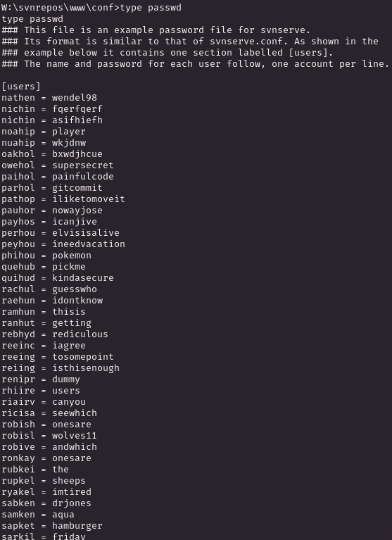

The only user we have located on the `C` volume is `robisl` which have assigned the password `wolves11` and this credentials work with WinRM as weel!

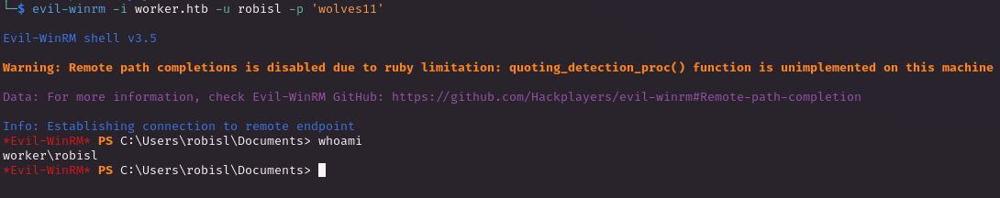

Now we have access to the user flag!

(btw this low user have SeImpersonate permissions but as I have said some writeup ago I would avoid to do it unless is strictly necessary, I dont wanna get bored doing the same thing also this let you jump the priv escalation part)

   

# PRIVILEGE ESCALATION
We can now login inside the Azure DevOps with this new user and we have access to a new project

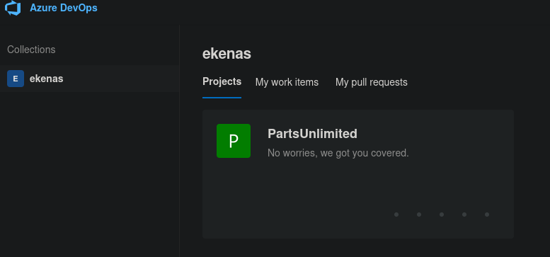

We have a focal difference between this user and the previous one, now we are in the `Administrators` group

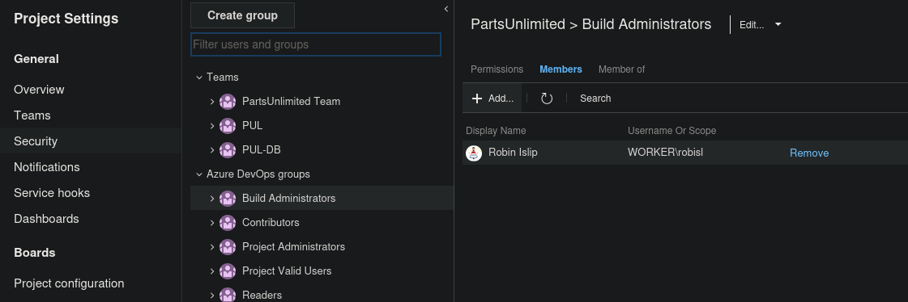

We have no pipeline ready for us but given our permissions we can create a new one, I choose the starter version of AzureDevOps, before confirm the creation we are dealing with the YAML file that would be used for the CI/CD integration, what's usefull here is the **<u>script</u>** section of the YAML which is used to execute OS command. Do the math and we can now try to read the root.txt file directly using the pipeline YAML file cahnging the appropiate section

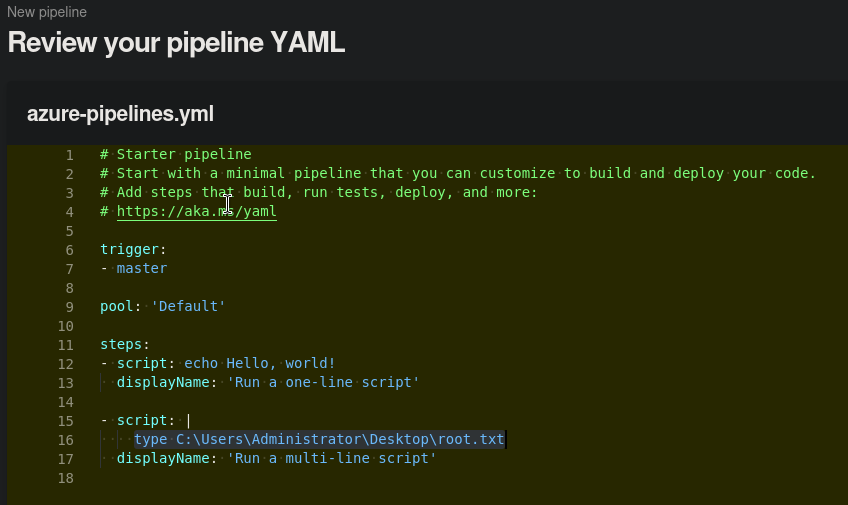

But is not that easy, lol. First we can't write on the master branch but as we did vefore we can add the pipeline in a new branch but I still have an error after that

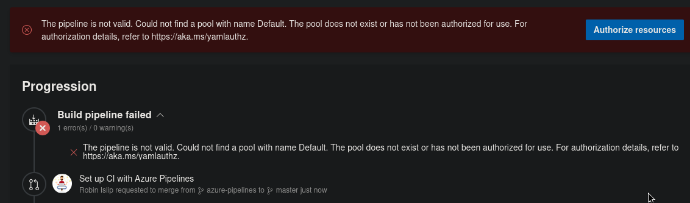

Plus we can't add the missing pool so we are in trouble

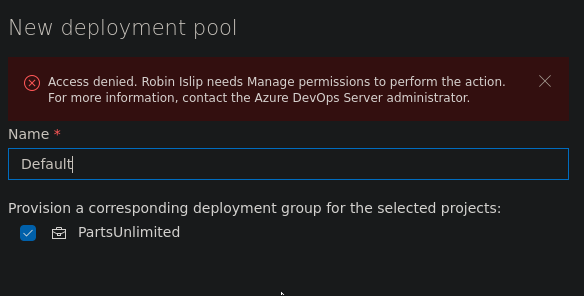

No worries we can easily discover an exisisting pool called **<u>Setup</u>**

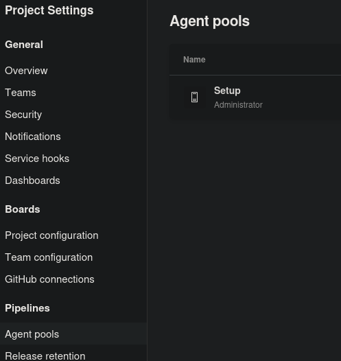

Good, so know we can change tha YAML file to get something like this (I have replicated the same command to read the root flag to make sure it works)

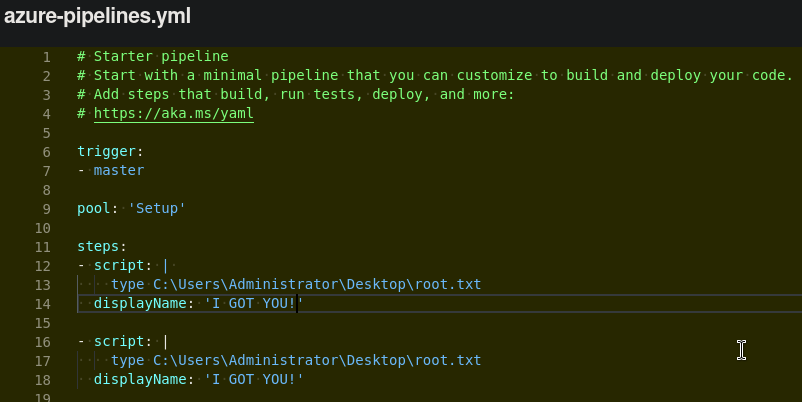

Now we can build it successfully and this would be the results

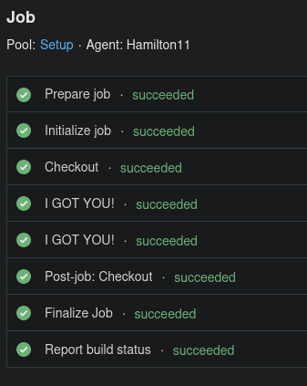

The `I GOT YOU` script was executed not only once but twice so both the options works let's click on one of it to get the contents of the flag

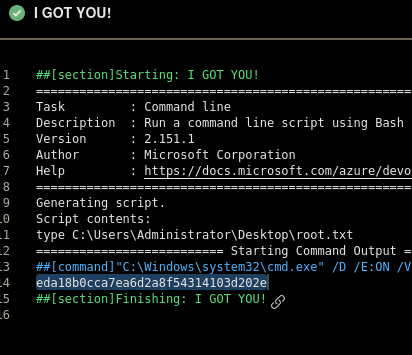

I GOT YOU! Same thing can be applied to get a reverse shell, uau! I have tried with the `web delivery module` of metasploit and it worked!
