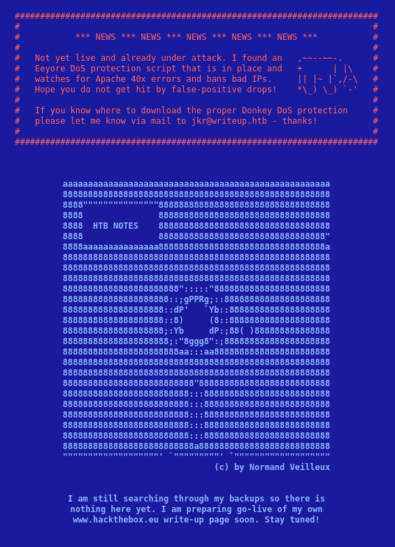
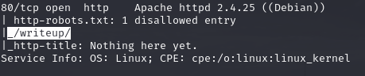
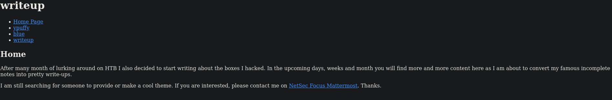
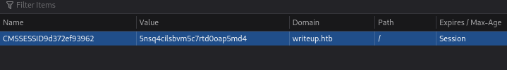
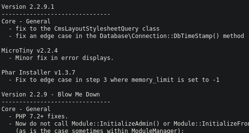
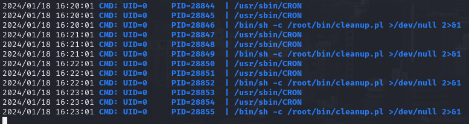
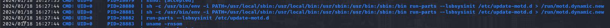
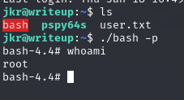

# PORT SCAN
* **22** &#8594; SSH
* **80** &#8594; HTTP (APACHE 2.4.25)

   

# ENUMERATION & USER FLAG
Pretty good 90's website style here! 

I have some issues when I run enumeration/dirbusting tool something can interfer between me and the machine, even if pretty strange to find in an easy machine this (apparently) seems the case and we can be banned if we don't be cautios enough

What's interesting is that the footer return `Pages are hand-crafted with vim`, cool stuff and for now is the only info we have. Source code is useless but cookies section store something!

I search on the web using the cookie as search-term and apparently [CMS-Made Simple](https://mvineza.github.io/spindel//2022/01/16/cms-made-simple) is used on the website. On `/writeup/doc/CHANGELOG.txt` we can found the version 

This version is vulnerable to [Time-Based SQL injection](https://github.com/STERN3L/CVE-2019-9053/blob/main/exploit.py) and after running the exploit we can retrieve username and password hash (with salt).
Hashcat returned the plaintext`raykayjay9` and we can use it with the username to login with SSH and retrieve the first flag!

   

# PRIVILEGE ESCALATIONS
`sudo` is not present on the target, pretty unlucky :(
We are part of `staff` group and we can edit `/usr/local/bin` and `/usr/local/sbin` both included in the **<u>PATH</u>**, well is time for **PATH HIJACKING**

We need to find a cmmand that's called (without the absolute path) by root to abuse the hijacking. `/usr/local` contain binary alternatives for the host so if we call `whoami` the one inside `/usr/local` will be executed.
**PSPY** can return very usefull and see if root user have some cronjob active

This perl script is useless because I can't se what is doing but when we log back to SSH something cool happen

Pretty confusing but we should focus on the `uname -rnsom` that's called when a user spawn with SSH. So I created a file called **uname** that just copy the bash binary on the home folder and add the SUID bit. After we reconnect through SSH we have the reward

We are free to get the root flag now!
