# SCAN PORT
* **22** [ssh]
* **80** [http]

<br>

# ENUMARATION & FOOTHOLD
The website is a template of  smartwatch dealer and on the homepage nothing interesting just a panoramic of their services 

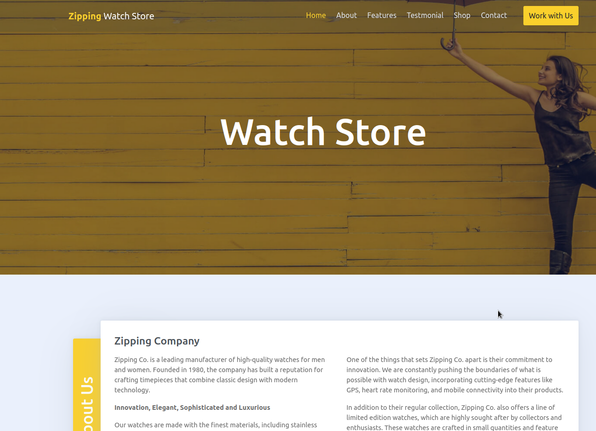

But we have "**Contact Us**" (useless when we send the message we jsut redirect to the homepage)

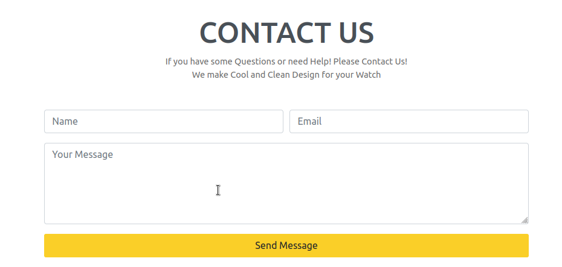

And "**Work with Us**"

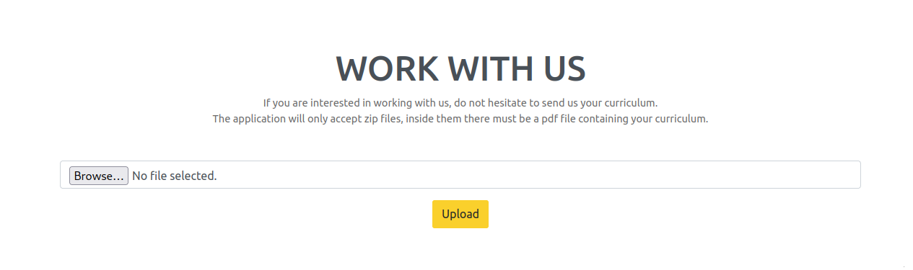

When we upload a file zip (with inside a pdf) we can access it with the path given by the web app

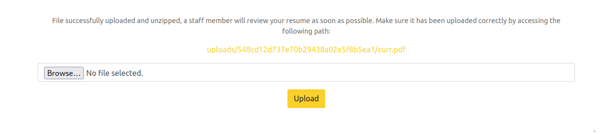

We need to bypass the expectation of the webapp to receive a pdf file inside the ZIP in order to upload a reverse shell, can be cool to use the **NULL Posion Byte**. After some trial and error that's the way I achieve it

1) Create a a php file with a pdf extension and zip it (before the `.pdf` I have add a "`D`" character as a placeholder)

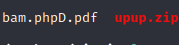

2) When you upload the file intercept the request and change the placeholder character in a null byte (`x00`) through the **HEX format** of the request

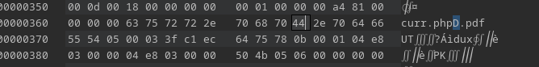

3) When we acces the URL directly we receive an error but remove the `.pdf` format to activate the reverse shell

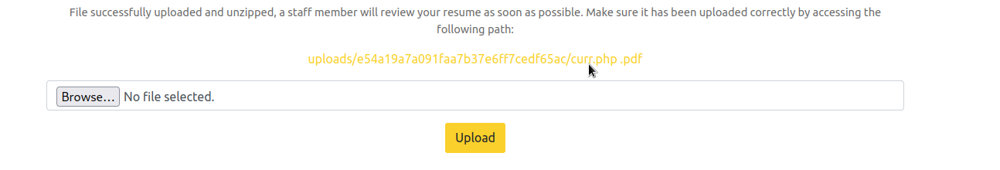

4) ENJOY!

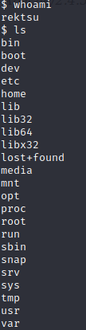

<br><br>

# PRIVILEGE ESCALATION

With the user I have gainend access to have sudo privilege on `/usr/bin/stock` C binary

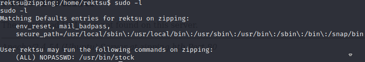

I run `strings` on this binary and found something interesting

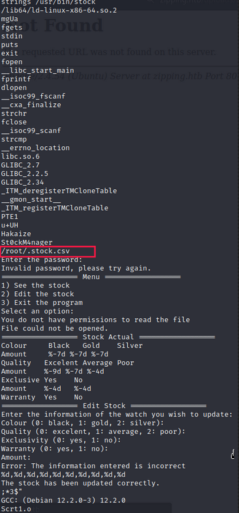

So this binary is using a file inside the root directory and ask for a password...cool! 

The password is `St0ckM4nager` (above red square) and we access a menu where we can **see the stock**

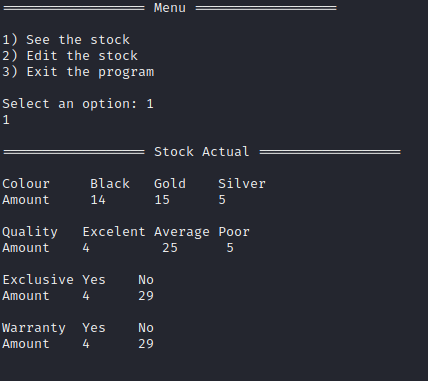

Or **edit the stock**

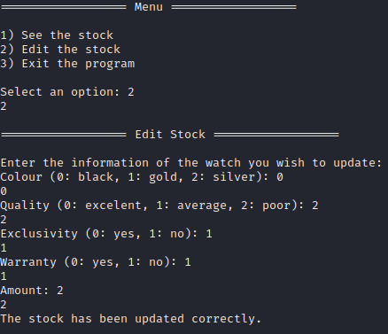

I can't get more info about this binary so I decide to exported locally and use `ltrace` so I can track library call (usually do it to find errors/bugs) and I found something that we can control 

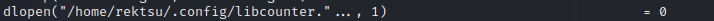

`dlopen` is used to open a dinamic link loader and can also be returned as HANDLE, like I've learned studying some malware development. We have the filename but not the extension so I used `strace` to have some info on the user space

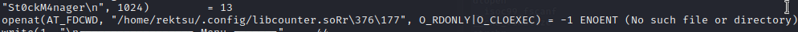

And we have the filetype which is `.so` a shared object (shared library). This is a misconfiguration because we can have control on the shared library while the binary run as root

So I've simplty created a C code like this 

```{c}
#include <unistd.h>

void begin (void) __attribute__((destructor));

void begin (void) {
	  
	  setuid(0);
    setgid(0);
    system("/bin/bash -i");

}
```

Than I've translate it in a shared object useing `gcc`

`gcc -shared -fPIC -nostartfiles -o ./.config/libcounter.so [MALICIOUS_C_CODE]`

Than is pretty easy just run the binary with sudo and when you exit you will become root!

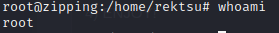

