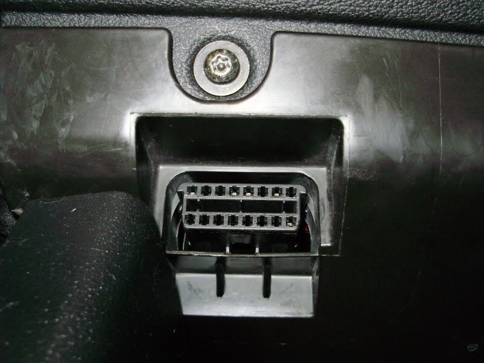
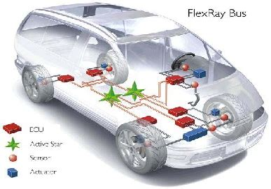
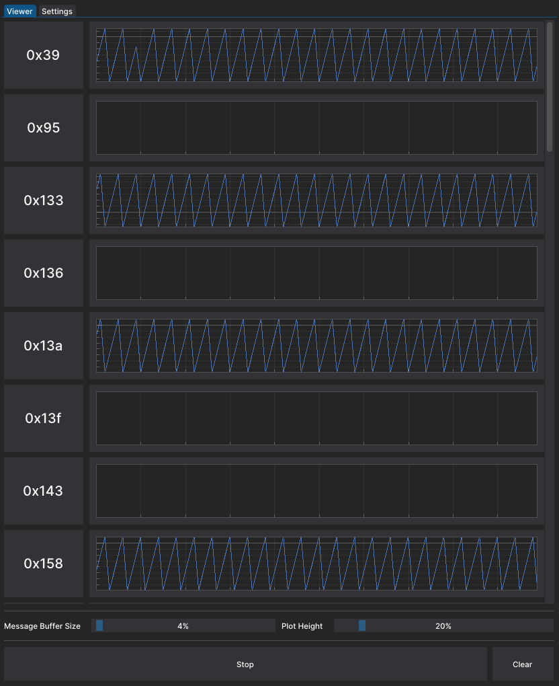

## <u>PRELUDE</u>

Cars (and every vehicles) are one of the clearest example on how much technology and internet services are versatile and can be used in different fields for different purpose. With the 4.0 industry, most of people are getting in touch with computere software and hardware making them vulnerable without even knowing

New models (since '00) have a increased use of internet, protocols and computer even (an especially) for critical action like breaking, acceleration and airbags, for instance, depends on software running on microprocessor. Toyota engineers used to have a joke "we are building wheels on a computer to avoid to scrap it on the street", this give you the idea on how the automotive industries are moving.

We are creating smart car making them vulnerable and if there is a vulnerability there is a method to exploit it to be used, soon or later. Not only "hacking" is a enemy for vehicles users but even data privacy is at risk, mozzila recntly made a [indipendent research](https://foundation.mozilla.org/en/privacynotincluded/articles/its-official-cars-are-the-worst-product-category-we-have-ever-reviewed-for-privacy/) describing cars as <u>"the worst product catefory we have ever reviewed for privacy"</u>, **the estimation of smart cars worth for 2030 is 750$ bilion**.

I love cars, not an engine or horsepower expert, but I like to see the improvement made starting from [JDM culture](https://en.wikipedia.org/wiki/Japanese_domestic_market) to the latest model using elettricity as power instead of gasoline, make me feel the smart world is approching to us, faster than we tought, this is why studying how to attack can allow us to be prepared for future threat.

There are a lot of ways to hack cars I'm trying to keep up to date this paper and add whenever I can more and more info about this fields.

  

## <u>CAR NETWORKS</u>

Think about how many things a car have to controll : lights, steering, tire pressure, infotaiment, radio, braking and the list can go on for thousand and thousand of devices.

We can see cars as **<u>SEMI-ISOLATED** NETWORK</u> of nodes that all talk to each other using a serial protocol (like scada).

 

### <u>CONTROLLED AREA NETWORK</u> (CAN)

Most used network that have to be implemented in cars since 2001 (2008 in america) and is based in 2 components :

1) **<u>ECU</u>** = Electroni Control Units, this are the actual PCs that reside inside the ca, are embeeded systems that run microprocessors and (tiny) embeeded OS which send/receive datafrom sensors/actuators. Modern cars have more than 150 ECU
2) **<u>CAN BUS</u>** = Standardize bus designed to allow robust communication with the ECU without the use of a host computer. Use of 2 wires (CAN high, 3.5 V / CAN low, 1.5 V)

The network works like ModBus (or HUB in networking) where every frame is sent in broadcast to all nodes of the networks and only the designed one will use it otherwise they discard it.

CAN use <u>**Differential Signaling**</u> to communicate, the two wires (HIGH / LOW) are twisted pair with a 120 Ω of impedence

When a ECU send a signal both HIGH and LOW and are read only if the two wire are in dominante voltage. 

   

**<u>FRAMES TYPE</u>** 

1) <u>DATA</u> 
|&#8594; data trasmission only (sent by source)
|&#8594; standard / extended (11 bit ID / 29 bit ID)
|&#8594; standard frame must be accepted, extended frame must be tollerated

2) <u>ERROR</u>
|&#8594; report error inside the bus or the ECU
|&#8594; 2 fields Flag (type of error) and Delimiter (end of message)

3) <u>REMOTE</u>
|&#8594; used when source node ask data to destination node

4) <u>OVERLOAD</u>
|&#8594; special frame implemented when the request of a variable is created and send to fast avoid the sender to read it, when this frame is sent the node have to slow down the communication throught the bus allowing the destination to retrieve the variable

 

<u>**FRAME LAYOUT**</u>

1) <u>STANDARD</u>
|&#8594; **arbitration ID** = identify the frame (not the sender or receiver, <u>spoofing</u> is possible) by the content/purpose. When 2 frame are on the bus the one with lower ID obtain the priority
|&#8594; **ID extension** = always 0 
|&#8594; **Data Length Code** = length o the frame content, 0-8 bytes
|&#8594; **Data** = the content of the frame, up to 8 bytes

3) <u>EXTENDED</u>
More standard frame concateneted togheter, allow to add ID and more data in the same frame, doesn't break older system allow the use of new ECU in legacy CAN networks

   

To access the CAN bus you can use the **<u>ODB</u>** port, usually located under the steering wheel, with the specific connector

But this is not the only way to obtain a open door on the network, some other not "traditional" method are available like to [detach one of the headlamps](https://kentindell.github.io/2023/04/03/can-injection/) and attach the ODB port in order to read/inject CAN frames

  

CAN summary :
* <u>Easy implementation</u> = ECU communication without the use of direct lines
* <u>Easy Access</u> = single entry point permit the controll and diagnostic of all the ECU connected
* <u>Robust</u> = electric and electromagnetic interference are managed in a secure ammner whitout slowing the functionality of the network
* <u>Efficent</u> = Use of priority in CAN frames for immediate access for critical ECU
* <u>Unsecure</u> = Is a low level protocol, mitigation like encryption or message signing are not implemented by default leading to spoofing an MITM 

   

### <u>MEDIA ORIENTED SYSTEM TRANSPORT</u> (MOST)
This is a network developed for multimedia system, this network type have  high data rate and low jitter with a <u>unidirectional ring topology</u> (64 ECU, 1 Timing Master ECU which feed frame in the ring and assign addresses to the components).

MOST can sound useless for attackers (changing video/music inside a vehicle is not a big deal) but this network allows access to microphone and traffic information (numbers, contacts, ecc...) which can be really juicy, especially in modern car ([this](https://www.9news.com.au/world/mercedes-2024-e-class-to-have-tiktok-zoom-call-functions-built-in/c604ee22-4dae-4eee-926b-88e8ebe6ae33) a good example, zoom call in a car)

Each **MOST** frame have <u>3 separate channels</u>
1) <u>Synchronous</u> = audio/video stream
2) <u>Asynchronous</u> = packet distributed data (TCP/IP)
3) <u>Control</u> = control and low speed data

 

MOST use all the <u>7 layer of TCP/IP</u>, like every media-based networking protocol

<u>Types of **MOST**</u> : 
1) **MOST25**
Run on plastic optical fiber (POF), transmisson through red light wavelengthusing LED. 23 megabaud for synchronous and asynchronous communications and bandwidth of 705 kB/s

2) **MOST50**
Double the bandwidth of MOST25 and increase the frame length (1025 bits) using an **<u>Unshielded Twisted Pair</u> (UTP)** plus an additional control line

3) **MOST150**
With the **ethernet** implementation increase the frame rate to **3072 bits** (6x MOST25), allow <u>isochronous</u> transfer (on the synchronous channel) and <u>multiplex infrastructre</u>

 

**<u>MOST Frame</u>**
The frame is 512 bits total

* **synchronous data** = 6/15 quadlets
* **asyncronous data** = 0/9 quadlets

Every 16 bytes ends up with 32 bytes of **<u>data control block</u>**

Exist a implementatio for linux of MOST called [most4linux](https://most4linux.sourceforge.net/)

   

### <u>FLEXRAY</u>

CAN is used for midrange vehicle, FlexRay is the CAN substitute for highend product. Firstly introduced in the BMW X5 E70 but **full used in 2008 with the BMW 7 Series**. Faster, more reliable and expensive than CAN is perfect for time-sensitive performance of communication (steer-by-wire, break-by-wire, adaptive cruise control or active suspension). Is harder to implement because you need to tell at every ECU the network setup (like addresses of other ECU).

The hardware used can be in <u>twisted-pair</u> or <u>dual-channel</u> wiring but most of the implementation use a single pair of wire like CAN. It can reach **up to 10 Mbit/s** of rate and optionally a one or two data channels for fault tollerance

FlexRay can be used in the traditional bus topology (equal to CAN) but also **different types of <u>star topology</u>**

In star topology we have an **HUB** that talks to other devices and more hub can be used togheter obtaining a <u>hybrid topology</u>. This stype of topologies are usefull to cover longer segment and more complicated ECU

 

<u>**How the FlexRay works?**</u>

FlexRay support both dynamic and static frames with a preset of **<u>communication cycle</u> (FlexRay cycle)** and manage the multinode communication using a deterministic **<u>Time Division Multiple Access</u> (TDMA)**. TDMA allows the transmitter to "fill" the packet that pass through the wire.

Think the wire like a binaries and the cycle ("packet") like the wagon of a train with this layout 

* **Static Segment** = data that rapresent the same meaning over time
* **Dynamic Segment** = data that rapresent different meaning over time
* **Symbolic Window** = data for network signaling, not normally used directly (as hacker this is an interesting field to mess with :) )
* **Network Idle Time** = used for synchronization
 

As the cycle pass (every microtick, usually 1ms) the ECU can decide or not to update /insert data in a slot, if all the slot are occupied wait for the next cycle. All the ECU are synchronized using **<u>Field Bus Exchange (FIBEX)</u>**, is an XML format which record the topology, microtick, address, channels, netwrok signal and other info of the network, than mapped the ECU during the development through the compiler (sort of hardcoded variable). 

 

The special feature of this protocol is the **<u>in-cycle control</u>**, enables deterministic, event and time-trigerred transmission of critical messages. Think about the wheel position, it occurs before the final update command from the central controller, but with this control type can process the tires position within the same cycle. Really usefull for critical situation and emergency decisions

 

**<u>PACKET LAYOUT</u>**

The status bit are divided in 5 :
1) Reserved Bit
2) Payload preamble indicator
3) NULL frame indicator
4) Sync frame indicator
5) Startup frame indicator

 

The **frame ID** is used as priority when need to transmit on dynamic slot (highest priority win), the **cycle count** increase each cycle pass

Lastly, a **<u>Bus Guardian</u>** can be implemented at hardware level preventing flooding or bus monopolization, DoS are harder to achieve

   

# CAN EXPLOTATION : ICSIM
To get started making something pratical, we can use the **<u>[Instrument Cluster Simulator](https://github.com/zombieCraig/ICSim/tree/master)</u> (ICSIM)** and **[CAN-utils](https://github.com/linux-can/can-utils)** a set of basic tools to use on a CAN interface. 

The installations of ICSIM and his usage is not covered here, is pretty simple btw. What we need to know is that the simulator use the **CAN protcol** and we are trying to abuse it. We assume we have are inside and have access at the ODB port of the vehicle (virtual port `vcan0`).

The CAN network now is ready and operative, we can use `cansniffer` to look at the traffic inside the network (with `-c` flag to have the colourized output)

Confusing? Well yes but we will learn some tricks to clean our output, let's start simple. Remember that even if the car is not moving (and even if is wit engine off) the CAN network have to work checking and diagniose some ECU, yeah is not dirty job but is FUN

The first collumn are **timestamp**, the second is the **frame ID** and the **frame data** as third collumn. The colorized version is usefull because highlight the changing bits and can be combined with `-h [time_ms]` to maintain the highlight for a fixed amount of time.

  

## EXAMPLE 1 : LEFT AND RIGHT ARROWS

This is the first method to <u>discover a specific frame for a specific action</u> is to look at the sniffer output and than use `canreplay` to inject that specific frame inside the network

Let's press the left arrow on the sim and take a look at the sniffer, after some time you should note that the frame with **ID 188** is changing in a pattern

When the left arrow is blinking the frame with ID 188 appear and the highlighted byte is going **00** than **01** and so on this is cool we can try to inject the following frame `188#0100000000000000` and here the results

Cool stuff! Even if is improbable that you have the time to look at the sniffer and check whatever interesting changing is occured this is the basic and you need to train you eye to distinguish the noise from valuable frames. 

In runtime we can use some commands to improve and make quicker our objective, while the sniffe is running we can press `#` and than `ENTER` to notch the currently marked bits, in this way we will clean the noise and when we use (for instance) the left arrow the highlight will be more effective (using `* + ENTER` we clear the notched bits)

Returning back to the frame captured `188#0100000000000000` we can now assume that the **ID 188** is the frame destinated to the arrow ECU, in case all the payload is 0 nothing occur, when we send the frame with payload equal to `0100000000000000` the left arrow blink so we can expect that a payload like `0200000000000000` will do the same but with the right arrow.

This is right and you can manually try or redo the process above, I like t learn new tools so why not use `cangen`?\

<u>**Cangen** allow to generate traffic</u> (random or incremental) inside the can network, we have the ID which will be fixed and the first byte to be changed overtime in incremental mode this is the command I used

* `-I` = fixed ID of the frame
* `-D` = the data to use as payload in the frame, the `i` character are interpeter like an incremental variable (there are other option like `r` which stand for random, `e` random but even ID, `o` random but odd ID)
* `-L` = fixed data length of 8 byte
* `-v` = verbose output, so we can see what frame are sent and check the simulator behaviour
* `-g` = gap time between generated frame (in ms)

 

Here's the output

We already know the first two frame so what's new? The payload with `02` will activate the right arrow and the `03` will blink both arrow (hazard light) cool I didn't even think about it. 

Surprise surprise, the `04` will have no action but the `05`, `06` and `07` are back repsectively the left, right and both arrows. This means that every payload with `00 + 04`, `00 + 08` and so on are for no arrow, `01 + 04`, `00 + 08` and so on for the left arrow same thing for right and both arrows. 

  

## EXAMPLE 2 : UNLOCK DOORS 
Here a secondo simple method to discover a specific frame for a specific action, in this case we will focus on **unlock the car's doors**. Assume we have insert a ODB-II device in the victim car, we would make a dump with `candump` of every CAN frame that pass through the network and we will use it to discover which frame can we replay to open the doors for us

To use `candump` in orderto have a .log file of every can network just run `candump [can_interface] -l` (to save the output in a log file we need the flag `-l`). Make some random traffic, obviously unlocking the door after some time, stop candump and you will see the log file saved on your computer. Take a look inside, even if you recorded for small amount of time the CAN network the number of frame is really high 

Now we can use `canplayer` to replay the full log file, `canplayer -I [log_file]`, this will come handy shortly now let's focus on how (I personally) discovered the frame to unloc doors. Just follow this schema

We are splitting in 2 the logfile and continue to split the section where the frame to unlock the door reside (using `canplayer`) until the log have just 1 frame inside.

I have created a quick-and-dirty bash script that automatize the schema above to save time on this process.
Using my script I discovered that the frame to unlock all the doors on the car is `19B#000000000000`.

WIth the same method above (`cansequence`) I discover the frame for open different door(s)

| Frame  | Functions |
| ------------- | ------------- |
| 19B#000000000000  | Unlock all doors  |
| 19B#000008000000  | Unclock back passenger door  |
| 19B#000004000000  | Unlock back driver door  |
| 19B#000002000000  | Unlock passenger door  |
| 19B#000001000000  | Unlock driver door  |
| 19B#00000F000000  | Block all door  |

Cool stuff, so the 3rd byte is the one that change for the doors frame.

| 3rd byte value  | Door |
| ------------- | ------------- |
| 8  |  Back passenger door  |
| 4  |  Back driver door  |
| 2  |  Passenger door  |
| 1  |  Driver door  |

We can also mix this values to have new behaviours, for instance if we want to unlock just the driver and passenger seats the value of the 3rd byte should be `(8*1) + (4*1) + (2*0) + (1*0) = 0C` (19B#00000D000000)

   

## OTHER TOOLS
Other tools that can be used on ICSim are [canexplorer](https://github.com/Tbruno25/can-explorer) a simple and light-weight CAN analysis tool with some cool plot for visuaize traffic on the CAN bus

[Caring Caribou](https://github.com/CaringCaribou/caringcaribou/) is renamed the "nmap of CAN networks" this is usefull in real scenaro where you need to understand basic services

[c0f](https://github.com/zombieCraig/c0f/) is the CAN network version of p0f, retrieve passively the fingerprint of thenetwork

<u>**Metasploit**</u> now have implemented the **Hardware Bridge**, extending his capabilities not only with socketCAN and SDR too (automotive section is really poor)

For a full list of resource you can use this cool [repository](https://github.com/jaredthecoder/awesome-vehicle-security#applications)
