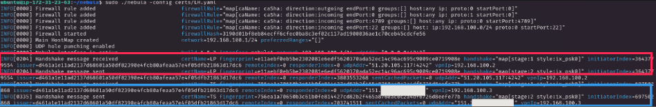
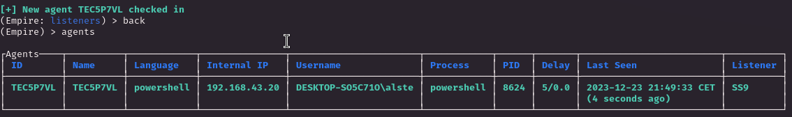

# MOTIVATION

Finally I have decided to start this project that was bugging me for a long time and during XMAS holiday 2023 I have something to work on, create a (relative-simple) **<u>red team infrastructure!</u>**
A lot of books/articles talks about it and I have collected everything in order to use the knowledge all togheter in a single project, this first paper would just be an introduction but my idea is to continue expaning it (or create more complex one from scratch) adding more and more feature. I'm gonna be honest, I am pretty scared because there is a lot involved but I always like to have this phrase in mind when I approach something new

> A bird sitting on a tree branch is never afraid of the branch breaking, because its trust is not on the branch but on its own wings

Cool this is a new adventure that will remove some time that I normally use for pawning hack the box machines but is time to make a step out of my comfort zone and this time we are dealing with the real internet, cool! Also spending time in "non-hacking activity" like how to set up a safe infrastructure would be usefull to understand how malicious threat operate on the net staying safe, how real red team engagements works and most importantly I could practice some common computer networking skills. What I am going to build is going to be tested in the future so I will encounter C2 server, obfuscation and other things like Phishing (finally OMG!) but everything required time and experience so let's get rolling!

 

# INTRO

A right infrastructure is needed for an effective red team assesment for a number of reasons like :
1) **<u>Simulate the adversary</u>**, this how bad guys operate in the wild so this is how we defend from them, knowing and being your enemy
2) **<u>Check at 360 degree the blue team posture</u>**, some really effective methods can be easily performed through a good infrastructure (for example Finance or Healtcare domains have a good reputation score and can skip overcome some blocking methods) which a blue team should be able to defend against. Having more weapons allows to test as much as possible
3) **<u>Check incident response time and effectiveness</u>** this is really important because is one of the focal roles of a blue teams, having an infrastructure give a good layer of anonimization and with some creativity special beacons or C2 callbacks method. The blue team needs to uncover everything and rebuild the crime scene correctly

Nice now we can move on the resources that I used. The core of this project is nothing more than a copy and paste of [Red Team Infrastructure Done Right](https://notes.huskyhacks.dev/blog/red-team-infrastructure-done-right) by HuskyHacks and [Building Red Team Infrastructure with Empire and Nebula](https://parzival.sh/blog/building-red-team-infrastructure-with-empire-and-nebula) by Parzival (this guy provided good critics to the HuskyHacks blog making a good resource and bring the best of both.

I wanted to leverage more and use a really cool (but most importantly usefull project) by [The Hacker Choice](https://www.thc.org/) I really love their contribute to the public for free and they created a Free Web Service called `Disposable Root Servers` ([Segfault](https://www.thc.org/segfault/), this is where `Phrack` and `HackTheBox` where hosted in the early years). Without pay anything you can easily have a kali linux installation with a good amount of tool installed with outgoing traffic through different VPN, this root server can be used for a lot of different purpose but for now we are gonna use it as the attacker machine. But why I will not use it? There is a technical limitation when we want to create a new **TUN** interface, making impossible to this machine to join the infrastructure correctly. I was really sad about it but all the things I have done on my personal machine can be replicated on whatever remote machine. In the future I would love to find a similar service which would be able to be part of the infrastructure (I have joined the telegram community chat searching for delucidation and even if the naswer were not positive I found a pretty cool community to share ideas and projects)

The C2 framework used in the HuskyHask article is **Sliver**. Honestly I opted for [Empire](https://www.stationx.net/how-to-use-powershell-empire/) (I just like it, idk why lol), I have already play with it a little and is the most common C2 (if we don't count CobalStrike but I time rich and money poor) I have seen in blog/books so this will be the choice, at least for now (parzival blog post use Empire too).

Last but not least let me introduce on of the most amazing (in my opinion) tool for networking, [Nebula!](https://github.com/slackhq/nebula) This tool is what will make the infrastructure scalable since permits to connect whatever computer computer (android and and IOS included) anywhere in the world to others with a good amount of security feature. The internal working is pretty simple (I will stay high level), a machine would act as **<u>LightHouse</u>** an intermedary server that know where `A` and` B` are located, when `A` wants to connect with `B` will query the **<u>LightHouse</u>** that would tell where `B` is located (traffic doesn't necessary flow thorugh it).

Cool too much words, now we can get our hands dirty! 

  

# THE SHELL - BUILDING THE INFRASTRUCURE

First, on my own machine I **generated a ssh key pair** we would need it to ssh on the machine we have to configure

Now I created an **<u>EC2 Ubuntu instance with AWS</u>** (microversion so I would save money for my future, lol) setting the public keys as the one we have just generated 

The next step is a good OPSec measure, we are going to restrict the incoming SSH traffic only from the TeamServer (kali machine), you can choose whatever method you prefer to get your Global IP Address and add it in the **Network Setting** section (we use the CIDR `/32` to lock the single address)

Cool now we can fireup the instance, copy the address and check if we can SSH into it if everything is good we should be able to get inside (I also check to SSH on a different network and blocked the connection correctly)

Fine the first piece of the puzzles has been initialized (we will call this first instance as ListeningPost), now I repeated the same thing with another instance that will act as **<u>LightHouse</u>** and add the 2 IPs in the hosts file. Good pretty simple right?

> Obviuously a black hat would use comprimised machine as listeningpost and lighthouse, AWS like other cloud providers block whatever malicious activity happening whithin their bounderis also I don't think that pay with a credit card is a safe way to hide yourself in the net. Good news is we are on the right side so we don't have to risk some jail time to practice! 

Now is time to create the center of our **<u>Nebula</u>**, let's spawn inside the lighthouse and install the package

`Nebula` use UDP packets through port 4242 for host discovery so we need to make a <u>Security Group</u> that allows inbound UDP traffic on that port (this security group should be assigned on all the machine in the cloud or you will lose time fixing the network like I did)

Yeah is open to everyone but don't worry everything is crypted and verified as we will see in the next steps because we are going to generate the **<u>Nebula certificates and Certificate Authority</u>** through the `nebula-certs` binary, the documentation is pretty clear to follow like the whole tool, we need the `CA` and a certificate for TeamServer (Kali Machine), ListeningPosts and obviously the LightHouse we can use the `-group` feature to regroup same class machines togheter

> The `ca.key` needs to be protected at all costs otherwise we will get burned, because anyone can sign certificates and act as legittimate machine on the infrastructure. We don't want that so make sure this file is never ever leaked!

Now how we configure every machine easily? Well `YAML` is the way, I would avoid the tedious of explaing how is each of the yaml file made and you can find it on the HuskyHask article I linked above. Now we beed to move everything from the lighthous to the teamserver and the listeningpost. I have organized in directory like it follow (the teamserver have already the yaml file stored)

Than I would just compress, move, extract and set every file following the description of the YAML configuration file now we are ready to build the <u>Nebula</u> starting firing up the LightHouse

Beautiful the center of the Nebula is running, now we can move on the TeamServer and ListeningPost and start nebula there too and check the LightHouse nebula output would highlight all the connections (handshake) on the nebula with the public IP and the VPN IP 

We can see on the Kali machine that a new network interface has been created and we are able to ping other machine in the VPN network

That's pretty pretty cool, now some consideration before we use the Nebula scalability to add a new machine to the Nebula VPN.
Nothing should be stored in the clouds machine, doesn't matter if we are the bad guy or not we don't want to store any files there. If we get burned we would need to change/delete machines quickly so we would not have the time to copy all the files, the infrastructure just needto be used for flowing traffic nothing else. About the `ca.key` if we want to abuse the scalability we want to put our hands quickly so I will store it on my Kali machine where I can use the `nebula-cert` to freely create new certificates as we need and repeat the process above to setting it up. Now let's stay simple and we will use my own Kali machine as C2 server and client not really simple but functional to what I need to achieve, in the future we can expand without limits our nebula. Lastly let's note that now that everything has been created correctly my own public IP can change but until our LightHouse IP doesn't change we can re-join the network without changing the infrastructure of the Nebula. COOL!

> From now on I saved on the /etc/hosts file the LightHouse (LH) and ListeningPost (LP) with the given IPs within the nebula 

Now we need to set up the ListeningPost as a Redirector starting from the creation of a SSH Tunnel from the TeamServer (Kali machine) to the LP,  we have acces with SSh so we can stay in comfort using that for this task

I am pretty keen with tunnel/port forwarding (HTB is a good training ground for this kind of things) but a refresh is always a good choice. Here we are simpling accessing the Remote port 80 through the Kali port 8080 (as you can see from the `ss -plant` output)

`localhost:8080    <------- Forwarding ------->   remote port 80`

We are pretty close to end this section now we need to permit to host whatever file we need (for instance a HTML page) from our TeamServer but with public access through our LP server (or we can simply say we need to create a proxy), [socat](https://github.com/3ndG4me/socat) is here to save the day but first let's add a new security rule (to the LP) to allow ingress traffic otherwise the proxy will fail to succed

Now let's trigger socat with `sudo socat tcp-listen:80,reuseaddr,fork,bind=[PRIVATE_IP_EC2] tcp:127.0.0.1:8080`, according to the HuskyHacks blog post we can bind the private address of the EC2 istance of the LP without harming the flow because is the downstream of the public facing IP.

Everything is lock and loaded, we have setup a redirector on port 80 that will hit the port 8080 where we set our tunnel which is interfacing with the TeamServer port 80, I have created a simple HTML page and hosted with python server module on the TeamServer the results is cool. Finally we are interfacing with the world without directly use our attacking IP address. I tried with my macbook and a Windows VM visiting the public IP address of the `LP`

Cool stuff this simple infrastructure is working as we wanted and setup our first HTTP redirector (`LP`) this is pretty good if we got burned (like the target will block communication) we can easily replace this redirector and create new one since we just need to get out all the nebula files and trigger in another machine plus all the technicals traffic rules!

> I don't think no one will read all of this paper (all my notes/HTB walkthrougs are made for my own motivation and, in a sense, my ego) but in case you found some OPSec fault or some noob moves plz be kind I am still learning! Plus a feedback is all I need at the moment. No matter what your level of experience is, no doubt you should let me know!

  

# THE GHOST - GIVING TO OUR INFRASTRUCTURE AN IDENTITY

We have setup the basis of a simple infrastructure, we have the LightHouse of the Nebula, a HTTP redirector which will add 1 layer that is interfacing with the pubblic without leak our attacker IP address machine.
Now this part could trigger some expert red teamer/pentester (actually who cares, nobody will look at this paper!) because we are going to make a self-signed certificate, I don't have enough money on my pocket to buy a Domain and it will just remove time where I can practice on the technical stuff.
On a real engagement (I never been on one of that obviously so I just repeat what I read around the web) you would buy a domain and deal with SSL certificates, which is not described as a fun activity from experts LOL! Me as a poor noob I will just skip these steps and will force the HTTPS recorde hard-coding that on the hosts file of the target. Plus finally we are going to use `Empire`. 

So as I said we need to create our self-signed certificate with this command line `openssl req -new -x509 -sha256 -newkey rsa:2048 -nodes -keyout [domain].key.pem -days 365 -out [name].cert.pem`, since all this project is a Ghost In The Shell theme I decide to call it **<u>SecuritySection9</u>**

Than the LP redirector should be setted up to work but with port 443, a new security rule should make possibile inbound traffic and than execute the series of command we did for port 80

`ssh -R 8443:localhost:443 ubuntu@LP`
`sudo socat tcp-listen:443,reuseaddr,fork,bind=[PRIVATE_EC2_IP] tcp:127.0.0.1:8443`

Now start Empire server and client, we need to create a brand new listener with `uselistener http` and with `set` we change the host field pointing to the hostname we have created. Same ting with the port and certificates location (certificate shpuld be renamed `empire-chain.pem` while the key file `empire-priv.key` otherwise yoour listener will not start)

Cool now that everything is lock and loaded we can start the listener with `execute`, we gotta it thanks to the tunnel and redirector the `LP` machine would be our trojan horse and redirect everything to our <u>Empire server</u> running locally. 
Now we can test if everything work as inteded using a Windows VM as target machine (Windows Defender disabled, we would deal with that in a difference instance).

So open it up and we will hardcode our Domain to the host file (with a legit DNS record a DNS resolution would occur and point to the `LP` machine but all the infrastructure flow is the same). The hosts file is no different from UNIX and is located at `C:\Windows\System32\drivers\etc\hosts`. Let's add our domain and link it to the LP public IP address

Hell yeah now we can create a `stager` that will callback our listener, I used [starkiller](https://github.com/BC-SECURITY/Starkiller) the client GUI interface of Empire with the simple `windows_cmd_exec` type creating an exe file ready to be executed

After we download the **<u>stager</u>**, move it to the target enviroment and execute it I have what I wanted to! 

Now we can interract and use all the Empire capabilities on this target but is out of the scope of this paper, the infrastructure works perfectly OMG! The agents will make a callback to the `LP` redirector and not our malicious attacker machine which is a good starting to evade whoever (or whatever) is monitoring the network because would see a connection to `securitysection9.sec`, obviously with a more "secure-to-use" domain we would not been caught (at least not immediately). If we add **<u>malleable C2 profile</u>** we would be more stealth but this is not the place for that, now I can cheer up I successfully setted up this really really simple infrastructure and even if I used different blogs I was able to troubleshoot a lot of issues and learn precious thing to add on my mental portfolio, THAT'S AWSOME!

  

# NO REST FOR THE WICKED

Everythings cool but...what's next? I can move on different side but I have 2 ideas in mind for now that I would love to try

1) **<u>Weaponize C2 Agents</u>** = if I want all of this to become my job (soon or later let's hope for it lol) I need to be able to fight back Windows Defender, AMSI or whatever measure defense is commonly used (at least for Windows). Evasion is important as much as stealthiness so build better agents, malleable C2 profiles or whatever else I will discover should be implemented (with this ready-to-be-used infrastructure) in order to execute whatever we want, even when the Blue side build a defensive ecosystem ready to be fooled!
2) **<u>Expand our Univers</u>** = that's definetly a lot more to cover about infrastructures, I saw that Digital Ocean Droplets are more easy to use (especially when we want to set DNS `A` Records) and can be a good candidate to be part of our Nebula. We set up a HTTP Redirector but what about SMTP for Phishing? IP Laundry can be expanded more? How much can we do with a DNS redirector? This all questions in my mind that need an answer soon or later, I will read and study the "theory" for sure and when I feel ready try to expand more and more

 

All of this will require time, I have a lot in my mind to do plus my normal-life studies mustn't be ignored. Just need the right organization, motivation and a little bit of passion to turn every idea into reality the time would do the rest. For now this is all, I would keep studying in my free time how to use/expand the infrastructure! 
