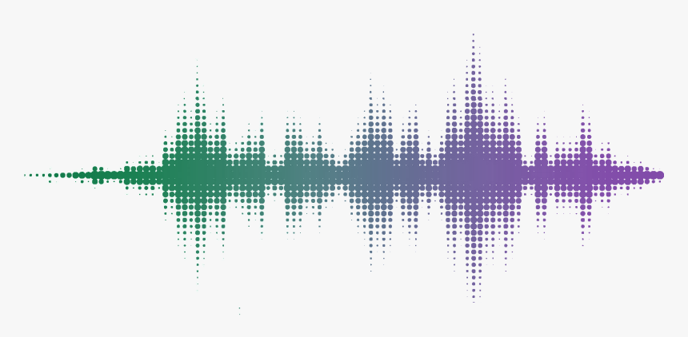

Radio waves existence has been discovered in the 1880s by <u>Heinrich Hertz</u>, since then radio waves have always served  humanity to communicate even at wide distances and nowadays they are everywhere even if we can't see them. Wi-Fi, Bluetooth, microwaves, alarm, telecomunications, satellites, cars, smartphones, drones and much much more use radio waves technology which makes their knowledge crucial especially for (cyber)security purpose

 

# WHAT'S RADIO
**Electromagnetic energy** occurs when particles of matter interract on an atomic level after an electric and magnetic fields modifications. The 2 components are an **electric potential** and a corresponding **magnetic components**, when the <u>electrons moves they create magnetism</u> and if a magnet moves <u>around a electrical conductor</u> **generating <u>current</u>**.

 

<u>**But how this energy is used for radio?**</u> 
Using electromagnetic energy is used by cyclically varying electric potential (**voltage**) in a trasmission medium (or OTA), this time-varying field of electric components and magnetic force (**EM field**) is created in a **wave-manner** (this is why are called radio-wave)

The <u>magnetic and electric fields</u> vary in a proportional manner **perpendicular to each other** (following the same direction) like the image below

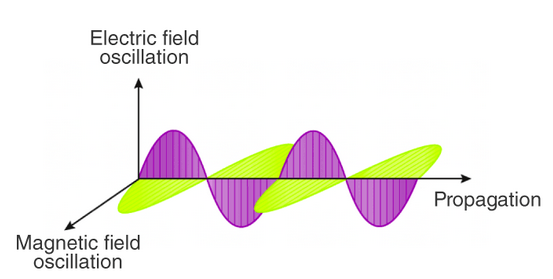

This is called **radio sinusoid**

In short, **<u>radio waves are a type of electromagnetic radiation</u>** with the longest wavelength of the spectrum.

 

# THE 4 COMPONENTS OF RADIO WAVES
The radio sinusoid is composed by 4 main components 

 

### 1) <u>FREQUENCY</u> (F)
This components describe **the number of time (per second) the wave complete a cycle** and use **<u>Hertz</u>** as unit measure (1 Hz = 1 cycle per second). 90% of radio implementation use from <u>1 Mhz to 6 Ghz</u>.

The frequency determine how the wave interracts with object that encounter in his path, **lower frequency are able to bend/refract/pass through objects** while higher one tend to be absorbed/reflected.

Also <u>lower frequency</u> have a longer wavelength which makes the wave to <u>travel farther but can carry less data</u>, higher frequency waves are the opposite

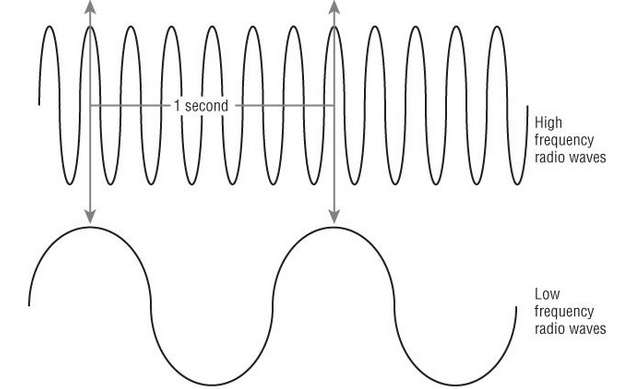

 

### 2) <u>AMPLITUDE</u> (A)
This is the "power" of the wave and there are 4 types:

* **<u>Voltage</u>** (V) = voltage in given instant of time
* **<u>Peak Voltage</u>** (Vp) = max value of the wave relative to 0
* **<u>Peak-To-Peak Voltage</u>** (Vp-p) = max value of the wave relative to the minimum value (most positive/negative)
* **<u>Root-mean-square-voltage</u>** (VRMS) = statistical value rappresenting average of alterning voltage 

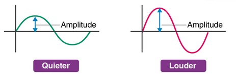

 

### 3) <u>PHASE</u> (P)
This is the distance between the point of origin (of any given time) and first zero crossing, usually this component is considered when comparing 2 different wave with same frequency. Phase can be defined in time, degree or radiants

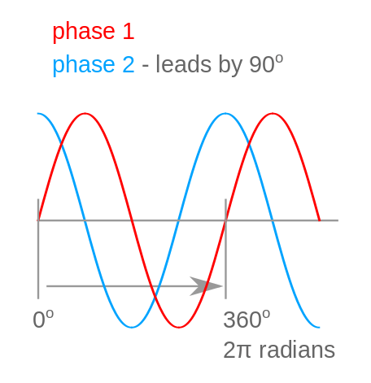

 

### 4) <u>WAVELENGTH</u>
This is the distance of 2 similar points on the same waves. 

Usefull for understand how far the wave can travel `(speed of light)/(frequency of signal)` (meters)

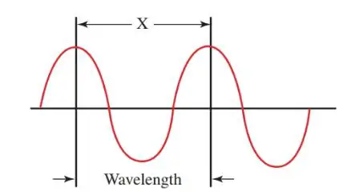

   

# MODULATION
This is the process of varying 1(+) properties of periodic waveform (**carrier signal**) using a <u>separate signal</u> (**information signal**) <u>that tipically contain information</u> (audio, video, binary digits, ...)

Usually the **information signal have lower frequency** and can't travel too far so using modulation will improve the range of the information wave. When reach the receiver will demodulate the signal and read the data

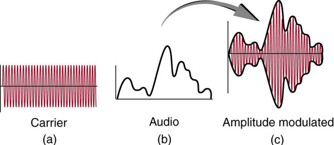

This process allow to **<u>add bandwidth and range</u>** and be **<u>more resilient to the interference</u>**

 

There are **<u>4 main types of modulation</u>** :
* **AM** &#8594; **Amplitude carrier varied** in accordance to the amplitude of the information signal
* **FM** &#8594; **Frequency carrier varied** in accordance to the amplitude of the information signal
* **PM** &#8594; **Phase carrier varied** in accordance to the amplitude of the information signal
* **QAM** &#8594; **Amplitude and Frequency carrier varied** in accordance to the amplitude of the information signal

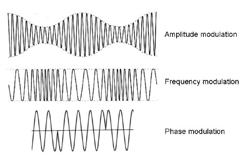

   

## DECIBELS
Unit of measurements that express **ratio of power or root-power on a logaritmic scale**. 
1Db of difference = 101/100 (or 101/2) 

10Db louder = 10x power
20Db louder = 100x power

 

## GAIN
Measure of the increase in power/amplitude of a signal (measurement of amplification of a signal).
Can be express in DB (`output pwer / input power`) or linear (`output amplitude / input amplitude`)

The gain can be improved with 2 device :
1) **<u>Amplifiers</u>** &#8594; electronic devics that increase power of signal
2) **<u>Antenna</u>** &#8594; increase gain focusing the signal in a particular direction

 

## SAMPLING
Translate analog signal to digital signal taking sample at <u>regular intervals</u> and storing the value in digital. Sample rate should be `>= 2*Frequency` in **order to avoid aliasing** (distorsion of signal).

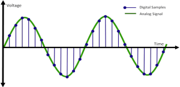

There are 2 method for sampling : 
1) **<u>DIRECT</u>** &#8594; Direct sampling the radio signal at the antenna (most common method)
2) **<u>INDIRECT</u>** &#8594; Convert analog signal to <u>intermediate frequeny</u> (IF) and sampling it. This allow, in specific context, lower rate of sampling or improve performance of improving process

 

## BANDWIDTH
Range of frequencies a signal occupies, difference between max/min frequency 

ex:/ `200 Khz = [88.1 Mhz,108.1 Mhz]`

Also it define the amount of data that can be transmitted over given frequencies

\+ BandWidth = + data = + power required 

 

## ANTENNAS
This is a device that **<u>convert electrical energy into radio waves (and viceversa)</u>** creating an electrical and magnetic field, oscillating fields radiate radio waves in space

When a <u>wave hits the antenna induce an electric current that is amplified and processed</u> by the radio receiver, the length of the antenna define the frequency the wave can radiate, **the shorter the antenna the higher the frequency of radiowaves**.

 

**<u>ANTENNA RULE</u>** 
Antenna length should be 1/2 or 1/4 to the desired wavelength

ex:/ F = 100 Mhz &#8594; `300000000 / 100000000 = 3 meters` &#8594; **1.5/0.75 meters** (antenna length)

 

1) **<u>Dipole Antenna</u>** = 2 antenna with same length divide by some space

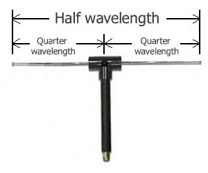

2) **<u>Yagi Antenna</u>** = singole dipole antenna with a number of parasitic (improve gain)

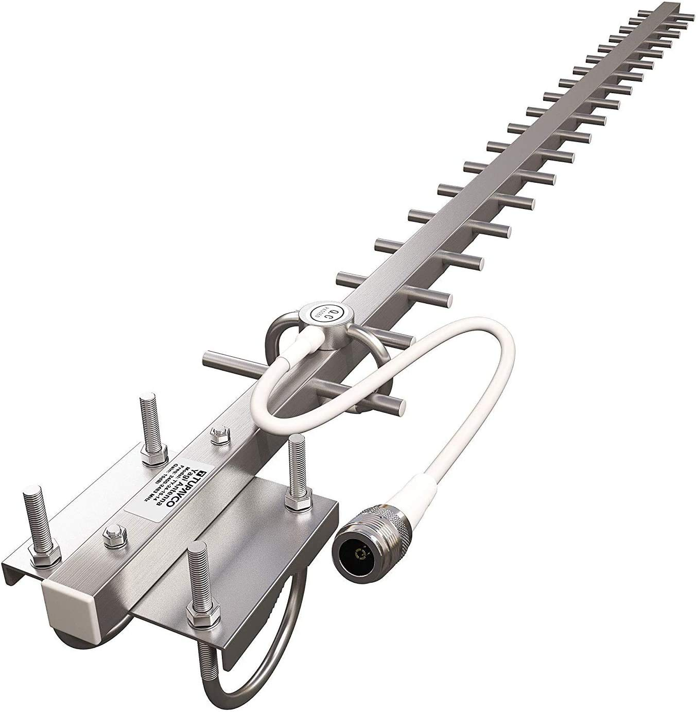

3) **<u>Parabolic Antenna</u>** = use of parabolic reflector with high directivity which reflect radio in a narrow beam or receive radio waves from one particular direction

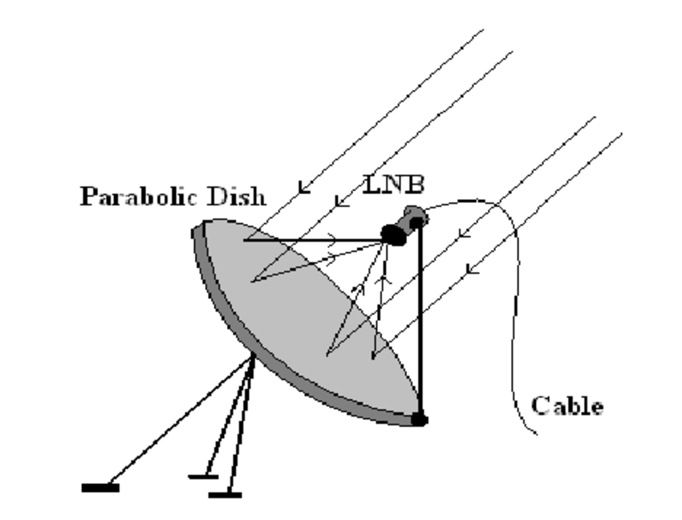

4) **<u>Patch Antenna</u>** = planar antenna typically made of metal often fabricated on PCB (widely used in smartphone). This allow a **low profile and cost, easy to fabricate and wide bandwidth**

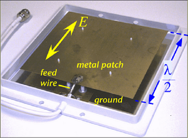

 

## TUNING
Process of adjusting frequency of radio receiver to match the frequency of radio station cahnging the **resonant frequency** of a **<u>LC</u>** circuit

A LC is a <u>tuned circuit</u> with a natural frequency which it oscillates. When frequency of a signal matches this natural frequencies the circuit **resonate and amplify the signal**

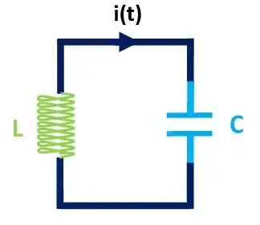

<u>Tuning</u> is used when we decide which radio station listen at
