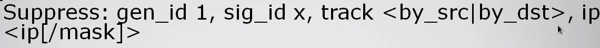

SNORT is the most widely used **<u>Intruder Detection System</u> (IDS)**

* Open Source and highly costumizable
* Small and LightWeight
* Can be used as **pure IDS, IPS and packet sniffer/logger**
* Based on **libcap/wincap** sniffing interface
* Based on **rules** (signatures) + **modular detection** elements

 

This tool is used by blue/purple team and is usefull to understand how it works, how to costumize it and how to bypass/abuse it as attacker. There is no limitation on is use and with specific context and scenario can be used by attackers (like as pure packet sniffer of specific data)

**Detection is not just about technology**. Response coordination, policy, management and training are critical factors  for the best outcome you need to understand how to setup an IDS, what is doing while is running and what happen when an alert is activated

 

**<u>SNORT Mode Use</u>**

1) Sniffer
2) Packet Logger
3) Network Intrusion Detection

  

## <u>PLUGINS</u>
The concept of <u>plugins</u> has been introduced in Snort 1.5 and is themain components that makes this software extremely modular

1) **PreProcessor**
How packets are examinated/manipulated before handed to the detection engine, this plugins are called one time for each packet. Some of the most common usage are <u>TCP defragmentation</u> and <u>traffic normalization</u>

2) **Detection Engine**
Single simple tests on single aspect/field of the packet and check if match (or not) specific criteria, this plugins can be called more than once per packet

3) **Output Stage**
How snort should report results from other plugins and what action need to occur (alerts/logs)

  

## <u>RULES</u>
This is the core of snort, the usage of rules tell the IDS how and what packet evaluate. 

This is the structure of every rules

* **HEADER** = describe the source-destination of the packets to evaluate

`[RULE_ACTION] [PROTO] [SOURCE_IP] [SOURCE_PORT] -> [DEST_IP] [DEST_PORT]`

* **OPTIONS** = the soul of the rule, name-value pairs separated by a `;` cahracter and tell the IDS what to look inside the packet

 

What snort does is to regroup all option under the same header for performance purpose so each packet that match a header will be submitted to every options

Snort have 30K(+) rules available for almost every protocol (for instance ModBus and DNP3) and are divided in 5 categories :

* **<u>Alert</u>** = generation of an aler when a suspicious packet is detected
* **<u>Block</u>** = blok the packet and all subsequent packet in the network flow
* **<u>Drop</u>** = dropping the packet when the alert is generated
* **<u>Logging</u>** = log the malicious packet 
* **<u>Pass</u>** = ignore the packet and mark it as "passed"

 

There a 3 <u>official sets</u> of rules for snort :
1) **SourceFile VRT** (gold standard, free for 3 days)
2) **Community Rules** (GPL)
3) **Emerging Threat / Bleeding Edge** (quick release, minimal testing)

 

The rules are written and stored, by default, in the `snort.conf` file and the additional rules in the `local.conf` (not overwritten by other rules)

  

# WRITING (EFFICENT) RULES
The efficency is a critical factor to lower the % of dropped packet when writing rules you should keep in mind both to fill only with the right packet the log and save CPU cycles

 

## <u>**TIPS**</u>
* Be specific as possibile when checking the header
* Use `any` keyword only when necessary / specify IP addr, port and protocol whenever you can
* Use CIDR blocks when IP list is too long
* Use `flow:established` for TCP sessions (packt with bad flow number are usually innocents)
* Body option are evaluated in order &#8594; CONTENT MATCHES <u>before</u> PCRE (**broad match first rule**)
* Keep rule on `local.rules` file unless they are overwritten by other
* Use `suppress` on on rules/option/host which alert rules but are not malicious
* **Think about protecting the vulnerability than catch the malware** as rule of thumb
* If possible configure the order on **pass-alert-log** (+ performance and false positive **default is alert-pass-log**)

  

## <u>OPTIONS</u>
The rules are the factor that make SNORT modular and costumizable, the options are the factor that make the rules modular and costumizable as well. SNORT is **costum2** (cool stuff!)

 

<u>**GENERAL OPTIONS**</u>
* **nocase** &#8594; case insensitive
* **msg** &#8594; message to attach when log the packet
* **GID** &#8594; Global ID
* **SID** &#8594; Snort ID (0-100 = snort team, 101-1000000 = wide distribution use, > 1000000 = local rules)
* **rev** &#8594; revision number
* **classtype**&#8594; assign a costum class (ex:/ "buffer-overflow attempt") to rules, usefull when revisionate log 
* **priority** &#8594; give a priority to a rule (significant for efficency)
* **metadata** &#8594; add additional info at a rule
* **content** &#8594; widely used, check match inside the payload (binary / ASCII / hex)
* **reference** &#8594; add an external reference to the rule (like a link)
* **suppress** &#8594; keep away vents that are not of interest or noisy rules (ex:/ a leggitimate host continue to alert)
* **logto** &#8594; save the alert on a specific log file
* **streamsize** &#8594; check stream size of a given TCP session, use of [min, max] value or comparator operator (need <u>stream5</u> preprocessor)

 

<u>**IP HEADER OPTIONS**</u>
* **sameip** &#8594; check if the header have same dest and source IP
* **ip_proto** &#8594; check packet only with the specified protocol
* **tos** &#8594; type-of-service
* **ttl** &#8594; time-to-live
* **fragbits** &#8594; check for the fragmnet bits   M = more frag   D = don't frag   R = reserved bit  (**+** = specified bit and any other / **-** = like logical OR / **!** = match if none of the bit specified is present)
* **fragoffset** &#8594; specify the fragment offset value

 

<u>**IP OPTIONS**</u>
* **flags** &#8594; specify flags, can use wildcards (**+** = at least the specified bit  / **!** = none of the specified bit / **\*** = logic OR)
* **seq** &#8594; check sequence number
* **ack** &#8594; ACK less than / equal to / not equal to / greater than a value
* **window** &#8594; like ACK but for the window size value
* **flowbits** &#8594; set a flag than another rule can check and take into consideration, concatenate with other rule's flowbits value for a chain of logical event. Usefull because events can ocur many packets/minute later in the stream

 

<u>**ICMP OPTIONS**</u>
* **Icode** &#8594; check ICMP code value 
* **Itype** &#8594; check ICMP type value
* **icmp_ID** &#8594; check ICMP identifier
* **icmp_SEQ** &#8594; check ICMP sequence number 

 

<u>**CONTENT MODIFIERS**</u>
* **depth** &#8594; how much need to "go inside" the paket before stop checking for match
* **offset** &#8594; point of the payload where to start searching for match
* **rawbytes** &#8594; inspect original payload (no normalized/preprocessor use)
* **distance** &#8594; distance (to the previous match this option is called) to another
* **between** &#8594; like **distance** but with between
* **within** &#8594; like **distance** but with within
* **uricontent** &#8594; use the URI buffer to check for the match
* **byte_text** &#8594; test specific field of bytes from known value, is a <u>relative</u> (from previous match) option, available in big and little endian and hex/oct/dec (ex:/ `byte_tes:8,=,0xdeadbeef,0` &#8594; after 8 bytes the previous match check values equal to `deadbeef` in 0 offset) 
* **byte_jump** &#8594; search in packet for fields that may be located at different offsets between the packet, usefull for protocol variation (always malicious)

 

other options

  

# PERL COMPATIBLE REGULAR EXPRESSION
The **<u>PCRE</u>** allow to do complex things that will be hard/impossible to achieve just with the options like string with multiple options. 

The basic syntax is the following `/[evaluation_string]/[modifiers]`, here some of the modifiers :

* **I** &#8594; insensitive case
* **M** &#8594; cross multiple line
* **S** &#8594; include `\n` in `.`
* **B** &#8594; no use preprocessor normalized data
* **U** &#8594; use http_preprocessor data
* **R** &#8594; search at the end of previous match
* **A** &#8594; pattern match at the start of  the buffer

other modifiers

  

Inside the **evaluation_string** we need to make 2 distinction : 
1) <u>LITTERAL</u> = raw string character
2) <u>METACHARACTER</u> = expression with different functions

 

## METACHARACTERS

* **\w** is the shorthand for [a-zA-Z0-9_]
* we can reuse the grouping `([value])` with this shorthand `\1`,`\2`,...,`\n`
* You can use the `/` to read as litteral a metacharacter unless few character that need to be written in hex in order to be evaluated as litteral (`"` = 0x32 \ `;` = 0x3B / `\` = 0x5C / `|` = 0x7C)

 

Some <u>examples</u> : 
1) `/^[Cc]at/`&#8594; match with every string that start with **Cat** or **cat**
2) `/\$[a-zA-Z0-9_]+/` - `/\$\w+` &#8594; match every string that start with "\$" (**\$lol**, **\$Lo_1**)
3) `/\$\w{1,3}` /\$\w+ like before but match only string that start with "\$" and have at least 1 and maximum three specified characters, will match **\$s**, **\$A1** and **\$3_p** but not **\$hacker**
4) `/\/foo.php?id=[0-9]{1-10}/iU` &#8594; check for every string like `/foo.php?id=0123456789` but with ID no longer than 10 character
5) `[1111-9999]-?[1111-9999]-?[1111-9999]-?[1111-9999]` / `([1111-9999]-?){4}` / `([1111-9999]-?)\1\1[1111-9999]` = essentially check a match for a potential credit card leak so will match **1111222233334444** and **1111-2222-3333-4444**

 

[This](https://github.com/HikaruDY/pcre-windows) is a tool usefull to check and training PCRE expressions 

  

# MISCELLANOUS

* `kill -USR1 [SNORT_PID]` &#8594 kill snort process and dump performance statistics at `/var/log`
* Use `Event Filtering` in order to alert when certain limits/threshold are reached (ex:/ excess ICMP buffer)
<u>threshold.conf</u> (should be included in snort.conf) to set **limit** (number of alerts to show in specific amount of times) and **threshold** (how many tims an alert must occur within a specific amount of time)

* `ipvar [NAME_VARIABLE] [IP_ADDR]` &#8594;  Save IP address in a variable for a smoother rule creation (can use of ANY, CIDR OR `!`)

* `portvar [PROTOCOL] [PORT(S)]` &#8594; Same as above but for the ports, ports can be store in different manner

* `\>= 1024` &#8594; `[1024:]`
* `\<= 1024` &#8594; `[:1024]`
* `53 and 99 and 1002` &#8594;`[53,99,1002]`
* `80-1024` &#8594; `[80:1024]`

* `var [FILENAME] [PATH]` &#8594; stored path of a file/rule 

* `include $RULE_PATH/[file]` &#8594; include specific rule files (**.rules**) or conf file (**.conf**) 

* Inside `snort.conf` you can add a line to save the log on a database but you need to install **barnyard2** a spooler for snort unified2 format that allow to write to disk (and database) in efficent manner

 

`snort -i [interface] -vde -c [config_file]` &#8594; Traditional Use

<u>FLAGS</u>

`-v` = verbose
`-d` = application layer
`-e` = data link layer
`-l` = log path
`-r` = pcap file to analyze instead of a live interface
`-k` = alert type

 

* Use of suppress 

   
